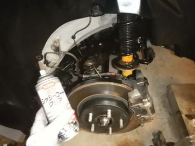

# 定番ネタ！3シーズン，計44500km走ったスタッドレス，YOKOHAMA iG5+はどのくらい減ったのか？

📅 投稿日時: 2021-06-03 03:27:23

えー．

このBlogを長いこと読んでいる方には定番の

ネタですが．

これから月山にどっさり雪が降って雪道に

なってほしいところだけど←だからそれは異常気象だから

…さすがにもう今シーズンは雪道を

走ることは無さそうなので…

我がLEVORG君のタイヤをスタッドレスから

夏タイヤに交換しました～！

で．

普段なら私の車は，1シーズンで2万kmほど

走ってしまい．

大体スタッドレスは2シーズンしか

もたないんだけど…

昨年はコロナの緊急事態宣言の影響で，

1シーズン14000kmしか走らなかったので．

2シーズンで走行距離は31000kmちょい．

タイヤの状態を見ると，

[2シーズン目が終わっても，まだ使えそう！](eb1e6ddcd930656fa3de6f9b8e94f08df.md)

…ということで．

我が車としては珍しい，スタッドレス

3シーズン目に突入していたわけですが．

（以前に一度，スタッドレスを3シーズン，

51000km履いた時には[こうなっていた](ead1b8aaf0a78791c3a109aaac3f294e5.md)ので，

普通は2シーズンしかもたない）

今年もコロナの緊急事態宣言のおかげで，

トップシーズンにスキーに行けない

時期があり，

今シーズンのスタッドレス走行距離13500km

と，いつもより少なめ…

少ないと思った去年よりも走行距離が

少ないとは…（泣）

ってなことで．

3シーズン合わせて，44500km走った

スタッドレス，YOKOHAMA iG5+は

どのくらい減ったのか？

…ってところを，見てみましょう…

まず，フロントアウトサイド側の

プラットフォームを見てみると…

をを？？

もう，残り少ないとは言うものの．

まだ1mm以上，プラットフォームまで

残ってますよ！

そして，インサイド側を見てみると…

こちらももう残り少なくはなっているけど．

なんとかプラットフォームは露出して

おらず，ギリギリスタッドレスとして

使えるレベル！

リヤのアウトサイドも…

残り少ないながらも，プラットフォームまで

まだ1mmくらい残ってますね…！

そして，どのタイヤを見ても．

発泡ゴムが削れ切って，下地が出てきている

様子もなかったし．

あと1000km以上は，スタッドレスとして

使えそうな感じでした…！

300psもあるLEVORG，タイヤへの負荷が

高くて，スタッドレスは長持ちしないんじゃ

ないか…と思ってましたが．それでも，

YOKOHAMA iG5+は，45000kmはもつ

かなり寿命が長いスタッドレスだ…

ということが分かりました～！

という感じで．

いつも通り，タイヤ交換と同時に．

1シーズンの凍結防止剤やらなにやらの

汚れが溜まった下周りを…

徹底的にきれいにする！

ひたすら洗って磨く！！

リヤ側もかなり汚れていたのを…

まずはフェンダー内側をピカピカにして…

そして，サスアームも汚れを取る！

走行距離73500kmと思えないほど

ピカピカにする！！

…そして．

ピカピカにしたら，いつも通り錆止め

クリヤーコートをかけて．

ということで．

いつも通り，下回りがピカピカになりました～！

はい．

夏タイヤに交換完了！

…ってな感じで．

今シーズン．

コロナの影響でスキーに行く回数が

減ったのは悔しいけど．

スタッドレスが3シーズンもってくれて，

お財布に優しかったから良かった…

と，ちょっとでもポジティブに考えようと

思った，Skier_Sだったのでした…

## 💬 コメント一覧

### 💬 コメント by (ほっぽ)
**タイトル**: Unknown
**投稿日**: 2021-06-03 12:34:03

Sさん

「スタッドレスが3シーズンもってくれて，

お財布に優しかったから良かった…」

ということは、物欲選手権で何度も大敗出来ますね❗🤣

### 💬 コメント by (Skier_S)
**タイトル**: ＞ほっぽさま
**投稿日**: 2021-06-04 03:30:37

いや…LEVORGのスタッドレス，やっぱり17インチは高いですから（涙）

ホイールのうち替え工賃入れれば新しい板1セット分のお値段しますよね…

これが2シーズンで終わるか3シーズンもつかは大きいです．

スキー板が2シーズンもつか3シーズンもつかの違いくらい大きいです！

…スキー板は2シーズンも持ってくれませんが（涙）

### 💬 コメント by (りやまやり)
**タイトル**: Unknown
**投稿日**: 2021-09-18 20:34:29

スキー関連記事、いつも楽しく拝読しています！

さて、VNレヴォーグを購入し初めての冬を迎えることになり、冬用タイヤを検討中です。新発売のIG7は高価なので型落ちのIG6を狙うつもりです。そこで質問です。IG5の乾燥路、特に高速道路での印象はいかがですか？各社各銘柄とも氷雪性能は大きく進化しているのは間違いなさそうなので、むしろスキー場までの大半を占めるドライコンディションの高速道路での性能とライフを決め手にしようと考えています。よろしければアドバイスお願いします。

S様の記事を読んでいると、楽しくてためになり、シーズン前なのに期待でわくわくしてきます！これからもよろしくお願いします！

### 💬 コメント by (Skier_S)
**タイトル**: ＞りやまやりさま
**投稿日**: 2021-09-19 04:28:33

VN Levorg，いいですね～！うらやましいです…

普通のドライ路を走ったインプレッションは，

https://blog.goo.ne.jp/tsakamot2001/e/bc6646489c7ca892ce7f03f7cfdcaf9b

の記事が参考になるかも．

ドライコンディションは，VM LEVORGの純正タイヤがロードノイズ高めってのもあって，

IG5+に替えてもロードノイズが高いと感じません．

ケース剛性が結構高いようで，高速での安定性，ニュートラル付近の

締まりもしっかりしていて，おそらく言われないとスタッドレスと気づかないレベルです．

ライフも私の乗り方で4.5万km走るので，かなり長いです．

お値段次第ですが，私も次はIG6買おうかな…と思っています！

