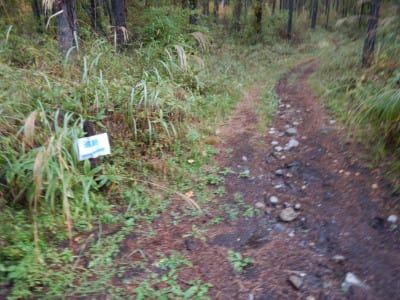

# 2020年10月，八ヶ岳の編笠山に登ってみた，その2

📅 投稿日時: 2021-08-04 01:01:51

えー．

先日，スバルから電話がかかってきまして．

何だかわがLEVORG.

[リコールに引っかかった](https://www.mlit.go.jp/report/press/content/001416826.pdf)ようです…

LEVORGのうち，2018年3月～10月の半年間に

作られたものだけが対象みたいですが．

ドンピシャそこに当たる自分の引きの強さよ…！！！

ホントになんだか最近，いろいろ

引きが強い…（涙）

詳細を調べてみると．

なんだか，燃料ポンプのインペラ製造不具合で

交換になるようですね．

（[国土交通省ホームページ](https://www.mlit.go.jp/report/press/content/001416824.pdf)より）

ディーラーさんのピットの空きがなく，

作業は9月になっちゃいました…

かなり先だな．

代車もお願いしたんですが．

また，

[サンバーが代車](e89c59157670eec668c354fcb08445487.md)

だったりするのかな？？

それはそれでまた楽しめそうな気がするけど

ってなことで，本題へ．

八ヶ岳の登山レポート，続きです！

ーーーー

ってなことで．

やってきたのは，富士見高原ゴルフ場の

駐車場．

駐車場は広く，車は余裕でいっぱいおける

広い駐車場です．

…って．富士見高原「スキー場」って書いて

ありますね？？

富士見パノラマは知ってたけど，

富士見高原スキー場ってあったんだ…

と思いながら．

登山客はここに車を止めるようなので．

ここに車を置いて，

編笠山方面へ向かいます…

ってなことで．

朝7時に，登山スタート！

駐車場から5分ちょい登ると，

ゲートがあるのでこの横を通って，

ゲートの向こうに行くと…

その先すぐに，登山道入り口が

あります！

登山届ポストもここにあります．

では，登山道へ！

…って，5分ほど登山道を歩くと，

すぐ林道へ突き当って．

矢印に沿って林道を左へ進めと

案内が…

しばし，両側を紅葉に彩られる林道を

歩いていくと…

林道わきに，ピンクテープが貼ってある

木があったので．

一瞬，ここがコースか？？

と間違ってしばらく歩いて行っちゃいました…

実際はこれはコースじゃなく，

もう少し林道に沿って歩いていくと…

むちゃくちゃ小さくて目立たない，

簡単に見落としそうな看板が出てきました．

うーむ．

これを見落とすと，登山道に入れず

行き過ぎてしまうなぁ…

とりあえず，こちらが登山道です．

と，登山道を5分あるくと，

また林道に突き当たりますが．

ここは，ちょうどこの地図の矢印部分．

西岳と編笠山の分岐に当たる部分

みたいですね．

まずは編笠山が先なので，

矢印の編笠山方面に従って

進むと，また短い山道があって…

またまた林道に突き当たりました…

どうやら，うねうね曲がっている林道を

ショートカットする形で，登山道が

つけてあるようですね．

この林道を渡った先に，続きの登山道が

あります．

こんな感じで，何度か林道を横切りながら

登ることしばらく，駐車場から40分ほど．

最初のポイント「盃流し」ですね…．

なんだか，河原っぽいところに出ましたが．

「平安時代，そこに盃を流す間に一句を読む遊びに

　使われた一枚岩に似ているためその名がつけられた」

とかいうところだそうですが…

この右側の岩かな？

とりあえず．

盃流しを超えると，そこからはようやく

普通の登山道っぽい感じになり．

ここから編笠山まで3時間30分，か…

スタートしたばかりでまだ疲れも

膝の痛みもなく，元気なんだけど．

膝を傷めないように慎重に歩いてきたら，

盃流しまでコースタイム49分のところ，

ほぼコースタイムの45分…

最初にあまり飛ばすと下りで痛くなるので，

このくらいのペースがせいぜいだと

思うんだけど…

これなら，コースタイム通りのあと

3時間半で山頂にたどり着ける

ペースかな？

と．

この時は，この先に待つ試練を知らずに，

気楽に考えていたのでした…

## 💬 コメント一覧

### 💬 コメント by (カンタロス)
**タイトル**: Unknown
**投稿日**: 2021-08-04 05:29:30

Sさま、こんにちは。

膝の調子も、サポーターのおかげで良いようですね！

私も、スキーの時などは、膝、腰のサポーターが欠かせません。

富士見高原スキー場ですが、懐かしのシングルリフトがあります！(笑)

斜面は緩斜面と、中斜面の二枚ですがクセのないバーンです。滑走路標高差は稼げませんが…。

### 💬 コメント by (yumi)
**タイトル**: Unknown
**投稿日**: 2021-08-04 11:33:31

Ｓさぁ～ん🥳🏞️🧗

へぇ～😲⁉️

北海道の山奥🏞️なら いざ知らず 関東近辺なのに Ｓさんデモ知らないスキー場が☃️有るんだぁ～😅

再来月には 滑れますね🎵😍🎵

⛷️💨💨💨

### 💬 コメント by (Skier_S)
**タイトル**: 8月なのに雨が多い…
**投稿日**: 2021-08-05 00:36:55

＞カンタロスさま

膝の調子，むちゃくちゃいいですよ~！

富士見高原スキー場，行かれたことあるんですね…

斜度は結構緩そうですが，混まなくて良さそうですね．

人工降雪機があるんでしょうか？

あそこは天然雪だけだと厳しそうですよね．

＞yumiさま

私も知らないスキー場でした…

かなりマイナーなスキー場まで網羅しているつもりでしたが，

全くノーマークでした…

もう8月なので，あと2か月半くらいでシーズンイン．

まだまだ待ち遠しいです…

### 💬 コメント by (カンタロス)
**タイトル**: Unknown
**投稿日**: 2021-08-05 05:26:22

Sさま、こんにちは。

シングルリフト懐かしさに行きました(笑)

人工降雪機完備してます。完璧にローカルスキー場です。

一級の検定もやってるそうです。

滑った感触として、一級の検定もOKな斜面だなと感じましたのでそんな感じの斜面。とイメージしてもらえれぱ。

富士見町の町営スキーのなので町民割、町民と一緒に行くと割引があります。

ネタで行くのもありです。近いですし。

### 💬 コメント by (Skier_S)
**タイトル**: ＞カンタロスさま
**投稿日**: 2021-08-06 02:01:06

シングルリフト…！

私が最後に乗ったのは，数年前のサンバレーでしょうか．

数シーズン前に撤去された，今は無きシングルリフトです．

一級検定ができるって，そこそこの斜面と不整地があるってことですね．

そして，人工降雪機もあるとは…！！

一度ネタで行ってみたい気もします．

が，シーズン中はやっぱり志賀に行くだろうなぁ…

