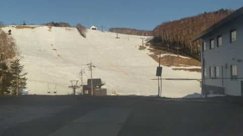

# なに！？？来シーズンのスキー板，軒並みすごい値上がりするよ！！トップモデルは軒並み20万越え？？

📅 投稿日時: 2023-04-05 02:54:00

🏷️ カテゴリ: [スキー雑談](c1f9d2cb7478308da16419928ea3945e9.md)

えー．

本日も志賀高原特派員情報によれば，

志賀高原は，気温が高い晴天だったようで…

今日も気温はあさイチからプラスという，

4月上旬としても高すぎの気温（泣）

…ここしばらく，朝ですらマイナスに

冷えてませんね…（涙）

まぁ，この時期の平日は人も少なく

ガラガラで，朝から緩めの雪ながらも，

あさイチはフラットで気持ちよかったみたい

ですが…

やはり高温＆晴天で，雪はすぐに緩んでいった

みたいです…

そして，GSコースの非圧雪側．

早くも土が出てきてます．

…普通，ここの土が出てくるのは

4月下旬くらいなんですけど…！？？

（昨日の写真と比べると，土のエリア確実に拡大中）

さらに一の瀬ダイヤモンドも，早くも上に

土が出始めてきていて…

これも，4月下旬並み（涙）

現時点で，雪の多いGWより少ない…（泣）

とりあえず，気温は高いものの，

ここしばらく雨は降っておらず．

今滑れるゲレンデはまだほとんど

白いままでいてくれてますが…

今週金曜日までの高温続き＆金曜の雨で

ゲレンデはどこまでやられるのか…（恐怖）

土曜に冷えるので，ちょっと積もってくれると

嬉しいんだけど，どうやら今の天気図では

土曜の積雪はちょっと期待薄で，

積もって2－3cmくらいかも（激泣）

ダメだ…今シーズンはちょっとヤバすぎる…

まぁ，今週の土日はこれまでに比べれば

冷えてくれそうなので，そこに期待したい

ところだけど．

雨のあとの低温で，全面アイスバーンになる

という悲劇を呼ぶ可能性が…

ってな悲しい情報のあとは．

さらにスキーヤーに追い打ちをかけて

痛い情報を…

3月5，6日に，長岡のスキーショップのエキップさん

主催の試乗会に参加してきたのは，

かつて[記事に書いた](e84acb579e5ff4ad27d7d08131f62f38a.md)のでご存知かと思いますが．

15種類くらいの板を試乗してみて．

来期のHEADは色が変わった以外大きく

変わらないように見えるけど，かなり

良くなってるとか．

FISCHREのSC PRO，RC PROのプレートが，

M/Oプレートから新しいMプレートに

変わってて乗り味が微妙に変わったとか．

いろいろ変化がありましたが…

でも．

一番びっくりしたのは，板の乗り味でも

モデルチェンジでもなく…こいつを見たとき．

…な，なにぃ！！！

NORDICAのDOBERMANN SLRが

税込み22万円！！？？

他の板も…

え？？FISCHERのRC4 SC PROも

税抜き19.8万って…

税込み21万7800円！？？

RC4 SCの安い方，SC M-trackも…

税抜き17.9万ってことは…

税込み19万7千円くらい．ほぼ20万円なんですけど！？？？

他の板はお値段が貼ってなかったのですが，

他のメーカーも，だいたいおなじくらいの値段に

値上がりするっぽい…

23－24シーズンのオガサカのカタログを見てみても．

なに！？？

TCシリーズの小回り用，TC-SBも，プレート無しのビンディング付きは

19万6900円？？

そして，SR585 プレート付きのビンディング無しモデルは

17万4900円っ！？

これにビンディングをつけたら，定価22万近いよ！！

（[OGASAKAスキー23－24カタログ](https://www.ogasaka-ski.co.jp/pdf/catalog/23-24_spec.pdf)より）

ぐ，ぐはぁっ！！！

ヨーロッパの物価高＆円安のダブルショック，

恐るべし…（激涙）

そして，材料高＆光熱費アップで日本製スキーも

揃って値上げとは…

…とてもじゃないけど来シーズンモデルの

板を買うなんて無理…（泣）

おそらく，ブーツも軒並み値上がり

するんだろうなぁ…

…ってなことをいろんな人に話してたら．

それを聞いたのか聞かないのか，

エキップの鈴木社長．

「Sさん．今シーズンモデルの板を何セットか

　貸しますから，ぜひ乗ってみてください」

と，悪魔のささやきが…

（貸してもらった板たちの一部）

今シーズンモデルは来シーズンモデルより

圧倒的に安いうえ，時期がもう3月になって

いるのでお値段もさらに安くなっており…

ただ，在庫がもう少ないので，売り切れ御免

状態で．

…これ，みんな来シーズンモデルがすごい

値上がりするって知ったら，即効で売れちゃう

よね…

ヤバい．

エキップさん，私の物欲のツボの刺激のしかたを

知りすぎている…

やばい．エキップの社長さん，危険すぎる…

## 💬 コメント一覧

### 💬 コメント by (かず)
**タイトル**: Unknown
**投稿日**: 2023-04-05 19:27:50

ボードもトップモデル板だけで25万以上なんて感じです  試乗してほしくなるとやばいので試乗すらしません このまま値上げし続けて雪も降らなくなると悲惨ですね

### 💬 コメント by (Skier_S)
**タイトル**: ＞かずさま
**投稿日**: 2023-04-06 13:11:13

ええええ！！

ボードで板だけで25万以上ですか…！！高い…！！

スキーやボードはもう選ばれしお金持ちの娯楽になっていくのかも…（涙）

### 💬 コメント by (よっちゃん)
**タイトル**: Unknown
**投稿日**: 2023-06-08 19:48:08

もはやスキーは一部の金持ちと、メーカーから支給を受けている技術選連中のスポーツになりました。スキーの裾野を広げるべきのデモや選手らが、そのステイタスを保持するために来シーズンモデルを支給され、その補填を一般スキーヤーがおこなう。普通に考えたら詐欺に近い商売を、なぜみんな疑わないのでしょうね。

### 💬 コメント by (Skier_S)
**タイトル**: ＞よっちゃんさま
**投稿日**: 2023-06-09 04:45:49

いやー．

これからスキーはヨーロッパのように，お金持ちしかできないスポーツになりますね．

一般家庭が家族でスキーに行くなんて，これから子供が生まれるような世代には

無理になっていくんじゃないでしょうか…

### 💬 コメント by (チビ)
**タイトル**: 同感
**投稿日**: 2023-12-03 06:33:56

私も昨日、（R5年12月2日）市内のスポーツ店に行ってみてスキー板の高さに驚いてきました。今のが7年乗っているのでそろっとと思いましたが、買えません。

### 💬 コメント by (Skier_S)
**タイトル**: ＞チビさま
**投稿日**: 2023-12-04 03:00:56

ですよね～．高いですよね～…

中古の程度のいいやつとか，型落ちの掘り出し物を探すしかなさそうです．

私も型落ちの試乗会落ちしか最近買っていない気が…

