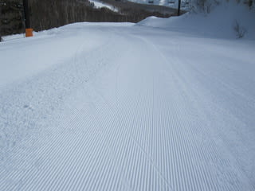

# 3月20日の志賀高原は…

📅 投稿日時: 2011-03-20 21:34:28

🏷️ カテゴリ: [2011スキー滑走日記](ca488c98cfb9169941c3e73770dcefb56.md)

本日の朝イチに．

志賀までやってくる道のりを報告しましたが．

…こちら，志賀高原は平和です．

まったくいつもどおり，

微妙に違うのは，いつもよりすいてることでしょうか…

でも，先週よりお客さんは戻ってきてる気がします．

．．．しかし，首都圏ナンバーの車をほとんど見かけません．

中京・関西圏がほとんど．

さてさて．

本日の志賀高原．

運転リフトは…

高天ヶ原から奥志賀のエリアでは，

完全に元通りに戻りました

（ただし焼額を除く）

お客さんこんなに少ないのに，こんなにいっぱい

リフト動かしてるの？

って感じです．

（ただし焼額を除く）

がらがらなんだから，一の瀬クワッド動いてれば

一の瀬の第3クワッドなんてだれも乗らないでしょ？

ダイヤモンドクワッド動いてたら，ダイヤモンドトリプル

誰も乗らないでしょ？

…って感じで．

先週は営業を止めていたすべてのリフトが，今週は営業しています

（ただし焼額を除く）

で．

問題の焼額ですが．

まず，営業開始が8時ではなく8時半からになっています．

で，動いているのは第1ゴンドラ，第2，第3高速，第4ロマンスの4本．

3連休というのに，第2ゴンドラ，第1高速，第3ロマンスは止まってます．

あー．

動いている第1ゴンドラ，第2高速も減速運転です．

山頂まで，いつもの倍の時間がかかります．

さらに．第1高速沿いの白樺コースはコース整備すらしてなく，

立ち入り禁止．

…だのに，なぜか焼額第1高速につながる山の神第1リフトは

動いているという…

かなり意味がない気が（笑）

というわけで．

ガラガラというのに，いつもどおりの数のリフトが

動いてました．

（ただし焼額を除く）

さてさて．

本日の朝イチは晴れ．

朝イチは，比較的締まったいい感じの圧雪でしたが…

日差しが強く，ぐんぐん気温が上がります．

昼前には，湿った3月の雪になっていきます…

あったかいなぁ．

しかし．3時過ぎに天気は急転．

にわかに曇りだし，風が強くなってきたと思ったら…

4時前から．

ついに．

雨（涙）．

標高の高いエリアは雪でしたが，

それでもウエアに着くと溶けてべちょべちょになってしまう雪．

焼額ゴンドラも，4時15分の予定が4時に営業終了しちゃいました．

で．

その後．

夜の今まで雨は降り続いています．

小雨になってきたものの…

明日はコンディション悪そうです．

っつーか，明日も雨でしょう…

昨日，今日と滑った人は晴れた中ずーーっと滑れて

よかったかと．

…今日，明日とすべる人はちょっと残念な感じかなぁ．
