# 2月5日（日）の志賀高原詳細レポート…朝は良かったけど，午後はビミョーな天気．焼額は雪だったし良しとしておこう…

📅 投稿日時: 2017-02-07 03:07:36

🏷️ カテゴリ: [2017スキー滑走日記](c7d777cecfc91bdf0fa464ad62c6d49ab.md)

ということで．

昨日，日曜の志賀高原の状況を速報しましたが．

本日は，詳細レポートです～！

えー．

まずはこの日．

朝は意外と，かすかに太陽が望めるくらいの

天気で始まりました…

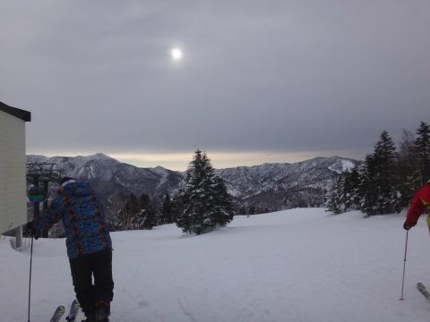

で．

朝の気温はマイナス4℃ですか…

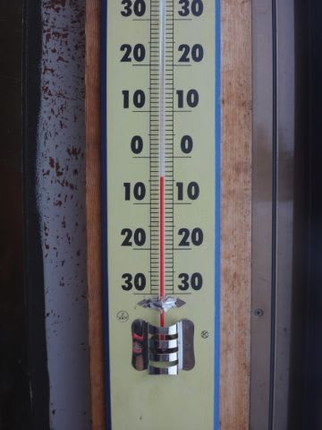

この時期の志賀高原の朝としては，

かなり高めの気温．

うーむ．

…ちょっと危険な予感…

とりあえず．

朝イチのゲレンデは…

うほう！！！

今日も見事な締まったシマシマバーン！！！

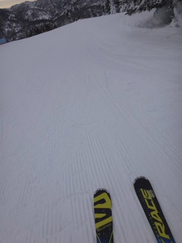

ちょいと重めの雪がしっかりパックされたような，

がっつりエッジが効く，激烈快感バーン！

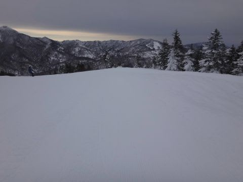

…ちょいと曇ってて，雪面が見えないけど…（ちょい涙）．

でも．

雪面が見えなくても．

雪はガッツリしっかりエッジが食い込んで，

どこまでも傾いて行けるような．

どこまでもスピードを出せるような．

かなりの快感バーン！

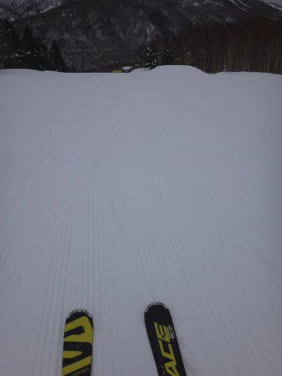

いいよ！

楽しいよ！

…ホントに今日，天気荒れるの？？？

…惜しい．

これで雪面さえくっきり見えれば…

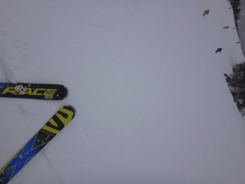

（雪面の凸凹が全く見えない…）

…そして．

営業開始から1時間半ほど．

10時を過ぎてくると…

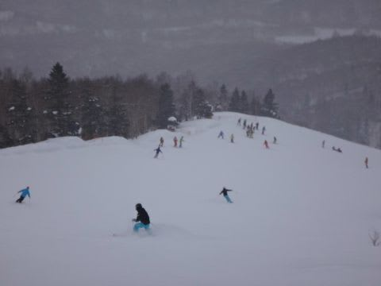

あり？？

ちょいと人口密度が上がってきちゃったんですけど…（涙）．

これは…

快適に飛ばすのは難しくなってきましたな…（泣）．

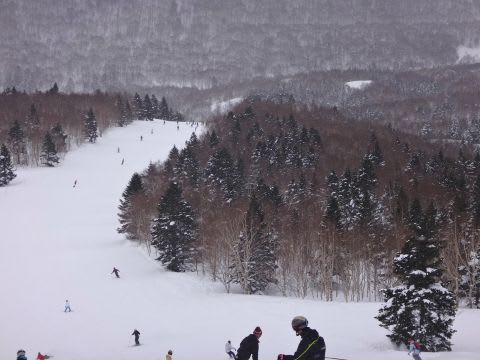

でも．

まぁ．

ゴンドラ待ちは最大でも，ぎりぎりゲートを超えるかどうか．

10時～11:30まで，1-2分待ちって感じで．

それほど待ちが無かったのが救いかな．

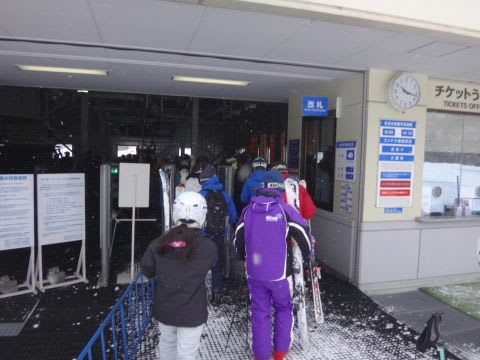

って感じで滑ってたところ…

午前11時過ぎごろ．

え？

あれ？

降ってきたよ！？

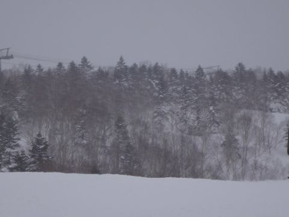

…ちょっと早くない？？

とある人の予想では，降り始めは昼過ぎ～夕方って

話じゃなかったっけ？？←予想を微妙に外したな…

…でも．

まぁ，雨じゃなく雪なので，許す．

降りも時折チラチラ…って程度だし．

ほとんど降ってるうちに入らないよね…

しかし．

この日は意外と．

午後になっても．

ゲレンデの人が減らないなぁ…

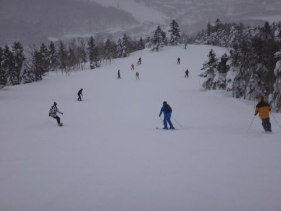

…とか思いながら滑っていたら．

うむ？

午後2時ごろから．

なんだか，雪の降りがちょいと激しくなってきましたか…？？

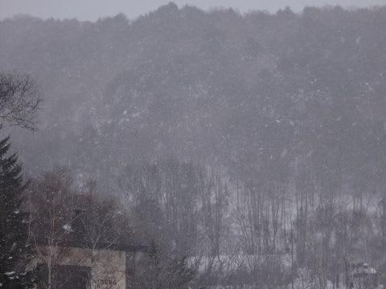

…でも．

これ，雪だよね．

うん．白いのが見えてるから，雪だよね…

だって．山頂の気温．

この時点でも-3℃だし．

雪のはず…

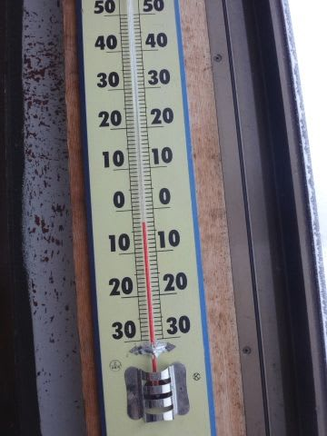

…だけど．

ウェアに着くとすぐにびしょ濡れになるような．

なんだかかなり湿っぽい雪で…

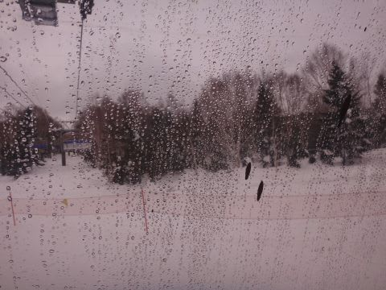

うーむ．

降りはバラバラ程度なので．

まだ全然耐えられるけど…

と，思っていた，午後3時近く．

なんだか風も強くなってきて…

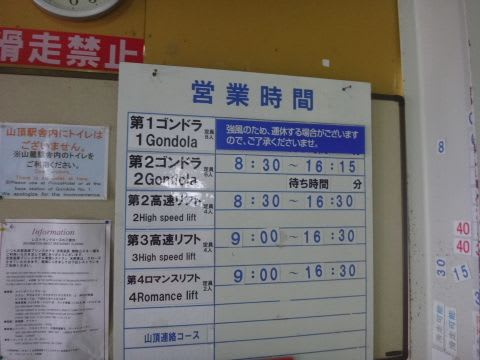

ええ？

ゴンドラ，減速運転ですか！！？

運休の可能性もあり…？？

ガーーン（涙）．普段は7～10分で山頂に着くゴンドラ．

15分くらいかかってるよ…（泣）．

そして．

山頂付近はガス（悲）．

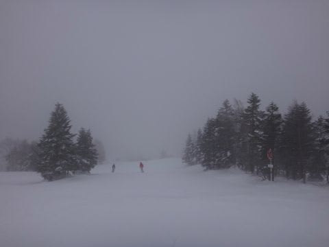

この，湿った雪攻撃＆ガス＆ゴンドラ減速運転のおかげか…

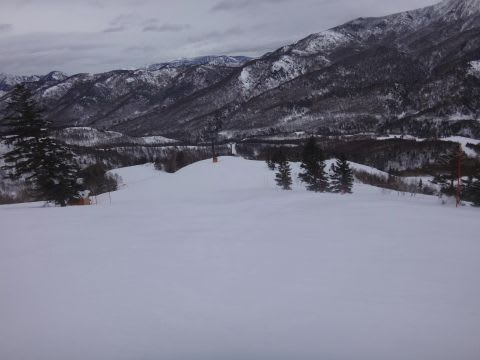

午後3時前には，ゲレンデはガラガラになってました…

でも．

だけども．

焼額は雨にならず．

雪だったのだ！

私の祈りのおかげで，雨にならず，雪だったのだ！！←しつこく主張

だもんで．

雪質はそれほど悪くならず…

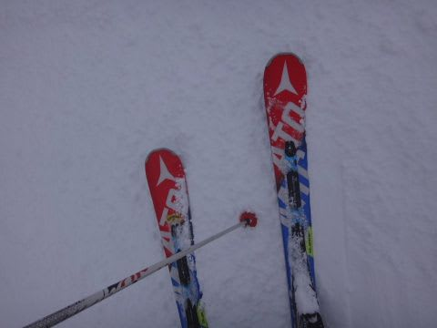

むしろ，しっかり踏み固められたような．

エッジがしっかり効くバーンで．

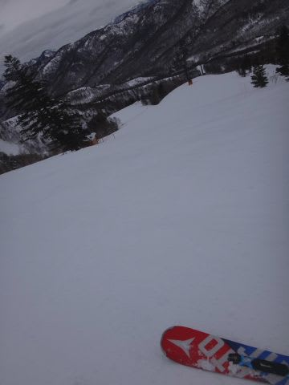

そして．

雪が重めでしっかり固まっていたからか．

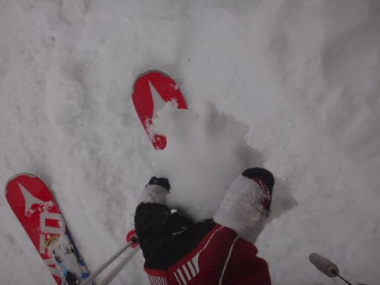

夕方まで，意外とフラットなバーンをキープ！

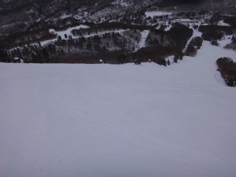

…ゴンドラの減速運転は残念だけど．

でも，人がいない夕方．

フラットバーンを飛ばせて，意外といいかも！？？

…という感じで．

人のいない夕方のゲレンデをかっ飛ばしつつ．

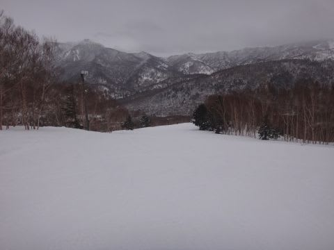

この日もしっかり，16:30の営業終了まで．

たっぷり楽しんだのでした…

いやーー．

でも．

きわどかった．

きわどかったけど，雪になってよかった…

でも．

標高の低いジャイアントやサンバレーはかなり

雨っぽかったみたいなので．

これはやはり．

私の祈りのおかげで，焼額がぎりぎり雪になってくれたということで．

皆の者，感謝するのだ！！←だから，あなたが志賀高原の天気を決めてるんじゃないんだから

PS1.

このあと．こんな感じで…

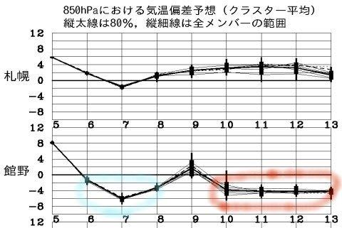

青くマークした6，7，8日と冷えて．

また7日はパフパフパウダーデーですね～！

そして．そのあとも赤くマークしたように，10，11，12，13日と．

平年より4度ほど低い日が続くので．

どうやら，冷え冷え祭りパート2が始まったようです．

…今週末も，かなりパフパフっぽい気配！

PS2.

土曜日に，わざわざ駐車場で私を発見してくださった方，

どうもありがとうございました～！

すっかりシールを渡し忘れていたので，

もしシール希望であれば，またお会いした時に

リクエストしてください～！

## 💬 コメント一覧

### 💬 コメント by (はなげ親分)
**タイトル**: 焼額
**投稿日**: 2017-02-07 12:47:45

志賀高原らしい軽い雪が降っています。こんな状態が週末迄続いたらどんなことに成っているのでしょうか!?

今週末滑れないのが残念！

### 💬 コメント by (Unknown)
**タイトル**: ドッペルケンガー？
**投稿日**: 2017-02-07 18:07:28

あれれぇ～？

### 💬 コメント by (Skier_S)
**タイトル**: 今週末もパウダーだなぁ…
**投稿日**: 2017-02-08 03:33:06

＞はなげ親分さま

あれれれ？

いつまで滞在ですか？？？

8日は止みますが，9日から

またひたすら降り続けそうです．

今週末もすごいパウダーになりそうです…

＞Unknownさま

…こ，コメントの意味が分かりにくいのですが…

もしかすると，お昼ご飯を食べにヤケビを

脱出し，高天ヶ原方面にいた私を発見した方でしょうかっ？？

…そうです．

この日，ヤケビ以外で私を見かけたような

気がする人は…

それはドッペルゲンガーではなく，私本人です～

### 💬 コメント by (Unknown)
**タイトル**: Unknown
**投稿日**: 2017-02-08 13:58:44

「Skier_S さんを日中にヤケビ以外で見た＝オコジョ並の異常事態」な訳で、色々憶測するんですよ。

・風向きで１ゴンが運休した

・焼額山が雲海に沈んで視界０

・発見地点はぎりぎり雪なのにヤケビは雨

・西館山のピステンが気になって巡礼の旅に出た

・ウェアが一緒なだけの偽物

でもって、日記にヤケビ脱出の痕跡がないと

「あれれぇ～？偽物だったか。でもソックリだったよな」

となる訳です。

お昼ご飯を食べるんですね。

お昼ご飯のためにゲレンデを移動するんですね。

### 💬 コメント by (Skier_S)
**タイトル**: Unknownさま
**投稿日**: 2017-02-09 03:27:38

…実は．

これまで隠していましたが．

私もご飯を食べないと死ぬ，普通の

人間だったので，

…昼ご飯を食べないといけなかったのです！！！

＃ゴンドラ上で済ますことも多いけど

ということで．

・風向きで１ゴンが運休した

・焼額山が雲海に沈んで視界０

・発見地点はぎりぎり雪なのにヤケビは雨

・西館山のピステンが気になって巡礼の旅に出た

・ウェアが一緒なだけの偽物

のほかに，

・密かにお昼ご飯を食べに行っていた

を足しておいてください～！

