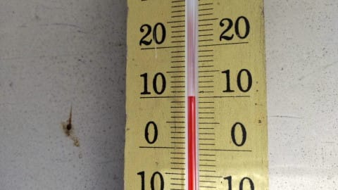

# 4月16，17日の週末の志賀高原スキー場の天気は？…16日はまぁまぁ冷えて曇り後晴れ，17日は晴れそう

📅 投稿日時: 2022-04-14 05:19:02

🏷️ カテゴリ: [スキー天気予想](c6554f5c3c106093b511a8daae23757e8.md)

スキーダイエットと仕事ダイエットの

効果がバツグンに効いているらしく．

先日鏡を見て，自分の上半身の貧弱さに

ちょっと驚いたSkier_Sです…

…このスキーダイエットのおかげで，

お財布もヤバいくらいダイエット

してるんですが（涙）

とりあえず．

今日もおこみん特派員から送られた写真を見ると…

今日も気温は+10℃と超高温ですね（泣）

そして，さらに晴天の強い日差しで，

朝から雪が緩んでいて…

普通ならこの時期，朝は硬めに締まってる

雪のはずが．

朝イチから，簡単におこみんちゃんが

埋められるほどの緩い雪だったようです…

普通はこの時期でも，少なくとも

あさイチは雪は硬くなる気温なのに…

…ダメだ．この4月，気温が高すぎる…

果たして，この高温はいつまで続くのか？

また，週末にかけての天気予想を

するわけですが…

でも，今日もいろいろヤバい感じ（涙）

なので，いつもの天気図解説はやらずに，

予想結果だけ書きますね．←天気図解説なんか読んでる人は少ないから，

普段からこのスタイルでいいんじゃないかという疑惑が…

14日(木)：朝は曇り~パラパラ雨(涙)

　終日雨がしとしと降り，時折強く降る．

　台風接近で気温は高め．朝から+5℃以上，

　昼間も+10℃くらい．

　でも天気は悪いので肌寒く感じるかも．

15日(金)：曇り時々雨．

　そんなに強く降らなさそうだけど，

　終日雨が降ったり止んだりの一日．

　この日も朝は+5℃以上，最高気温は

　+10℃近くまで上がる．

16日(土)：台風が東に抜け，冬型に．

　朝の気温は久しぶりのマイナスで，

　-2~3℃くらいに冷えてるかな？

　明け方は雨~みぞれっぽい雪．

　あさイチはもしかしたら重い雪が

　圧雪の上にうっすら乗っているかも？

　あさイチバーンは下地はガチガチ．

　昼間も気温は0℃前後までしか

　上がらず，バーンは緩みにくい，

　硬めガリガリバーン．

　明け方雪になり，うっすら雪が乗って

　いればガリガリバーンはちょっと

　ましかもしれないけど，

　その場合，午後に向かって天気は回復し，

　午後は日が射しそうなので．

　積もった雪が融けて強烈なストップ雪に．

　明け方雪が積もらなければ朝はガチガチ

　カリカリだけど，ストップ雪にはならず．

　さて．どっちがいいのやら…

17日(日)：朝から晴れ！終日晴れ．

　早朝営業の頃はマイナス気温．

　あさイチはかなり硬めのバーン．

　天気がいいので，午前中に雪は緩み

　昼間は+5℃以上まで上がりそう．

　昼ごろには雪が完全に緩んで

　荒れた雪になっていきそう…

…ってな感じでしょうか．

14，15日の台風の影響の高温の雨で，

雪が大量に融けなければいいんですが…

そして，16日の土曜は一瞬冷えるけど．

また，17日から気温が上がって

いきそうです…

今シーズン，1，2月は冷えて良かったけど．

3，4月は残念な高温が続くなぁ…(涙)

## 💬 コメント一覧

### 💬 コメント by (レインボー74)
**タイトル**: Unknown
**投稿日**: 2022-04-14 13:31:01

木曜日の志賀高原情報

朝の上林+13℃　蓮池+10℃　高天+7℃。小雨。

ゴンドラに乗るとまもなく濃霧の中に。

視界は全く悪いけど、雪面が真っ黒なのが怪我の功名。なんとか雪面が見えるので滑れます。

だけど、これまでの人生で、こんな黒い雪を滑った記憶はない。係員によると、昨日が休業日だったので昼に圧雪したからだそうな。

ゴンドラ一本が15分のペースで7本滑って、ふるい落とされました。根性ないんで。

帰りの高天は+6℃でした。

明日は私のシーズン最終日。雨の中をいつまで頑張れるのかなあ！

### 💬 コメント by (かず)
**タイトル**: Unknown
**投稿日**: 2022-04-14 20:01:16

最終日ですか？？？いつもより早くないですか？日曜から行く予定してます…

### 💬 コメント by (Skier_S)
**タイトル**: ダメだ…完全徹夜だ…
**投稿日**: 2022-04-15 06:45:44

＞レインボー74さま

雪はかなりとけたんでしょうか…

金曜は朝から雨です．

終日雨で，時折強く降ります．

レインウェア忘れずに！

＞かずさま

日曜は晴れの典型的な春スキーになりそうです．

春スキーと割り切ればいい日かと…

私は行けるか微妙になってきました

