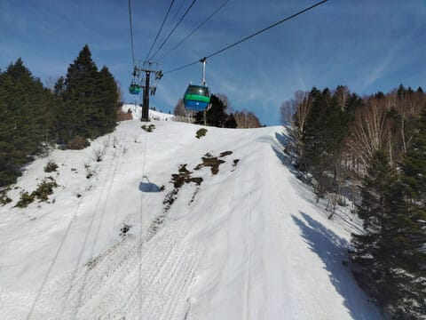

# 2025シーズンモデルのスキー板の試乗レポート速報…OGASAKA編　TC-S，TC-L

📅 投稿日時: 2024-04-12 01:16:24

🏷️ カテゴリ: [スキー板試乗](c0bd8048615710cee890e403a36cc9a2b.md)

本日も，志賀高原特派員から写真が

送られてきているわけですが…

うーん．

雪が減りましたね（泣）

焼額第1ゴンドラ沿いのGSコース，

一番最後の落ち込み部分が

閉鎖になりましたが．

日曜までは問題なくすべれたと

言うのに．

もうガッツリ土が出てますね…（涙）

そして．

ヤバいことに，パノラマコースも

コースにもう土が出始めてます（泣）

白樺コースをクローズしたから，

そこから雪を運んできて何とか

もたせてほしいところ…

プリンスホテル東館前，第1ゴンドラに

続くところも，雪をコースに寄せて

コース延命の準備に取り掛かりましたね…

ただ．こういった場所を除けば

またパノラマコースもGSコースも

雪はたっぷりあるみたいですし…

まだしばらくは問題なく滑れそう！

…ただ．本日も気温は朝からプラス（涙）

それでも朝のうちはわずかに下地の

硬さもあったようですが…

やはり朝のうちにもう緩んだ雪に

なっちゃったみたいです…（泣）

うーん．

天気図を見ても，

このあと17日まで，

全く冷えそうな気配がありません

というより．

今日発表の1か月予想のグラフを

見てみると…

なんじゃこりゃ～っ！！！！！！！

平年より+2℃ほど高い気温が，

5月6日のGWラストまでひたすら続きそう

なんですが！！？？

だめだ…

ダメすぎる．

GWまで雪がもつのか微妙…（泣）

せっかくこの春の焼額．

GWは1ゴン＆2ゴンで早朝営業を

やってくれるというのに…

何とかGWまで，2本のゴンドラが

滑れるよう，

これからGWまで寒気の歌を歌い続け

ましょうか…（涙）

ってなことで，本題へ．

先週末の志賀高原レポートで，焼額じゃなく

一ノ瀬でずっと滑っていたのはご存じかと

おもいますが…

また，スキー試乗会に参加してました～！！

だもんで，また速報レポート！

これからGWまでに，試乗会に参加する人も

いると思うので，その時の板選びの参考に

なるよう，簡単なレポートをまとめました．

詳細なレポートは，また後日，いつも通りの

濃厚なやつを書きますので，それまでお待ちを…

では，簡易版レポート，本日はオガサカ編！

〇OGASAKA TC-S+SR585 165cm

技術選向けのTCシリーズの小回り板．

一番強いSRプレートが入ったやつですが…

履いた感じ，かなり強い！しっかり硬い！

緩めの春の雪ではたわみにくく，かなり

気合を入れて圧をかけていかないと

小回り板のわりにまっすぐ目に走ります．

おそらく普通の人が履いたら，165㎝でも

ミドル，ヘタすればロングっぽいターンに

なると思います．

かなりスピードを出して，高速で落差を

取らないと鋭い小回りができない感じ．

求めるスピード域はかなり高く，

春の柔らか雪ってのもあったけど，

私に対しては板のレベルが高すぎる

感じでした…

硬い斜面だともう少し何とかなったかな？

〇OGASAKA TC-S+FM585 165cm

同じTC-Sでも，こちらはプレートが優しい

FMプレートの板．

これは…SRプレートと全然違う！

たわむ！曲がる！

エッジに乗ってキレキレターンができます．

スピードを乗せても板が負けることなく，

気持ちよくエッジの線に乗って小回りが

できます．

踏む量のコントロールでターン弧を

調整できる自由度も高いし，

ずらしのコントロールも良いので，

板を動かして弧を仕上げていくことも

できるし．

縦目に落とすターンからじっくり深いターン

まで，自由な中回り～小回りの弧が作れる，

かなりのハイスピードでも怖くない板．

結構気に入った！

〇OGASAKA TC-L+SR585 177cm

同じくTCシリーズの，こちらは大回り用．

優しめのSRプレート付きです．

R=21mと，長さが177cmにしてはRは大きめ．

比較的まっすぐ走るのかと思ったら，

意外と回転性が高い！

グリップも強く，角付けを強めれば

勝手にたわんで，小回り板か？と思うほど

カービングのまま小さい半径で回ることも

できます．

角付けをそれほどしなければR=21らしく

かなり半径が大きい大回りまでできるし，

回転弧の自由度はかなり高い！

トップからテールまでの長いエッジが

しっかり効いてグリップしてくれるので，

高速安定性も高いし．

それでいてこんな長い板と思えないほど

小さくも曲がれるし…

結構スピードを出す人で，

大回り用だけど，大回り特化ではない

板が欲しい人にはお勧め！

## 💬 コメント一覧

### 💬 コメント by (スキーイヌ)
**タイトル**: Unknown
**投稿日**: 2024-04-12 10:17:55

いつも楽しませて頂きありがとうございます。

オガサカの試乗情報、参考になりありがとうございます。

### 💬 コメント by (副院長)
**タイトル**: Unknown
**投稿日**: 2024-04-12 11:57:50

S様、小賀坂レポートありがとうございます。友人の昨年モデルのTC-Sを履いたのですが、高齢者にはやさしかったです。板がミスをごまかしてくれる感じでした。TC-SかTC-Lか悩ましい感じですね。他メーカーレポートも楽しみにしています。

スキーヤー殺しの高温が続くみたいですが、僕は自転車脳、ゴルフ脳に変換されていまして、あったかいのはうれしいです。すいません。

### 💬 コメント by (Skier_S)
**タイトル**: 試乗レポートは好評ですね…
**投稿日**: 2024-04-12 23:10:44

＞スキーイヌさま

コメントありがとうございます～！

今後も試乗レポート続くので，参考にしてください…！

＞副院長さま

TCシリーズは，毎年怖いほど乗り味が変わるので，気に入った板があったらその年の板を

買わないと，全然違うのでちょっとびっくりしちゃうかもしれません．

小回りベースなら，来年のTC-SのFMプレート付きがいい感じです．

TC-Lも177㎝ならゲレンデで行けますが，焼額みたいに人が少なくて大回りできる

ゲレンデじゃないと辛いかも…

