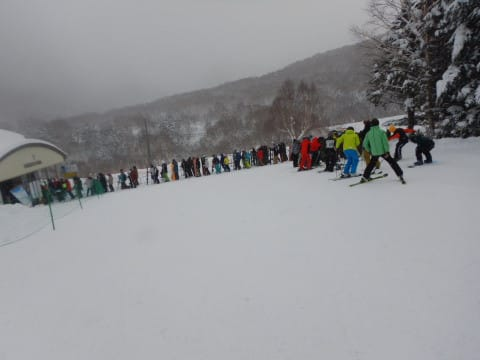

# 2021/12/19(日)の志賀高原焼額山スキー場の詳細レポート…朝は一瞬晴れたけど，曇~雪降りの一日．午前は混んだけど午後はガラガラ最高！

📅 投稿日時: 2021-12-21 01:27:16

🏷️ カテゴリ: [2022スキー滑走日記](cc9cb73e4320f6a97af6fccc37587a61a.md)

えー．

来ますね．

すでにニュースとかでも話題になってますが．

今週末25日から…来ます．寒波が．

今回も激烈寒波で，また積もりそうです！

今週一週間もそこそこの冷え込みが続き，

時折雪が数cm積もったり晴れたり…

という感じなので．

この一週間のゲレンデはかなり良さそう…！

とりあえず，週末に向けての天気は，

また後日に詳細に予想しますが…

この数日の積雪のおかげで．

志賀高原は次々ゲレンデがオープン

していく予定です！

一の瀬はパノラマコースが開いたし，

西舘も全面オープン済み．

さらに東館山が明日21日オープン，

寺小屋，ブナ平が明後日22日オープン．

サンバレーが23日オープン，

蓮池が25日オープンで．

25日の週末には，全面オープンになりそう！

我が焼額山も…

明日の21日から，オリンピックコースがオープン！

まだ第3高速が動いてないけど…

これも今週末には動いてくれるんじゃないかな？

([焼額山スキー場Facebook](https://www.facebook.com/yakebitaiyama/photos/a.533933973368620/4596891130406197/?type=3&theater)より）

いやー．

今シーズンは順調にゲレンデがオープン

してますね…

ここ数シーズン，12月は悲惨な状況が

続いたので，

久しぶりに例の踊りを踊らずに済む

12月となった感じ…

やはり，私の日ごろの行いかいいから

だな！！←昨シーズンまでは日ごろの行いが悪かったってことか…？

ってなことで．

本日は，激烈寒波で雪が積もった翌日，

12月19日の志賀高原の詳細レポートです！

えー．

まず．

朝8:30の営業開始を狙って，営業開始

30分ほど前から，焼額の第2ゴンドラに

並びますが…

営業開始時には，すごい列！

…これは，今日も混みそうだ…

山頂に着くと…

気温は-9℃と，結構な冷え冷え！！

…でも，予想は-12℃だったので，

3℃外した…(涙)

そして，

あさイチの天気は晴れ！

最高の冷え冷え＆晴天の朝！

…って，晴れてくれるのは嬉しいけど．

誰かの予想だと，

　志賀では降らない西風だけど，

　寒気が強いので，根性のある雪雲が

　北アルプスを越えてくるので，

　この日は曇ったり雪が降ったり

のはずじゃなかったっけ…？

そして．朝イチは最高の柔らか冷え冷え

雪のシマシマっ！！！

…これも嬉しいけど．

誰かの予想だと，10cmくらいの積雪が

あるはずなのに…

夜中の寒気が弱すぎて，朝の積雪は

ほぼ0(涙)

これも予想外した…(泣）

とはいえ．

昨日までに降った最高冷え冷え雪が

綺麗に圧雪された，トップシーズンでも

そうそう無い，最高級柔らか圧雪の

官能シマシマバーンっ！！

これだ！

このためにスキーをやっているのだ…っ！！

もう，12月第3週でこんな最高級の

シマシマバーンを，晴天のもと滑れる

なんて…っ！！

シアワセ．

シアワセだぁ…！！！

と．

気持ちよく最高シマシマを滑っていたけど…

第2ゴンドラは待ち時間10分弱…(涙)

第2高速リフトはずっと待ち時間

ほぼ0だったのに，

ゴンドラ，混んでるなぁ…

ってな感じで数本滑っていると．

本日は午前10時から，今シーズンの

第1ゴンドラ営業開始が予告されて

いたので．

第1ゴンドラが居住地である私としては，

行かずばなるまい！！←だから，ゴンドラに住んでないから

…ってなことで．

10時になったら，第2ゴンドラから

第1ゴンドラへ移動開始！

(10時前に移動したかったけど，2ゴンから

1ゴンへのコースオープンが10時だった…(泣））

…そうそう．

10時になったら，太陽は完全に隠れてしまい．

曇り時々雪の天気になったので…

朝の晴れ間がちょっと予想から外れてただけで，

基本的に私の予想は当たったのだ！！←自己正当化

しかし．

実に約9か月ぶりのGSコース…！

懐かしい…

何もかもみな懐かしい…！

…でも．

なんだか，コース上の人口密度が高いん

ですけど！？？

…これは，嫌な予感…

と思ったら．

案の定，オープン直後の第1ゴンドラ，

ものすごい列が並び始めていて…

自分は15分待ちくらいで乗れたけど．

後を振り返ると，列はさらに

倍くらいに伸びていて…

これまで，私が見たこともないほどの．

…おそらく第1ゴンドラの歴史的にも

最長の待ち行列では？という長大な

列になってました…

ってなことで．

実に久しぶりの第1ゴンドラとの再会に

感動していたのですが…

朝10時～11時頃まで，第1ゴンドラ

待ち時間30分(泣）

オープン直後，みんな1ゴン狙ってたのね…

だもんで．

9か月ぶりに戻ってきた，我が住み家の

1ゴンはしばし見捨てて．←なんてドライな…

第2ゴンドラ側に行ってみると．

みんな第1ゴンドラに行っちゃったから，

ガラガラですよ！

うほほほほ．

先週まで，2ゴンはずっと混雑して

いたので，ゴンドラグルグル

できなかったけど．

これだけ空いていれば，

ゴンドラぐるぐるできる！

今シーズン初のゴンドラぐるぐるだ！

…と，喜んだものの．

なぜかこのころにはゲレンデの雪も

激しくなり，視界がちょいと悪く

なってきたのでした(涙）

でも，昼間になっても気温は-10℃近くの

冷え冷えで．

降り積もる冷え冷え雪のおかげで，

板は滑ってゲレンデコンディションは極上！

さらに，午前中は激混みだった

第1ゴンドラも…

12時半を過ぎると，なぜか飛び乗りに！

ってなことで．

午後は第1，第2ゴンドラとも飛び乗りに

なったので，思う存分ゴンドラぐるぐるだぁ！！

雪の降りが強くなってきて，

視界はあんまりよくないけど…

でも，冷え冷え最高雪で．

さらに日曜午後のお約束，

みんな帰っちゃって人がいなくなった

ゴーストタウンゲレンデを，貸切で

滑り倒せます！

ふはははは．

これだよ！

貸切りのガラガラコースを

ゴンドラぐるぐるで休まず止まらず

滑り続ける．

これが私の求めるスキーだよっ！！

…と．

冷え冷え雪が降り積もり，雪質が

さらに良くなっていくゲレンデ状態に

喜びながら…

今日もしっかり営業終了まで，

お昼休みもとらずにノンストップで

ひたすら滑り倒したのでした…

いやーーーーー．

先々週から第2ゴンドラは動いて

いたものの，ずっと混雑してたので．

ホントに久しぶり，待ち時間の無い

ゴンドラグルグルを楽しめたよ…

もう，ゲレンデはトップシーズンの様相です．

ブッシュの心配もなく，新しい板を出しても

大丈夫！！

…そして，今週末も積もりそうだから…

いやー．

今シーズンは，最高の12月になりそうです！！

## 💬 コメント一覧

### 💬 コメント by (大阪のK)
**タイトル**: Unknown
**投稿日**: 2021-12-21 08:33:53

S様、今シーズンもよろしくお願いいたします🙇

先日お会いしたら、少しお痩せになったみたいです。

ちゃんと昼食を頂いて、しっかり滑りましょう❗

### 💬 コメント by (かず)
**タイトル**: Unknown
**投稿日**: 2021-12-21 10:35:33

下り効かない…10年位乗って初めて知りました  笑  absなんて現行の車なら標準装備なので  前のノアはいきなりハンドルきったのかもしれないですね  

下り緊急時はブレーキガツンと踏みっぱなしで逆ハンの準備が最適でしょうかね？

### 💬 コメント by (アリス)
**タイトル**: Unknown
**投稿日**: 2021-12-21 14:30:39

S 様

12月20より志賀高原に参戦しています🎵

シマシマ、ガラガラ、晴天下で最高のコンディションです☀

ヤケビと東館山のオリンピックコース久しぶりに楽しみました🎵

やはり、志賀高原はスキーの聖地ですね❗

先程、ユミ様と東館山の頂上でお会いし、ご挨拶できました🎵

不思議にレインボーさんとはすれ違いみたいです😅

### 💬 コメント by (レインボー74)
**タイトル**: Unknown
**投稿日**: 2021-12-21 17:35:29

火曜日の志賀高原情報

朝の上林-1℃　蓮池-2℃。晴れてるけど雲が多い。

パノラマから唐松へ。気持ちいい！老人に優しい食い込むバーン。

すぐにオリンピックへ。急斜面に入ると、な、なんだ、この凸凹は！右側と真ん中は硬い凸凹。左側に逃げたら大丈夫だったけど、魅力はない。

GSはまさに快楽快楽。人も少なく思うように滑れる。

奥志賀も行きたかったけれど、下の連絡道がヤバそうとのことで、歩くのが嫌で断念。

一ノ瀬ファミリーは昨日のぼこぼこが、こぶ斜面に変化。疲れます。

高天でピザのあとは、西舘へ。ブナゴンドラ、ジャイアントは運休。ブナへは上からしか行けない。

西舘第一が圧雪もよい快適バーン。独占禁止法に引っ掛かるんじゃないというくらいの、貸し切りマイゲレンデ。夢中で何本すべったか？

ただ、高天への連絡橋がクローズなのがつらい。

あとはいつも好条件を保ってくれるタンネ回し。ここも貸し切り。

曇り予報(てんきとくらす)が終日晴れで、得した気分。楽しく一日を終えることができました。(まだきょうは10時間も残ってた)

帰路にまた大きな事故。坊平橋から300m位上の、滝を見る駐車場の辺りで、松本ナンバーの車が横転してました。帰りの蓮池は2℃だったか4℃だったか？ともかく0℃辺りは危ないので、皆様どうぞお気をつけください。

### 💬 コメント by (Skier_S)
**タイトル**: 今週の志賀もいいコンディションキープ！
**投稿日**: 2021-12-22 02:43:21

＞大阪のKさま

いや…瘦せました(涙）

でも，スキーでお昼を抜いているより，平日仕事中に食事ができない方が

瘦せていっている原因です…多分．

＞かずさま

とりあえず，今の車のABSは良くできているのでフルブレーキングでOKです．

ただ，それでも急ハンドルを切るとヤバいので，ステアリングを回避方向にゆっくり切りながらフルブレーキングが正解だと思います…

＞アリスさま

シマシマガラガラ，うらやましい…！！

20日から滞在って，かなり正解ですね…

いつまで滞在ですか？

＞レインボー74さま

西舘貸し切りとは…！！贅沢ですね～！！！

明日はまた雪が積もりますよ！

明後日は晴れかな…

