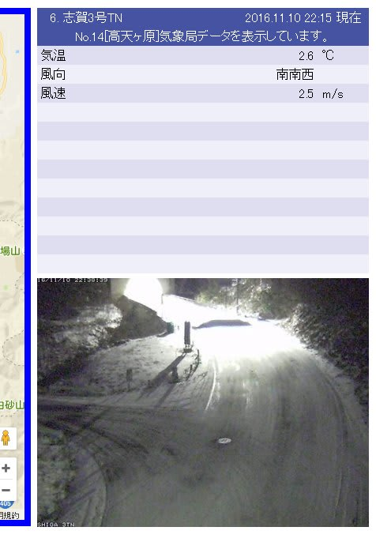
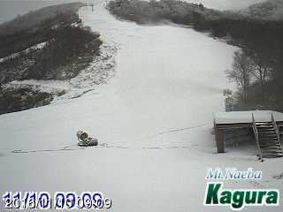
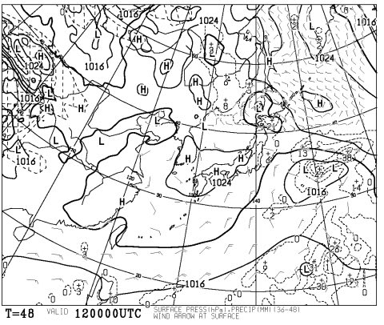
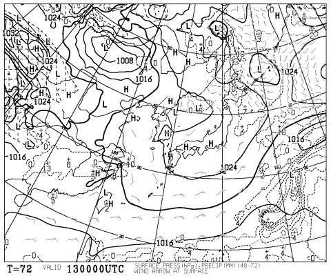
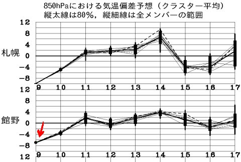
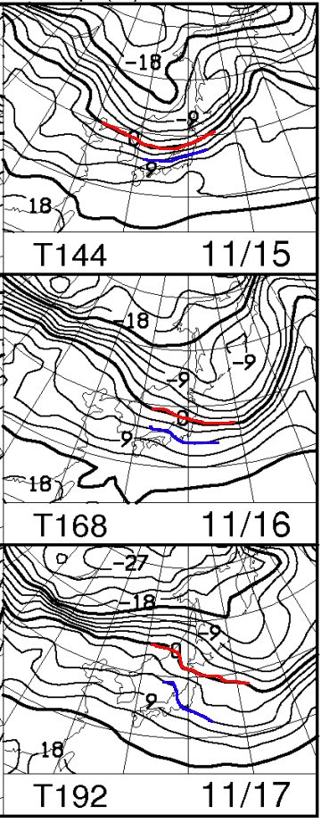
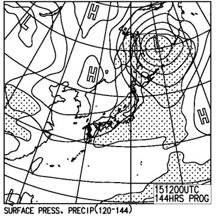

# 今週末のYetiの天気…そして，来週は冷えるのか？19日までに，雪が積もるのか？

📅 投稿日時: 2016-11-11 00:28:54

🏷️ カテゴリ: [スキー天気予想](c6554f5c3c106093b511a8daae23757e8.md)

えー．

風邪がひどくなり．

咳が止まらないSkier_Sです…（涙）．

ということで．

本日も，志賀高原の道路状況カメラを見ると．

見事に雪が積もってますし．

かぐらも今日は人工雪を打ち続けていたようで…

熊の湯も人工降雪機が稼働したらしく．

本格的なシーズン準備が始まった感じがありますね～！

…ってことで．

今シーズンも，シーズン初めの積雪状況が気になる時期に

なってきましたよ～！！

…そうです．

みなさんお待ちかね．←ホントか？待ってる人なんているのか？？

スキー天気予想の時期がやってまいりました～！

…まずは．

とりあえず．

今週末の天気ですが．

まず，土曜日．12日の地上天気図を見ても…

まぁ，高気圧に覆われてるし．

日曜13日の天気図を見ても…

この日も全体的に高気圧に覆われ．

Yetiも軽井沢も．

この土日は，雨に悩まされることは

なさそうな感じですね～．

気温は2日間とも平年並みで．

それほどガンガン冷えることはなさそう…

で．気になるのは．

来週末にオープン予定のスキー場が

いっぱいあるので．

それらのスキー場が無事オープンできるかどうかが

かかっている，来週以降の冷え込みなわけですけど．

…うーーむ．

9日の奇跡の冷え込みが終わった後は…

来週いっぱい．平年並みかそれ以上の

気温の日々が続きますね…（涙）．

来週は，冷え込みは期待できなさそう…（残念）．

大体，高度1500mの気温の目安になる，

850hpa気温図ですが．

15，16，17日と3日分を見てみても…

ううううーむ．

雪の目安，0℃線はまだ東北近辺．

むしろ，志賀高原近辺にはまだ+6℃線が

かかっているような状態で…

…これを考えると，15，16，17日は人工降雪を打つのすら

難しい気温っぽい…（泣）．

運が良ければ，夜中の冷え込みで．

夜中に数時間，人工降雪が打てるかもしれないけど…

…

…

でも．

15日の地上天気図を見ると…

どかーーん！

追い打ちっ！！

なんと．なんと．

雨が予想される網掛けが，

日本全土を覆ってます…

これは．

15日の1500m気温から考えると．

山のうえでも…雨です（泣）．

残念ながら，雪にはならなさそう…

ってことで．

残念なことに．

来週は，人工降雪機が動かせるかどうか

厳しい気温が続き．

さらに，火曜15日の雨があるので…

うーーーむ．

19日オープン予定のスキー場，

厳しいところが多いかも…（涙）．

うむ．

でも．

きっと．

奇跡は起きる！といいなぁ

来週，予想外の寒気がやってくる！といいなぁ

みなさん…

とりあえず．

今のところは．

来週冷えるよう，祈りましょう…←やっぱり今シーズンも，いろいろ祈るしかないのか…（涙）
