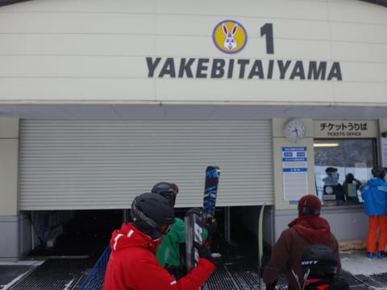
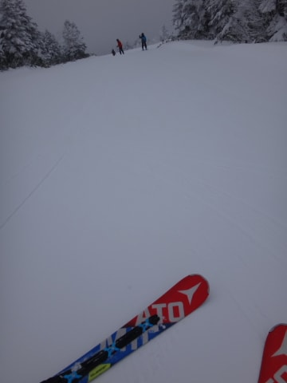

# 12月17日（土）の志賀高原は…ガラガラ，雪質トップシーズン並み！恵まれた一日

📅 投稿日時: 2016-12-17 22:30:52

🏷️ カテゴリ: [2017スキー滑走日記](c7d777cecfc91bdf0fa464ad62c6d49ab.md)

ということで．

本日も志賀高原を滑ってましたが．

いやーーー！

いいコンディションでしたね～！！

とりあえず．

朝，志賀高原に登る道は…

予想通り，完全パーフェクト積雪路です！

結構滑る，本格雪道を登ってやってきたのは…

…そうです．

本日オープン，焼額第1ゴンドラっ！

ついに．

戻って来たよ…ここへ…（感動）

第1ゴンドラのオープン前から並び．

今シーズンの1番搬器をGet！

…やはり．

焼額の全ゲストの中で．

焼額第1ゴンドラに乗る回数が最も多い人物

だと思っている自分としては．

シーズン1番に第1ゴンドラに乗っておきたいところ←いったいそれに何の意味が？

で．

1番ゴンドラで，山頂に出てみると…

-9℃と，結構冷え冷え！

そして，雪質は…

この時期としては最高の，冷え冷え圧雪！

コースわきはこんな感じで，10cm～20cmほどの

新雪が積もっていて．

コース上は，新雪が圧雪された，エッジががっつり

食い込むやわらかめの圧雪バーン！

うひょおおおおーーーーーーー！

帰って来たよ，朝イチ最高のGSコースっ！！

最高のかっ飛ばしバーン！

思いっきり飛ばしたい放題！

来たよ．

来たよ，私のトップシーズンが！！

午前中，10時ごろまではコースもガラガラで．

ゴンドラも飛び乗りで．

コース脇はこんな感じだし．

もう，エッジががっつり食い込む最高の，

人がいないかっ飛ばしバーン！！！

これで，ゴンドラ待ちもなく飛び乗りだし…

いやー．

最高なんですけど！？？

これ以上，何を望もうというのか！！

もう，昼近くまで，コースはガラガラのまま．

ホントに，タイミングによってはこんな感じの

貸し切りバーン！

こんな雪質がいい，最高バーンで，

こんなガラガラでいいの？？

GSコース，旧第3ロマンス脇の100mちょっとほど，

ちょいと硬い下地が出てきたところがあったけど…

それ以外は，文句なし！

去年の1月中旬より，ずっといいよ！！！

…で．GSコースは良かったけど．

第2高速沿い，唐松コースに行ってみたところ．

ちょっとアイスバーンがコンニチハしてて，

こんな氷のコロコロがありましたが…（涙）

でも．

唐松コースのコース脇．

を！？？

プチパウダーじゃないですかっ！

10cmほどのうっすらパウダーですが，

美味しくいただきました～．

ちなみに，第2高速も．

第1ゴンドラ同様，完全飛び乗り状態でした…

第2ゴンドラ側，パノラマ～サウスコースは．

雪質は問題ないものの．

ちょっと人が多かったかな～．

今日は，時折風が強くなり，第2ゴンドラが

減速するタイミングもあったにもかかわらず．

このシーズン恒例の某所の研修会があったからか．

第2ゴンドラ側，結構人口密度たかかったです…

それに比べると．

1ゴン側のGSコースは…

午後になってもこんな感じ．

Oh!ゴーストタウン…

某所研修会の人が流れてきて，1ゴン側のGSコースも

午後一瞬だけ混んだタイミングもあったけど．

混んだのはわずか一瞬．

もう，それ以外はほとんどこんな感じ．

午後になっても，気温は全く上がらず．

最高気温も-7℃程度で．

雪質はいいままキープ！

天気も，一日中．

曇り時々小雪が舞う感じで．←午後晴れるんじゃなかったのか？？？また，天気予報外したようだな…（涙）

ひどい吹雪やガスになることなく，

晴天ではないとはいえ，穏やかな天気で．

夕方，日が暮れるまで滑り続け…

いつも通り，営業終了間際に最終の第1ゴンドラに

飛び乗る私．

私「今年もいつも通りのぎりぎり飛び込みです～！」

索道係「やっぱりですね～．お待ちしてました（笑）」

って感じで．

いつもの第1ゴンドラとの再会を，最後まで楽しんだのでした…

いや．

良かった．

完全トップシーズン並みのコンディションなのに．

がら空きで．

今日は良かった…

…来週，このゲレンデが雨で壊滅してしまうとは．

今のところ，とても信じられないSkier_Sなのでした．

## 💬 コメント一覧

### 💬 コメント by (まいる)
**タイトル**: 初滑り
**投稿日**: 2016-12-18 22:28:32

Sさん、お疲れ様です。

やっとシーズンスタートしました。

雪はまた十分とは言えませんでしたがよかったです。

### 💬 コメント by (Skier_S)
**タイトル**: まいるさま
**投稿日**: 2016-12-19 08:55:23

初滑りはどちらへ？

志賀はコンディション良かったですよ～！

### 💬 コメント by (まいる)
**タイトル**: スキー場は
**投稿日**: 2016-12-19 17:49:44

丸沼です。まだロープウェーはダメだでしたが。写真は、最初のコメントのリンク参照ください。

### 💬 コメント by (Skier_S)
**タイトル**: まいるさま
**投稿日**: 2016-12-20 01:40:12

丸沼ですか！

写真見ていると，コンディションは

良かったみたいですね～！

これで混んでなかったらいい感じですね！

