# 2018/11/25(日)，3連休最終日の熊の湯スキー場詳細レポート…雪がもう少し欲しいけど，この状況では上出来のゲレンデかな

📅 投稿日時: 2018-11-27 02:12:01

🏷️ カテゴリ: [2019スキー滑走日記](c3e4496fc0fb7f9c17ff21214a35b1ace.md)

ってなことで．

昨日速報した熊の湯の詳細レポートです！

えー．

まず．

朝ですが．

いきなり事故火災による高速通行止めに出くわすなど．

不幸なスタートになったこの日（涙）

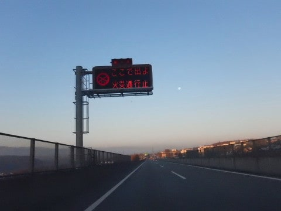

小諸インターで強制的に高速から下されて．

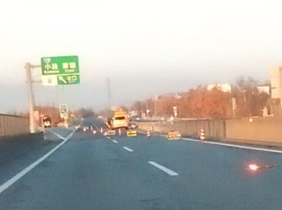

小諸ICから東部湯の丸まで，下道を

走らさせられることになるという…（泣）

そんなこんなのトラブルはあったものの．

志賀高原にやってきました～！

…今年は夏に志賀高原に来ていないので．

タケノコ狩りの6月以来，久しぶりの

志賀高原ですっ！！

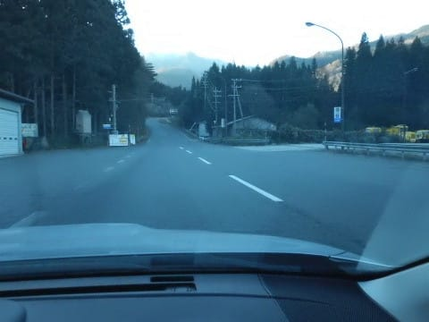

上林のチェーンチェック場は，

まだ全然雪がありませんね…

サンバレーまでは完全にドライ道路

でしたが．

をを！

サンバレー，もう人工雪を打ち始めてますね．

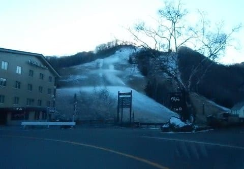

…そして．

蓮池を過ぎたあたりで，道路も雪景色に

なっていきます…

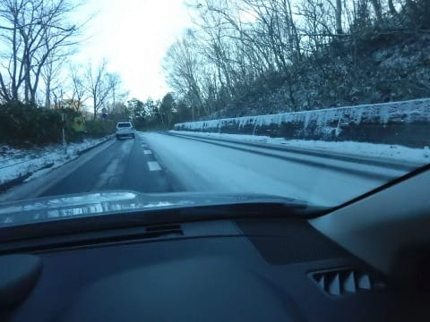

うむ．

何か命を懸けたチャレンジをしてみたい方

じゃない限り，

スタッドレスを履いて走ることを

おススメする道路状況です．

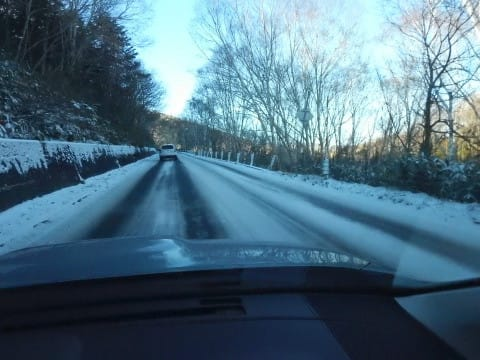

そして．

駐車場がいっぱいだったので．

スキー場からかなり離れた路上に

駐車して（涙）

とぼとぼゲレンデまで歩くこと数100m…

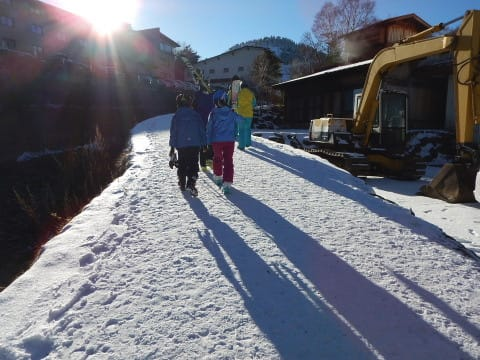

ついに来ました，熊の湯スキー場っ！！

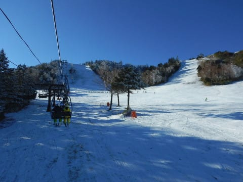

天気はピカピカ晴天！

気温も朝のうちは冷え気味で．

いやーーー．

やっと来ましたよ，アイスクラッシュじゃない，

リアルな氷点下のスキー場へっ！！

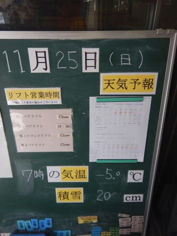

朝の気温は-5℃ということで．

朝の雪質は，結構いい感じ！！

しっかり硬めに圧雪された，いい感じに

スピードの出るバーンです！！

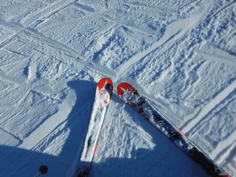

では，今シーズンの志賀の一本目．

いきまーーーす！

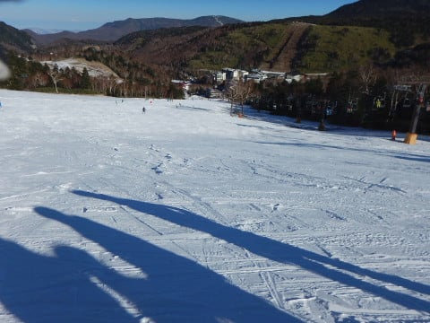

いやーーーー．

気持ちいい！

もっとひどいかと思ったけど，予想より

コース幅は広くて，

Yetiではできなかった大回りの幅で

ターンができるよ！！

…でも．

滑れるのは人工雪を打っている幅30mほど．

そこを外れると，ブッシュさんがいっぱい

コンニチハしていますので，注意が

必要ですが…

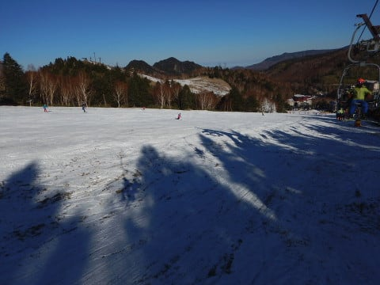

とりあえず．

リフトはペアリフト2本とも動いていたので．

朝のうちは，リフト待ちもこんな感じで．

ちょっと混んでるかな～，という程度．

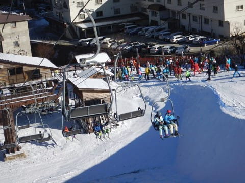

ゲレンデもそんなにひどい混雑では

無かったけど…

SAJの研修会の皆さんが出てくると．

うーーむ．

やはり，ちょっとすごいリフト待ちに

なってきましたね…（涙）

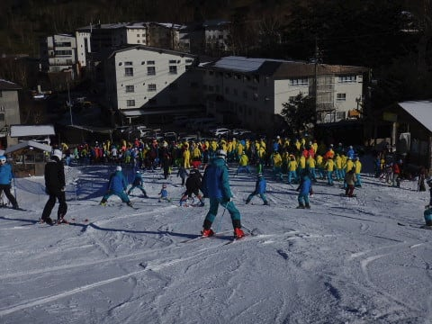

SAJの研修会の皆さんは，かなりの

人数がいましたが，コースの両脇で低速種目を

じっくり練習してたので，

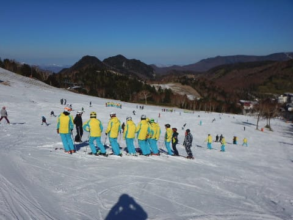

Yetiのようにコース上がすごいことになることは

無かったですが．

それでも，ゲレンデは結構な人口密度ですな…

まぁ，でもコース幅はYetiよりずっと広いし．

雪も結構いいから楽しめるよ！

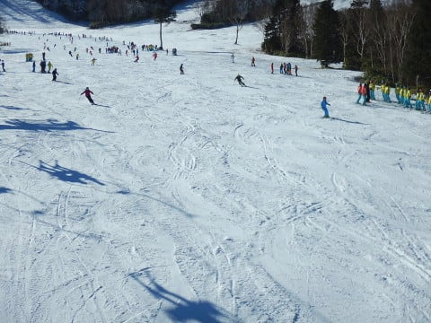

…とはいうものの．

やっぱりかなりの数の人が滑るわけですから…

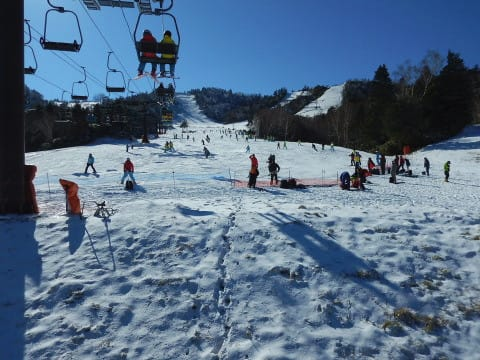

午前中のうちに，結構な凸凹バーンになって

来ましたね…（ちょいと涙）

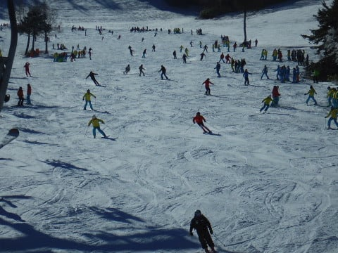

昼ごろには，SAJの研修会も終わり．

リフト待ちもだんだん減っていき…

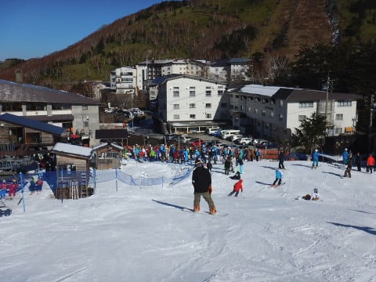

ゲレンデ人口密度も減っていきましたが．

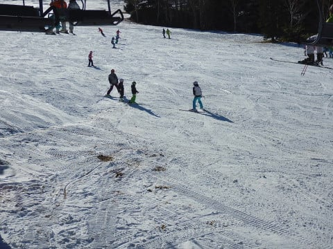

でも…

なんだか．

ゲレンデの凸凹がかなりアグレッシブになっていき．

ボコボコ飛ばされる，洗濯板バーンに

なってきてるんですけど…（涙）

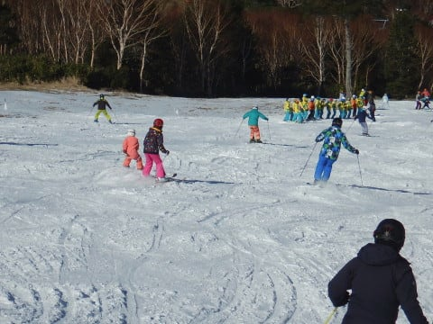

とはいうものの．

午後は気温はプラスにまで振れたけど．

午後になっても，雪質はそれほどひどく

悪化せず．

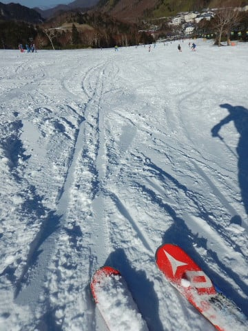

リフトも飛び乗りだったので．

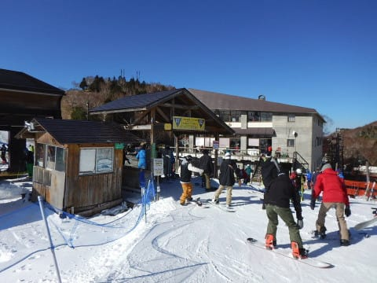

午後も結構楽しめたかな～．

…だけど．

いろいろ都合があって．

本日は午後に入ってすぐ．

1時に切り上げました（涙）．

でも．

この3連休の熊の湯．

奇跡の22日の積雪があって，思いのほか

いいコンディションで楽しめましたね～．

22日の積雪が無かったらと考えると，

恐ろしい…

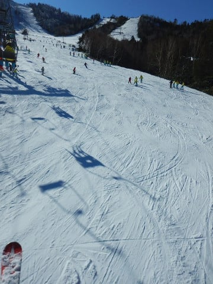

今週末は，焼額や一の瀬もオープンするはずなので，

ガンガン雪が降ってほしいところですが．

ですが．

うーーーん．

28日夜は，暖気が流入して．

ちょっと雨が降りそう…（涙）

でも，29，30日はボチボチ冷えそうなので．

この2日間で，フルパワーで人工降雪機を

動かして，何とか無事オープンしてほしいところ！

…しかし．

これから一週間．

天然雪が降るような天気じゃないので．

今週末の焼額オープンは．

間違いなく，第4ロマンス1本しか動かない

だろうな…（涙）

## 💬 コメント一覧

### 💬 コメント by (Goku)
**タイトル**: お疲れさまでした～
**投稿日**: 2018-11-27 20:54:34

日曜日はお疲れさまでした～♪

思いのほか、熊の湯良かったですよね～。

でも、奇跡の天然雪がなかったらあそこまでコンディションは良くなかったかもしれませんね。

それにしても、今週の暖かさは異常です(>_<)

来週の焼額山オープンが心配になってきました。

では、週末焼額山でお会いしましょう！

### 💬 コメント by (Skier_S)
**タイトル**: Gokuさま
**投稿日**: 2018-11-28 08:16:39

今日の夕方～夜までは暖かいですが、

今晩から冷えます！

木、金と人工降雪機に頑張ってもらいましょう…

オープン日のサウスコース、雪は薄そうな予感…

