# 2025/5/1(木)，GW谷間の志賀高原スキー場滑走レポート！…そしてGW4連休の志賀高原の天気は？

📅 投稿日時: 2025-05-01 21:09:16

🏷️ カテゴリ: [2025スキー滑走日記](cacd3fbf84d4a679ee61a5894c3f95e14.md)

えー．

GWの谷間の平日というのに，まだまだ

志賀高原に滞在しているわけですが…

しかし，さすがに今日は平日で．

いくつか会議に出なくてはならず…

ゴンドラの山頂のベンチやら車の中で

何回かWeb会議に参加していた

Skier_Sです…

基本的に私の部署はカメラOffでWeb会議

参加なので，どこにいるのか突っ込まれ

なくて良かった…

さすがにゴンドラ駅舎と雪山が背景だったら

ちょっとヤバい…

（そもそも私が休暇を取っているを承知で

緊急会議をつっこまれたんだから，

そのくらい許してほしいけど）

というところで，今日の志賀高原…

のレポートに行く前に．

そろそろGW4連休なので，これから4連休までの

志賀高原の天気を予想しておくと．

5月2日(金)：朝はぎりぎり降らずにいて

　くれるかもしれないけど…

　ヘタすると早朝から雨．

　遅くとも9時過ぎには雨．

　昼頃にはかなり強く降る．

　夕方まで雨は降り続ける．

　それ以前に強風でゴンドラはヤバそう．

　ヘタするとリフトも止まるかも？

5月3日(土)：終日晴れ！！

　早朝は0℃くらいまで冷え，早朝は

　かなり硬めのバーン．

　昼間は気温が上がるけど，朝はしっかり

　雪が冷えるので，8時ごろまでは

　締まったバーンを滑れそう．

　昼間は気温が上がり，日差しもあるので

　雪は緩み，バーンは荒れて滑りも悪くなる．

　夕方から雲が増えていくか…？

5月4日(日)：曇り～晴れ．

　朝は気温がそこまで下がらず，

　早朝からちょいと緩み気味の雪．

　でも，朝のうちは日差しも弱く

　そこまで雪は緩まず．

　運が悪いと，午前中に液体が

　ぽつぽつ落ちてくるかもしれないけど…

　本格的雨にはならない．

　午後は晴れていきそう．

　気温が高いので午後に晴れると

　日差しで雪が滑らなくなり，

　荒れていく．

5月5日(月・祝)：終日晴れ．

　早朝から+3℃程度．早朝は雪が

　締まり気味かもしれないけど，

　通常営業のころには緩み始めてる．

　昼頃には日差しで雪がザブザブになり

　滑りも悪く荒れた雪になっていく

5月6日(火・祝)；曇りのち雨．

　降り始めの時間はまだわからない…

　運が悪いと，早朝から雨(泣)

　運が良ければ昼過ぎまで降らないで

　もってくれる．

　今ではまだ5日後の低気圧の通過時間が

　正確に予想できないです…

　でも，気温は高めで雪は朝から

　ダメだと思う…

ってな感じでしょうか…

4連休は5月3日の朝以外，あんまり冷える日は

無さそうです（泣）

それどころか，4日，6日と雨になりそう（涙）

という4連休の天気を予想したところで．

本日の志賀高原のゲレンデレポートです！！

まず．

昨日の夜，お酒を飲んで楽しい時間を

過ごしてしまった結果．

夜寝るのが11時過ぎになってしまい，

朝5時には起きられず…（泣）

かなり眠い中，なんとか7時前に

焼額に到着！！

焼額はすっきり晴天です！！

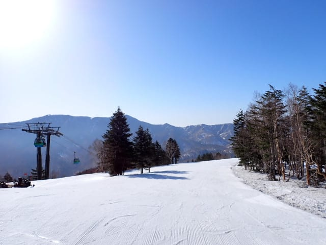

朝7時の気温は，山頂で+2℃．

未明には氷点下まで行ってしっかり

冷えたようです！！

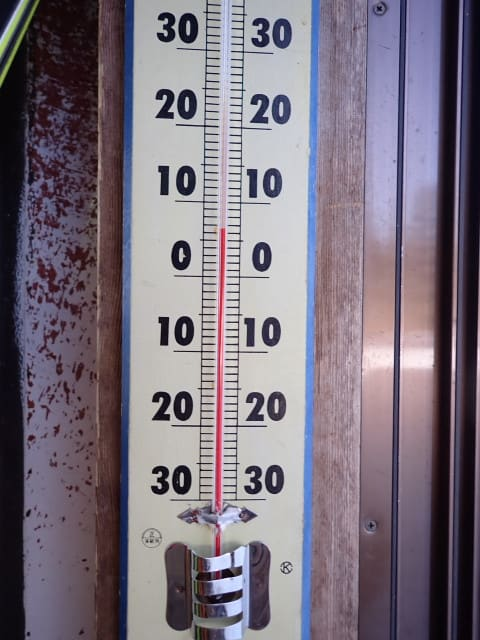

だもんで…

早朝営業開始から1時間たった7時でも，

硬く締まったバーンはシマシマが

残ってます！！

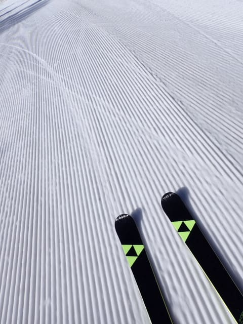

うほーーーー！！

これは私の大好きな，ザラメが硬く締まって，

硬いのに表面のざらざらにしっかりエッジが

効くので，スピードを乗せて思いっきり

傾いていける，快楽バーンじゃないですか！！

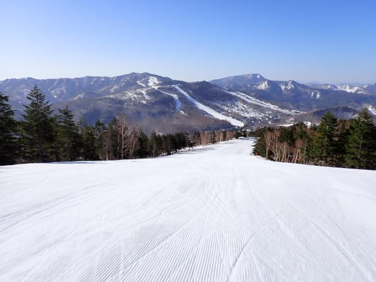

いや…

最高！！

今日の早朝は最高！！

1時間出遅れたのが惜しいけど…

ハイスピードでがっつり傾ける，

快楽官能シマシマバーン！！

雪が硬いので，8時近くまで

シマシマが残ってるよ！！

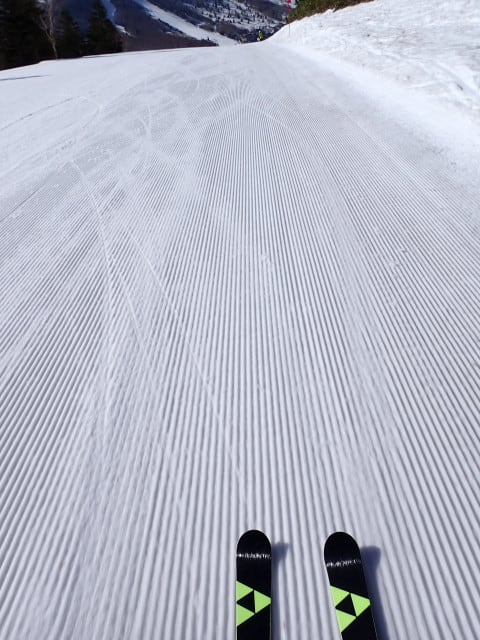

日当たりのよいサウスコースは，8時前に

残念ながら緩み始めて来たけど…

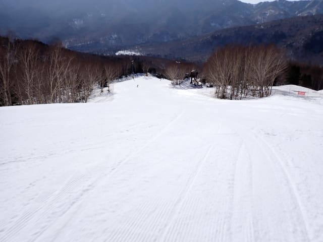

GSコースは8時を過ぎても，表面は緩み

始めたけど下地がしっかりしていて，

快楽カービングバーンをキープ！！

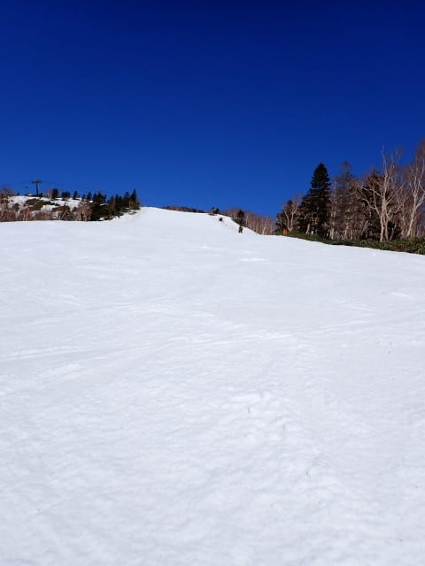

今日は明け方にかなり気温が冷えたからか，

9時ごろまではかなりしっかりした下地が

残った感じの，いいバーンが滑れました…！

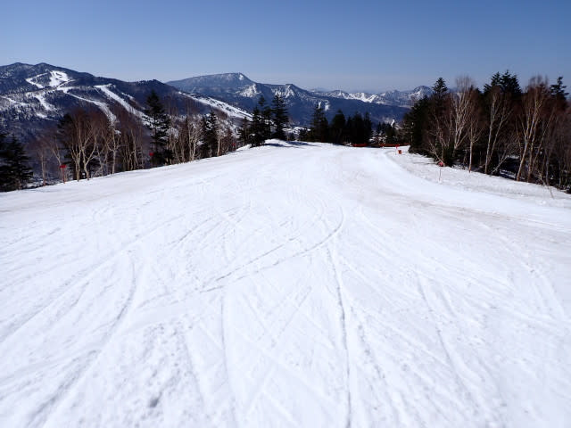

なのに…

今日もGWの谷間の平日ということもあり．

昨日にも増してガラガラ．

もう，ゴンドラの係員の方がさみしそうに

しているほどガラガラ．

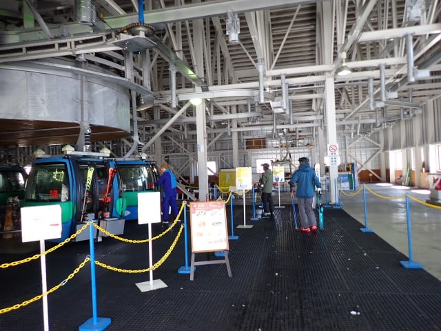

ガラガラなので．

雪は10時ごろにしっとりしはじめてきたけど…

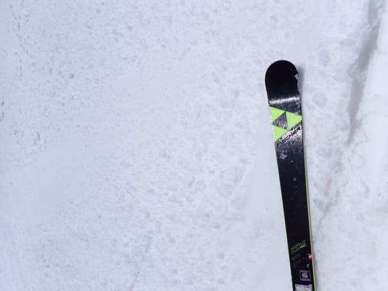

普通は雪がしっとりするとバーンが

荒れ始めるところ．

今日は人が少ないので，雪が柔らかいけど

バーンが荒れない！！

ザブザブの雪になってきたけど，

フラットなので大回りできるよ！！

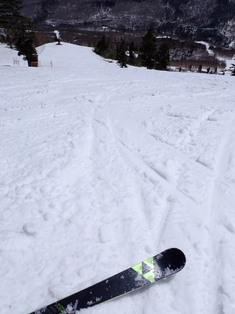

こんな晴天で11時近いのに…

バーンはほとんど荒れてきてないの

ですが…！？？

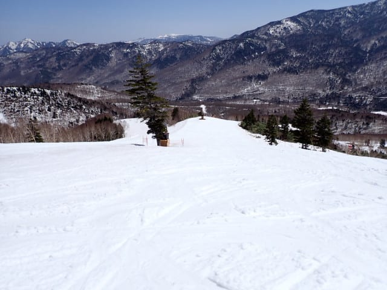

…と，喜んで滑っていたところ．

11時ごろには山頂でも気温が+10℃を

越えてきちゃって…(涙)

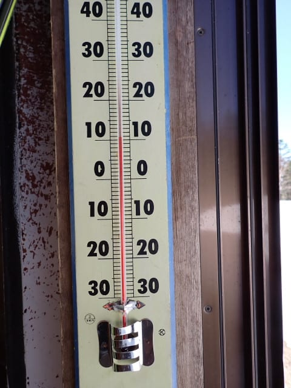

滑る人も少ないので，緩斜面は雪の汚れが

浮いてきて，かなり滑りが悪くなって

きたのが残念…（泣）

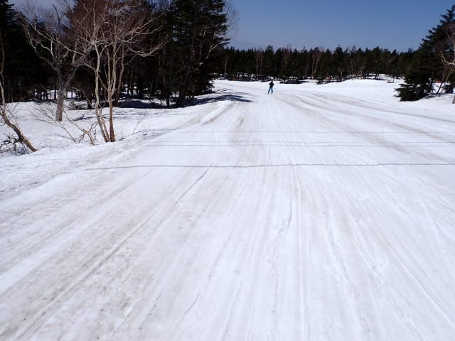

でも，今日は12時ごろでもバーンは

こんな感じで荒れておらず，大回り板で

滑れましたよ～！！

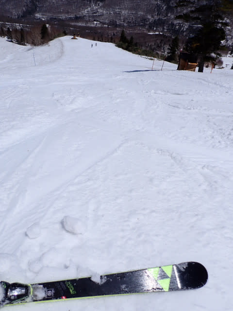

しかし，12時を過ぎると，雪の汚れは

加速度的に悪化して，激烈に滑りが

悪くなっていき…

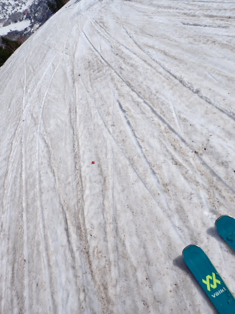

緩斜面では，かなり漕がないと滑らない

ようになってしまい．

緩斜面の移動がつらいんですが…

憎い…雪を融かして滑りを悪くする

日差しが憎い…

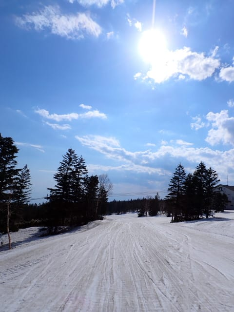

人が少ないので，急斜面は午後3時近くに

なってもそんなに荒れておらず．

雪はかなり重いものの，結構楽しく

大回りできるフラットさだったので…

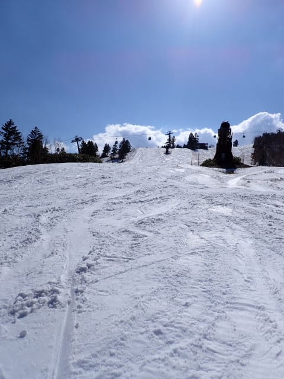

緩斜面に妖怪板つかみが団体で

大量発生したのが惜しい…(泣)

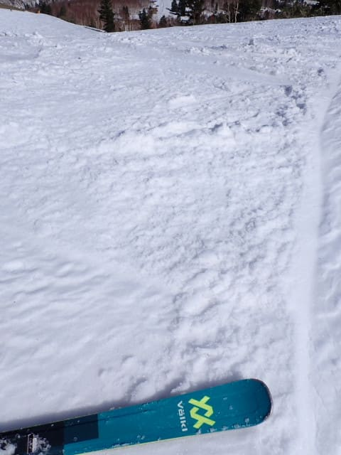

そうそう．

今日も小籠包コースのコブは2ライン

残っていて，コブの底に土が出ている

ところは全くなかったですよ～！！

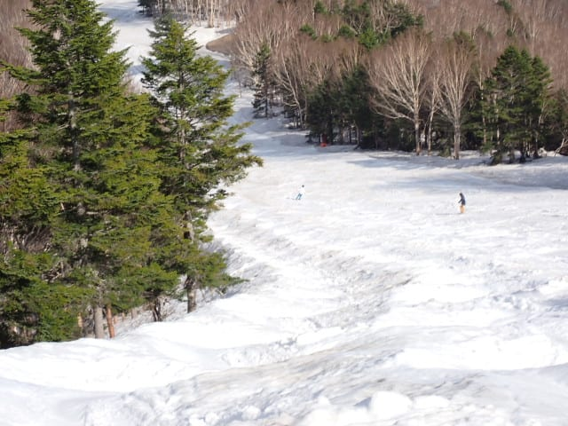

人工降雪設備を新設したパノラマコース．

気合を入れて人工雪を打っただけあって，

いつもならそろそろ地面に川ができて，

雪に穴が開き始めるころなのに．

今年は間違いなく，歴史上もっとも

パノラマコースに雪が残っている年ですね…

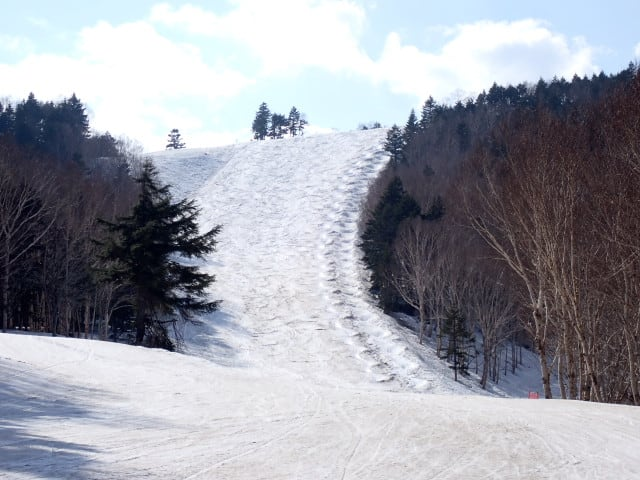

ってなことで．

緩斜面の妖怪板つかみと闘いながら

滑り続けた本日．

妖怪板つかみとの戦いに敗れた人が

多く，選ばれし民しか滑ってなかった

ので，営業終了時でもバーンは

この程度しか荒れておらず…

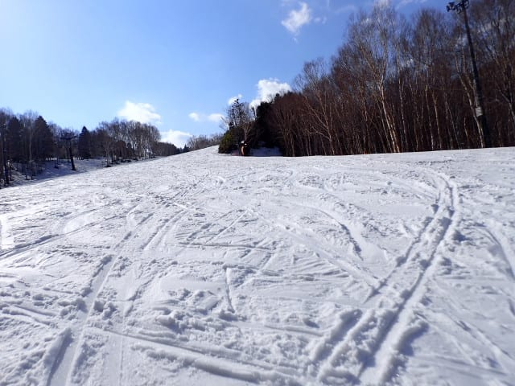

これで妖怪板掴みさえいなければ

楽しかったのに…

と思いながらも．

いつも通り，15；30の営業終了まで

（途中何回か会議で抜けながら）

滑り続けていたのでした…

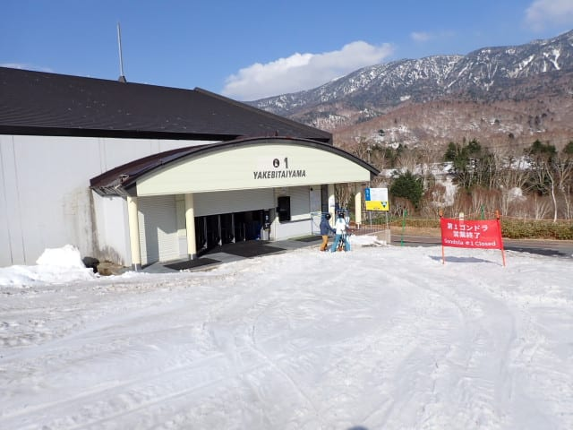

明日は雨＆風でコンディションが悪そう…

というか，ゴンドラが動かないかもしれないし．

ヘタするとリフトもヤバいけど…

何とか早朝くらいは天気と風が穏やかなまま

もってほしいな…

ということで．

明日もまだ志賀高原で滑ってますよ～！！
