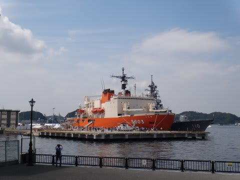
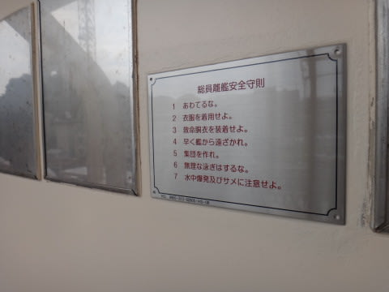

# 昨日は横須賀海上自衛隊＆米軍基地一般公開に行ってたので…

📅 投稿日時: 2013-08-04 13:15:49

えー．

昨日は日記の更新が無かったのですが．

昨日の土曜日．

なんだか，横須賀海上自衛隊と米軍基地の一般公開があるってことで．

ちょいといってみてたわけですね～．

…JAXAの一般公開とか，そういうのが大好きなんですよ．

で，今回．

横須賀自衛隊では，南極観測船「しらせ」の一般公開が

あるってことだったので行ってみました…

海上自衛隊の一般公開．

朝のうちは多少列がつくらしいけど．

昼過ぎに行ったので，入り口前の手荷物検査も待ち時間なく，

あっさり入れました．

んで，しらせに乗船…

の前に．

手前にあったヘリ，SH-60Kにトラップ．

気楽に中に入れてくれるんですね～

そんなこんなで，乗船します．

まずは飛行甲板．

でかいな～．

…これはレアかも．

「海上自衛隊」名のスノーモービル(笑）．

格納庫では，南極の氷やら…

機関長による船の説明の熱演．

現場に行かないと分からないお話がいっぱいあって面白かったですよ～．

あとはブリッジ見学やら，

居室の見学など．

…でも．この船．さすが自衛隊の船．

こーゆーパネルがあるのもちょっと引きますが．

こんな感じのパネル，すべて命令口調でした(笑）．

そして．

次からは，私にとってはおまけ．

護衛艦の一般公開です．

まずはイージス艦「きりしま」から．

乗船すると…

こーゆー魚雷発射管とか，無造作に触れる状態で展示されてたりします．

そして，前甲板．

練習用砲弾が展示されてたり…

触らせてもらったり．

マニアにはたまらんでしょうね～

こっちは護衛艦「てるづき」

射程24kmの5インチ速射砲を持つ護衛艦．

人が少なかったので，いくつか質問…

私「速射砲発射の映像とか見ると，ドンガラドンガラと廃莢されてますが，

　あの薬莢はどこから排出されてるんですか？」

隊員「あの砲身上部の穴からです…

　　排出された薬莢で，甲板がかなり傷つくんですよね～」

と，指差された先には，確かに薬莢がぶつかってへこんだ三日月型の跡が…

そのほかにも．

いろいろ質問に気さくに答えてくれて．

楽しめましたね～．

とりあえず．

いろいろ展示物が楽しめた自衛隊一般公開．

このあと，米軍基地の方も行ってみましたが…

こちらは露店が並ぶだけの，いわゆるお祭り．

露店も巨大ホットドッグやら，

巨大ハンバーガーやら…

アメリカンな感じで面白かったですが．

入場に最高2－3時間待つらしいので

＃私が入場した午後5時過ぎは待ち0でしたが

自衛隊のほうが，面白かったなっ！
