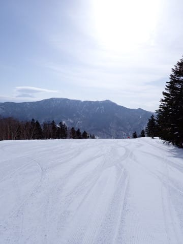
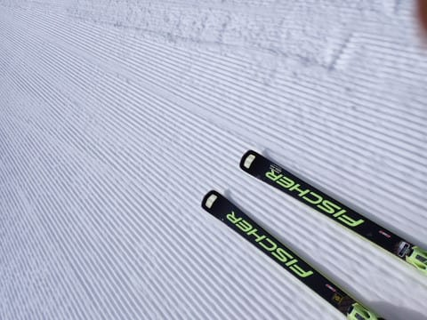
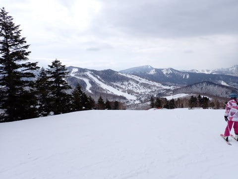
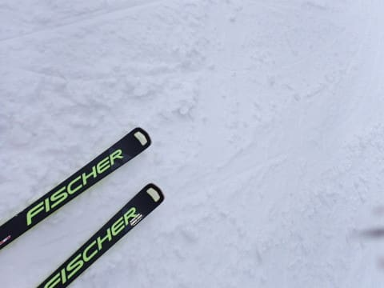
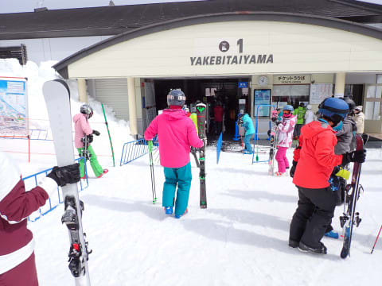
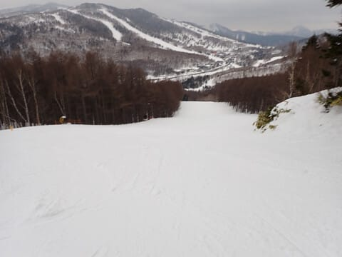
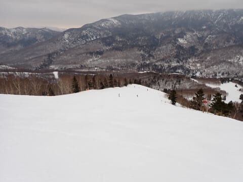

# 2024/3/17(日)の志賀高原スキー場，速報レポート！…朝一瞬だけ晴れ，午前から曇り空．気温は高めで雪は緩んだけど，焼額は良かったよ！

📅 投稿日時: 2024-03-18 01:48:12

ということで．

今日もお約束通り，営業終了時間まで

滑り続けてから帰ってきたため…

帰宅はいつも通り深夜（泣）

なので．

帰宅日定番の，速報モードでの

本日の志賀高原レポートです！

えー．

まず．

あさイチはうっすら雲が出ていたものの，

日が射してたんですよね…

でも．

朝から日が射して，さらに朝から山頂の

気温がプラス（涙）

だもんで．

さすがにあさイチは冷えて硬くなる

だろう…

と思っていたら硬くならず．

朝からバーンはかなり柔らかめ．

ただ…

柔らかかったので，エッジは食い込むし．

コロコロは出ないし．

中途半端に硬いより良かったかも…？

で．早くも9時半ごろには空が曇り

始め…

日差しは弱まったものの，気温が高かった

ので…コース上はかなり緩んだ雪に

なってきました（涙）

でも，今日もリフトもコースもそんなに

混まず．

ゴンドラはピークの朝10時過ぎでも，

ゲートの外まで列がつくことがない

くらいのガラガラ具合だったし…

午前中はかなり雪が緩んできたので，

ザブザブになって雪が荒れるかと

思っていたけど…

人が少ないせいもあって，雪は緩んでも

バーンはそれほどひどく荒れることは

なく．

むしろ昼を過ぎてから，朝よりも気温が

冷えてきたこともあり．

ちょっとしっとりと緩んだバーンがむしろ

しまったいい感じの雪になって

きましたよ…！？？

特に人工雪を打ってあるサウスや

GSコースは，硬いアイスバーンやカリカリ

バーンではないのにしっかり締まった

感じの雪になり，

営業終了時間まで，大回り板で

全く問題なく滑れる，

結構気持ちよく滑れるバーン状況

でした…！

ってなことで．

朝から気温が高く，

午後は結構雲が厚い曇り空で．

バーン状況は見にくかったものの．

思ったほどバーンは荒れず，

焼額は雪もそこまでひどく緩まず，

意外と楽しく滑れた一日でした～！

そして．

明日月曜から明後日火曜にかけては，

冷えてパラパラと雪が降りますが…

かねてより予告してきた通り，

20日水曜から21日木曜にかけて，

結構積もりそうです…！！

22日の金曜は，降った後の冷え冷え晴天で

最高なんじゃないかな？？

…だけど．

ちょうど次の週末になる

23日土曜から気温が上がって．

24日日曜は…うーん．微妙．

今のところまだ予想精度は低いけど．

運が悪いと液体がポツポツ落ちてくるかも…

とりあえず．

次の週末もいい雪で滑れるよう，

来週末に滑る方はこれから1週間，

日頃の行いにご注意ください…

また明日，仕事がちゃんと終わって気力があれば

今日の志賀高原の詳細レポート書きます～！

## 💬 コメント一覧

### 💬 コメント by (レインボー76)
**タイトル**: Unknown
**投稿日**: 2024-03-18 12:15:14

月曜日の志賀高原情報強風16m/s。いちごん稼働。ニゴン運休。我らは四ロマスタートです。朝の蓮池-8℃。昨日より13℃も低い。駐車場はさらさら雪10センチ。重そうな雪が降っています。

朝イチの四ロマは我ら４人だけ。唐松はほぼサラ場。左端は新雪5cm、右端は吹きだまって20超え。ウハウハ言いながらひたすら7本も回したからたまらない。手足が冷凍人間に。そもそもニ高は寒いので二本が限度だと決めてるのに、あまりに良すぎて。

GSはまあ普通だったけど、唐松に満足しすぎて早上がり。仲間によると、オリンピックは20新雪がぼこぼこになってたけど滑りやすかった。SGSは硬い底づきがあるし、吹き飛ばされて少ししか雪が乗っていない。その下のイーストが完璧。三高運休が勿体ない。GSサイド下部が荒らされてなくてよかった、とのこと。

### 💬 コメント by (地元民)
**タイトル**: Unknown
**投稿日**: 2024-03-19 07:29:58

長野県北部、予想降雪量、48時間で最大100㌢だそうです。

すげ〜な、3月下旬なのに😱

### 💬 コメント by (富山県民)
**タイトル**: Unknown
**投稿日**: 2024-03-19 16:27:44

こんにちは。

3月18日も志賀高原焼額山で滑走されたのですね。

私は3月18日はスキー場には行きませんでした。

3月18日は開業したばかりの北陸新幹線を見に敦賀駅と福井駅を見に行きました。

ともにかなり賑わってました。

3月18日はさすがに志賀高原も雪が緩んだのですね。

また天気は曇りだったのですね。

3月22日は絶好のスキー日和になりそうですが私はその日は出勤なので行けないです（泣）

今後の週末はスキーよりも青春18きっぷの消化を優先しなければなりません。

### 💬 コメント by (富山県民)
**タイトル**: Unknown
**投稿日**: 2024-03-19 16:29:11

コメントの訂正です。

3月18日→3月17日

### 💬 コメント by (Skier_S)
**タイトル**: ＞富山県民さま
**投稿日**: 2024-03-20 03:20:31

おっと．北陸新幹線敦賀開通見に行きましたか…！

17日は全体的に残念な雪質＆天気でしたが，ヤケビは荒れず結構よかったですよ~！！

