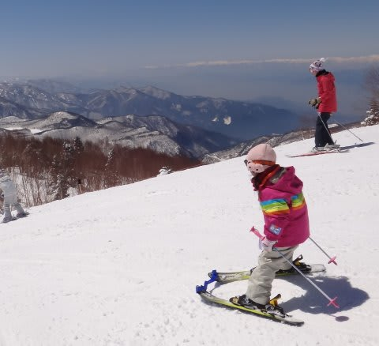
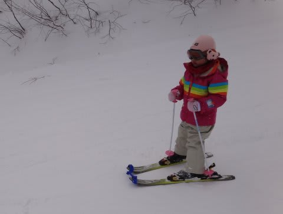
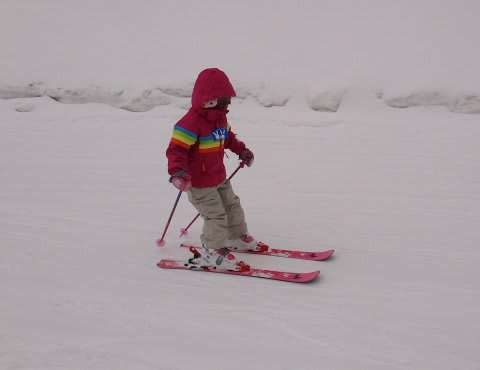
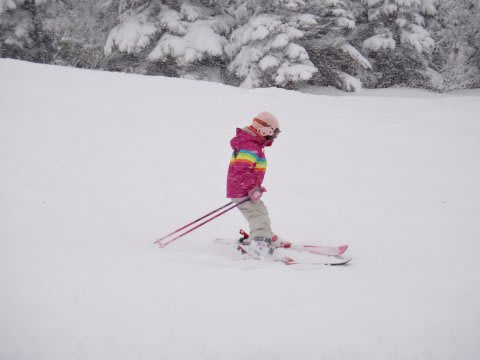
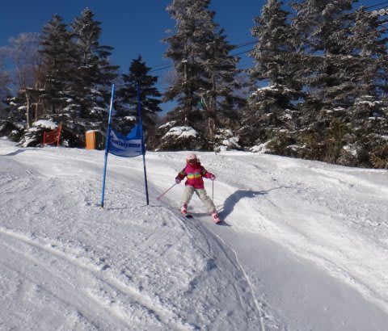
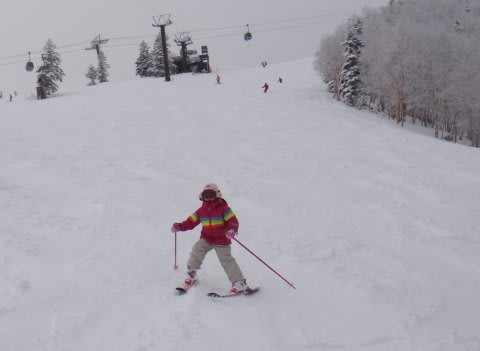

# 2013シーズン…今シーズンの娘＠5歳のスキーの上達は

📅 投稿日時: 2013-07-05 02:40:08

えー．

なんだか，まだ信じられないんですが．

まだ，信じたくないといったほうが正解かも

どうやら，私の2013シーズンが終わったらしいので．

うーん．

ホントに終わったのかなぁ…←諦めが悪い

まぁ，あれですね．

ちょっと，今シーズンを振り返ってみると．

まー，娘は上達しましたね～．

昨シーズンまで，トライスキーのお世話になっていたのに．

（スキーの先っちょの青いやつ）

昨シーズンの終わりにやっと，緩斜面ならトライスキーを外しても滑れるように

なったかな～，ってところだったんですが．

…今シーズンはなんと．

初日から全くトライスキーなしで滑り始め

結局それから一度もトライスキーをつけることなく，シーズンを終えました…

あっという間にトライスキー，卒業しましたね～．

そして，トライスキーなしで新雪やら…

ポールやら滑ったり…

こんな感じで，春雪で荒れ荒れの急斜面も問題なく滑るどころか…

最後には余裕のジャンプをかましていますし．

前に報告したように，コブも滑れるようになったし…

平坦斜面ではかなり飛ばすようになりました…

…どうやらうちの娘．スピード狂のようです…

それどころか．

緩斜面は余裕の鼻歌を歌いながら滑るように…

そして．

スピード狂の我が娘．

ストックを持っていないときに，スピードが落ちてくると．

変わった方法でスピードアップを図るようになりました…(笑）．

娘には特にスキーを教えたりせず．

ただ単に，一緒に滑ってるだけなんですが．

子供の上達は早いもの．

志賀高原のほとんどの斜面を，結構なスピードで滑れるようになって．

娘の上達を，すごく感じたシーズンでした！

＃私もこのペースで上達したい…

## 💬 コメント一覧

### 💬 コメント by (miya)
**タイトル**: うらやましい…
**投稿日**: 2013-07-05 12:39:36

うちの8歳の娘も緩斜面では

同じように滑ってますが、

ちょっとでも斜度がきつくなると

真横にしか進めません…。

いいアドバイスありませんかー？

ちなみにお嬢さんの板は、

アトミックのリトルBでしょうか??

### 💬 コメント by (Skier_S)
**タイトル**: miyaさま
**投稿日**: 2013-07-06 04:06:00

うーむ．

うちの娘には，特にスキーを教えていないので…（汗）．

滑れないうちから，背負われて急斜面や

コブ斜面を滑っていたので，

恐怖心が薄いのかも…

うーん，いきなり急斜面ではなく，徐々に

急なところに連れて行く，とかではだめでしょうか…

で．

うちの娘のスキー道具は，ウェア以外すべて

知り合いのお古をもらっているので，実は娘の

板がなんてモデルなんだか分からなかったりします…(汗)．

とりあえず，アトミックのピンクの板で，蝶々の模様が

描いてありますが…

＃親の板は新品なのに，子供の板はお古という…

### 💬 コメント by (KENKEN)
**タイトル**: 面白いスピードアップ方法ですね
**投稿日**: 2013-07-06 06:13:59

今度うちの娘にも教えてみようと思います。

大人がやると腰を痛めそうですが・・・・

しかしスキーも水泳もうちの娘より１つ上だけとは思えない。

### 💬 コメント by (Skier_S)
**タイトル**: KENKENさま
**投稿日**: 2013-07-06 06:41:29

いやー．

この加速方法のビデオ．

なんど見返しても，笑ってしまいます．

4歳，5歳の一歳違いは大きいと思いますよ，

やっぱり．

子供の1年は，すごい成長しますよ！

今から1年経ったら，KENKENさんの

娘さんも，水泳もスキーもびっくりするくらい

上手くなりますよ～！！

