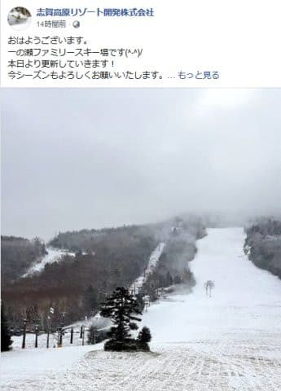
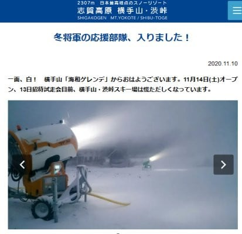
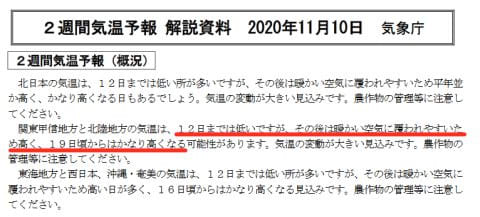

# 今年も開催，物欲選手権！その3

📅 投稿日時: 2020-11-11 03:25:09

えー．

9日から11日までの冷え冷え期間と

予想されている3日間の中日となる，

本日10日．

志賀高原は引き続き雪が降っているようです…！

予想通り，積雪はドサドサではなく，

うっすら程度ですが…

一の瀬ファミリーも白くなり，

珍しくこんなに早い時期から，ファミリーに

人工雪を打っています！！

新設人工降雪機が稼働してますね～！！

([志賀高原リゾート開発Facebook](https://www.facebook.com/ShigaKogen.Ski/photos/a.530911113691763/3420547091394803/?type=3&theater)より）

そして，横手山も昨日9日から人工降雪機が

フル稼働で，かなり白くなってきたようですが…

([横手山スキー場ホームページ](https://yokoteyama2307.com/news/11021/)より)

うーむ．

ただ，人工降雪が打てるのも，12日朝まで．

12日以降は，20日過ぎくらいまで

人工降雪機を動かすのが無理っぽい

高温期間が続きます…(涙)

2週間気温予想解説資料，QXVX91には…

12日以降，暖かい空気に覆われやすく．

19日ごろからはかなり高くなる

と書かれてしまってます(泣）

（[専門天気図QXVX91](https://www.sunny-spot.net/chart/QXVX91.pdf)より）

うーーーーーむ．

この予想が正しければ．

もし，14日の週末のオープンがアウトなら．

その次の週の3連休も厳しい可能性が大…（激涙）

あぁ…10月は冷え込んだというのに．

冷えるべきはそのタイミングじゃなかった

という思いが…

とりあえず．

今週末に，横手と熊の湯がオープンするように．

そして，気象庁の予想を裏切り，来週も

超激烈冷え冷えになるように．

このBlogの読者の皆様は

いつにもまして300%ほどパワーアップした強烈冷え冷え踊りを

踊ることを義務としますので，

よろしくお願いします←義務！？？義務なの？？

ということで．

今日は皆さんお待ちかね，←待ってた人なんていたの？

物欲選手権[その1](ec30d65ecf2d67ea374cb89930ce53a9e.md)，[その2](e80370307311c1508a87da92680e1fcb6.md)の続きの，その3です！

ーー

アナウンサー　「ということで，狙っていた

　FISCHERのVACUUMにダメ出しされて，

　落ち込んでいるSkier_S選手ですが．

　REXXAMを履いてみてしっくり

　こなかったのか，あっさり脱ぎましたね…．

　そして，ここでやめておけばいいのに，

　今度はROSSIGNOLを履きました…！」

解説　「ROSSIGNOLは，

　Skier_S選手が履くと，面白いくらい

　膝が内側に入ってますね．

　これはダメですね．」

アナウンサー　「Skier_S選手．

　エキップの社長さんの解説を

　聞きながらいろいろ試してますが．

　ブーツってこんなに違うもの

　なのかと感心しているようですね…

　このROSSIGNOLが合わなかった

　ので，ここで諦めれば

　Skier_S選手の勝利が見えて

　きますよ…！」

解説　「結局，社長さんには

　レグザムが一番骨格に合っていると

　言われているようですね」

アナウンサー　「でも，足首が細めの

　Skier_S選手．シェルの足首が太めだった

　レグザムは，これまでSkier_S選手の

　候補には全くなかったブーツですよね…」

解説　「そうですね…足型に合わせられる

　FISCHERのVACCUMがダメなら，

　今履いているATOMICをそのまま履き

　続けるのが，慣れていて一番いいと

　思っているはずですから…」

アナウンサー　「レグザムはやはり

　ちょっと足首前のホールドが

　甘いとか，Skier_S選手，不満点を

　いくつか言ってますね」

解説　「社長さんから，足首のホールドは

　タングの加工で解決できると

　言われてますね…

　フォーミングインナーなんか

　作らなくても，かかとが動かない

　ホールド性を十分出せるよう加工

　できると言われているようです…」

アナウンサー　「そのようですね…

　加工法を聞いて，納得している

　ようですが…

　…

　…納得したようで…

　おや…

　これは…」

解説　「あれ？」

　

アナウンサー　「あれ？？

　あれれれ？？

　なんと．

　なんと！

　行ってしまったーーーーーっ！

　行きました！

　ここで行ってしまいました！

　まさか，

　まさかのレグザムブーツ！！

　本人も全く想定外のレグザムを

　買ってしまいました～っ！！

　それも値引きが少なくお高い

　最新モデルのブーツを行って

　しまいました！」

解説　「FISCHERが履けなかった時点で

　諦めればよかったものを…」

アナウンサー　「型落ちブーツを安く

　買うことを，これまでのパターンと

　していたSkier_S選手．

　前回，生まれて初めて最新モデルの

　ブーツを買って，それから２シーズン

　しか経っていないというのに．

　また最新モデルのブーツを

　買ってしまいました！

　物欲が毎年加速して行っています！

　さすが，我慢という言葉をアンドロメダの

　向こうへ置いてきた男！見事です！」

解説　「…そこ，見事って褒めるところじゃ

　ないですから…

　レグザムブーツ，今シーズン

　かなり改良されたので，今シーズン

　モデルからおススメになったらしく．

　去シーズンモデルまで，レグザムは勧めて

　なかったようで…

　必然的に最新モデルになったよう

　です…」

　

アナウンサー　「さらに歯止めが

　効かなくなったのか，

　買ってます！

　まだ買ってます！

　なんと，インソールも買ってます！

　それも整形インソールを買ってます！

　どうしたことだ～！」

解説　「10万円の給付金も出たことだし．

　自分の滑りを知っている人が，

　ブーツ代金だけ，加工費無しで

　ブーツチューンを完全にやってくれる…

　ということに，コロッとやられた

　ようですね…」

アナウンサー　「おっと！なんということか！

　さらに，さらに板の金額も聞いています！

　Skier_S選手が気になっている，

　FISCHER RC4 SC Pro

　のお値段をきいています！！

　まさか…

　まさか，板も行ってしまうのかっ！？？」

解説　「このお店はFISCHERの板を

　かなりの数販売しているようですからね…

　この際あわよくば板も…と考えているの

　かもしれませんよ？」

アナウンサー　「おっと…こらえました．

　ここはSkier_S選手，こらえたようです！

　14万近い値段をきいて，さすがに出せる

　金額ではないと，ここは諦めたようです…」

解説　「まぁ，Skier_S選手はこれまで

　ATOMICのSXを，型落ちになってから

　ビンディング抜きで安く買うという

　ことを数年間続けてきたので，

　倍以上の14万円はさすがに引いた

　ようですね…」

アナウンサー　「ということで，

　今回の選手権も．

　板こそこらえたものの，やはり

　長岡まで行って何も買わずに帰る

　などということをできるわけがなく．

　狙っていたブーツがダメだったにもかかわらず，

　最新モデルのブーツ，それも整形

　インソール込みで買ってしまう

　という見事な負けっぷりにて終わりました！」

解説　「わざわざK奈川県から長岡まで

　来ているというのに，『FISCHERが

　履けなければ買わない』と思っていた

　Skier_S選手が甘すぎたと

　思うんですが…」

アナウンサー　「ということで．

　Skier_S選手，長岡を後にしますが…

　満足そうです．

　戦いの後の満足感に浸っています…」

解説　「…試合に完全に負けてるのに，

　満足しちゃダメでしょ…」

アナウンサー　「ということで，また次回の

　選手権でお会いしましょう！」

[(続く)](e1d88adddba28d0a22ed46ad7d01acde9.md)

## 💬 コメント一覧

### 💬 コメント by (レインボー73)
**タイトル**: Unknown
**投稿日**: 2020-11-11 08:01:22

今は朝の８時。投稿が４時間前となっていますから、Ｓ選手、なんと少なくとも午前３時過ぎまで起きていたようです。しかも、仕事のあとで。１日３時間しか寝なかったというナポレオンをほうふつ。凄すぎです。

### 💬 コメント by (Unknown)
**タイトル**: Unknown
**投稿日**: 2020-11-11 08:23:15

まさか、ブーツしか買わないなんて…

これで終わりじゃないですよね？？？？

### 💬 コメント by (Northfox)
**タイトル**: Unknown
**投稿日**: 2020-11-11 12:17:11

新しいレグザムは良さそうですね。レビュー楽しみにしています。

しかし．．今回板にいかなかったので近々また板尾買蔵さんの解説が聞けそうですね(^^)

### 💬 コメント by (いちおう)
**タイトル**: レグザムじゃなくて
**投稿日**: 2020-11-11 13:22:22

レクザムだから

### 💬 コメント by (しんちゃん)
**タイトル**: 今年も大敗(笑)
**投稿日**: 2020-11-11 23:35:24

今年も見事に負けてしまいましたね(笑)

新しいブーツのインプレッション記事、ぜひ期待しています。また、（続く）が気になっていて、引き続きどんな展開が待っているのか、楽しみです(笑)

### 💬 コメント by (Skier_S)
**タイトル**: 時間が無い…（涙）
**投稿日**: 2020-11-12 02:45:59

＞レインボー73さま

もう，最近睡眠時間が短くて死にそうです…（涙）

＞Unknownさま

え？？

＞Nowthfoxさま

ニューブーツはすでにYetiでデビューしました～！

またどんなだったかレポートしますね．

＞いちおうさま

そうだったんですね！

恥ずかしながらずっとレグザムだと思ってました．

思わず会社の歴史と命名の由来を調べてしまいましたが…

知りませんでした…

教えてくれてありがとうございます！

＞しんちゃんさま

負けました．見事に…

まぁ，10万円の給付金が出た時点で見えていたゴールですが(笑)

