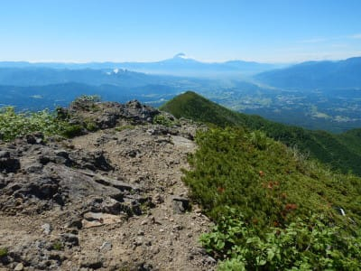

# 2021年7月，編笠山リベンジ＆権現岳へ！その8…権現岳山頂へ

📅 投稿日時: 2021-09-01 05:40:56

🏷️ カテゴリ: [登山・旅行](c1d637a11a25b457ac978d197adbdafc5.md)

えー．

最近，時空のゆがみが激しくなったのか．

まだまだ8月が続くはずと思っていたのに．

私以外の周りの時空は，全て9月の時空に

突入したようです…

ダイビングにも行けず，旅行にも行けず．

夏休みらしい何かがなにもなかった

というのに．

気づいたら，2021年も3分の2が

終わってる世界にいるんですよ！！

いったい，何が起こったというのか？

…タイムスリップか？？

…そして．

9月になると攻めてくる，上半期締め

という，巨大な敵．

数多くの書類を投げつけ，

大量のご無体資料要求によって

人間の精神力を著しくそぎ落とすという

卑劣な攻撃を繰り出す，悪逆な敵．

4部署兼務という無謀なシチュエーション

により，予期せずこの巨大な敵4体に

同時に取り囲まれてしまったSkier_Sは，

果たして無事，この戦いに生き残れるの

だろうか…！？？

乞うご期待！！←なんで映画予告風？

…とういわけで．

恐怖の9月がやってきて．

今日もとんでもない時間に更新してい

ますが．

今日も山登りレポートの

続きです～！

ーー

ってなことで．

権現岳山頂を目の前にした，赤岳分岐で

休憩しますが…

今日はホントに年に数回もない，

最高の天気！

むちゃくちゃ絶景で…

休憩するには最高！

権現岳山頂も目の前に見えます…

あの尖がった岩が山頂ですが．

かなりの絶壁感…

あのてっぺんに立つのは無理そう…

（矢印の先に人がいます）

そして，八ヶ岳最高峰，赤岳と

阿弥陀岳方面も見えますね…

この写真の矢印部分，赤岳方面へ

向かうルートがあるんですが．

良く見てみると．

かなりの急坂を降りてますね…！

この下，ものすごい長い梯子が

続いていて，梯子の順番待ちが

大変そうでした…

ってなことで．

30分ほど休憩したら．

さっきの尖がった権現岳山頂の方へ

向かいます．

さっきの山頂の写真で，人が立ってた

矢印のあたりをよじ登っていって…

このぴょこんと突き出た，高さ1.5m

ほどの岩の根元にたどり着くと．

こんな感じで，権現岳の看板と．

なぜか，剣が…

そして．この岩の上が山頂ですけど…

そこに登る根性は無く．

てっぺんタッチだけしてきました…

いや．

だって，周りはこんな感じで，

高度感バツグンで．

落ちたら「痛い」で済みそうになかった

ので，ちょっとてっぺんに登る勇気は

無かったです…

ってなことで．

てっぺんの岩場から下りて…

さて．これから下山開始！

次のポイントは，

この写真の富士山の下に見えてる

とんがりのてっぺん，三ツ頭に向かいます．

ここからのコースタイムは40分ですか．

…しかし．

今日はホントに景色がいいなぁ…！！！

