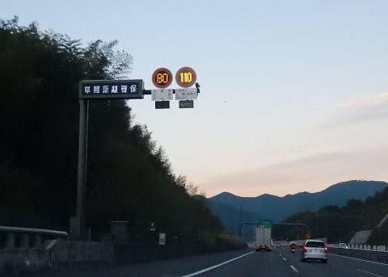
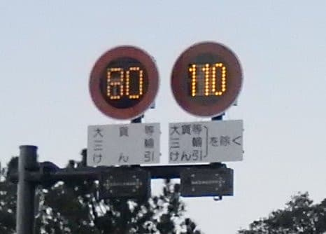
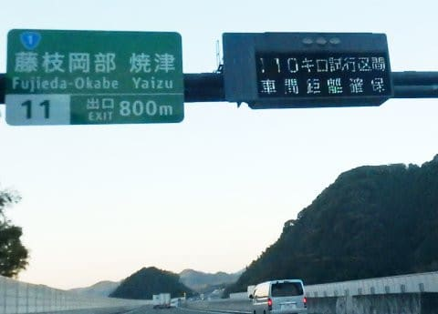
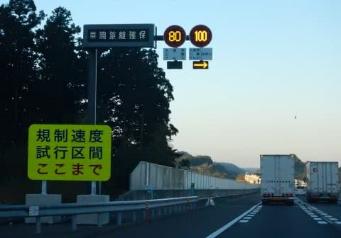

# ニュースで見てたけど…新東名110km制限ってもう始まってたのか！！そして明日はYetiへ．

📅 投稿日時: 2017-11-05 01:41:05

ということで．

3連休にもかかわらず．

金・土とスキーに行ってませんでしたが．

…ちょいとまた往復1000kmほど運転して，

お出かけしてました…

その際に．

新東名を通ってきたのですが…

うむ？

なに？？

制限速度，時速110km？？

ニュースで予告は見てたけど…

新東名の110km/h制限って，もう始まっていたのかっ！！

110km/h制限区間は，距離50kmほどなので．

30分ほど走ると，110km/h区間終了ですが．

まぁ，110km制限って言ったって．

100km制限区間と道路がなにか違うわけじゃないし．

他の車のペースも，全く他の100km区間と変わらず．

100km以下でのんびり走る車もいるし，

かっ飛ばす車は飛ばしまくるし…

他の区間とぜんぜん変わりませんね（笑）

ということで．

500kmほど走って帰って，ついさっき

帰ってきたばかりですが．

また明日，朝早起きして，

イエティへ滑りに行きます～！

＃また4時間しか寝られない…

明日はすっきり晴天の一日になりそうで．

これまでの2週連続で台風に見舞われたような．

イエティ連続雨の呪いが解けて，

晴れの中滑れるかな…
