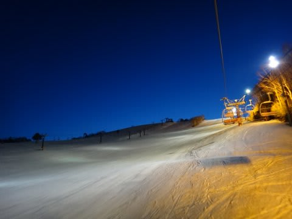

# 3月23日の志賀高原，焼額山の状況は…晴天！だけど，午後は荒れぎみバーン

📅 投稿日時: 2013-03-23 22:39:48

🏷️ カテゴリ: [2013スキー滑走日記](c91dbe557f9a69230b1600e48622fdd61.md)

ということで．

昨日から志賀高原に来まして．

2日目，土曜日の状況をば．

…朝のうちはちょいと雲が出て…

気温はマイナス5度近くまで冷え込み．

…むむ．これはアイスバーンか？？

と，覚悟してゲレンデに出た1本目．

むむ？？

こ，これは．

意外といいじゃん！

冷えてアイスバーン状に固まった後に，圧雪車が掘り起こしてくれたため．

硬いザラメがしっかり圧雪されたような雪質．

しっかりエッジが食い込み，スピードが出せるよ！

うひょーーーーー！

昨日に引き続き，最高！

超快適．最高．ぐっど．快適なロングターンを決められます…

朝のうちからちらちら日が射していたんですが，

午前10時には，完全な晴天に！

これは今日も良い日になりそうだねっ…！

…

…と思ったところ．

なんか，ちょっと人が増えてきて…

雪もやわらかくなってきたので，多くの人に雪が蹴散らされ，

ゲレンデはちょいと荒れ気味に．

朝10時過ぎには，ちょいと大回りが難しくなっちゃった…(涙)

…うーむ．平日スキーの幸せさを知ってしまうと，ちょっと残念な感じ…

ゲレンデは，昼ごろには結構荒れ荒れになっちゃったけど．

でも…意外なことに，天気が良いにもかかわらず，昼間の気温はプラス1度程度と，

気温が結構低かったため，雪はざぶざぶにはならず．

ちょっと融けかけたザラメって感じだったのは救いでしたね～．

あー．あと．

ゲレンデの人口密度は平日に比べると多かったけど，さすが3月下旬．

ゴンドラ待ちは，改札から外に人があふれることがなく，ほとんど待ち

なしってのも救いでしたね～．

でも…午後2時には，コース全面こんな感じにあれちゃって…

さらに．3時を過ぎると気温が冷えて，このまま硬くなっていきました…(涙)

つ…疲れるよ…人間の疲労試験やってるみたい(泣)．

って感じで．午後2時以降は，荒れ荒れ＆そのまま硬くなっていくという，

かなり厳しいコンディションでしたが．

でも．

最後には，一の瀬山頂からきれいな雲海も眺められたし．

雪はちょっと固めだったけど，ナイターもいっぱい滑って．

（ナイター開始の6時半に，残照が残る季節になってきたなぁ…)

今日もたらふく滑った1日だったのでした…

明日も，晴れそうかな～．

今日よりは気温が上がりそうな気配．

あしたも，暖かい典型的な春スキーの一日かな．

＃今日のトータル滑走標高差，20000m越えちゃったよ…←アホ

## 💬 コメント一覧

### 💬 コメント by (mari)
**タイトル**: 快晴でしたね！
**投稿日**: 2013-03-24 00:28:38

熊の湯も午後はいい天気でした。夕方の夕陽観賞会で一面の雲海の中、笠岳に沈む夕陽を堪能することができました(^^)

で、今日はうちの3歳児もどういうわけかコブに突進していきました…。中斜面に練習用に作られた浅めのコブでしたが、ハの字でゆっくり楽しそうに降りてしまいました…子供って、子供って、羨ましいですねー！！(私はコブ苦手です(T_T))

### 💬 コメント by (ゆうこ)
**タイトル**: 帰国しました。
**投稿日**: 2013-03-24 15:47:49

今朝無事に帰国しました。

プラハの地下鉄でスキー板を手に持ち、スキーブーツはいてるお姉さんを見かけました。

(クロスカントリー用でしたが。)

地下鉄からその格好で行くのかと衝撃的でした。

スキー場近いのは羨ましいです。

私も早く志賀高原に復帰したい。

### 💬 コメント by (ひろりん)
**タイトル**: Unknown
**投稿日**: 2013-03-24 22:45:38

ぐぬぬぬ・・・羨ましい・・・

オリンピックコース、もうちょいコブが深いとラクですよね～。

浅いと自分でターンしなきゃいけないし、斜度あるし・・・

しかも硬いとか、腰が終わります・・・orz

でもあんまり深くて縦に長いと怖いし（贅沢）

今月、絶対行きます・・・行けたらいいな（TT)

### 💬 コメント by (gokuraku skier)
**タイトル**: Unknown
**投稿日**: 2013-03-24 22:54:59

今日は突然失礼しました。

色々とお話もでき、またご一緒に滑ることができてとても楽しかったです。

またヤケビでお会いしましょう。

でも、今度お会いする時はウェアも春仕様に変わって、ヘルメットもサンバイザーになってたりするかもです。

それでは。

### 💬 コメント by (Skier_S)
**タイトル**: 帰ってきました…
**投稿日**: 2013-03-24 23:38:25

夜11時に帰宅しました…

みなさん，コメントありがとうですっ！

>mariさま

いやー．昨日も今日も，快晴で最高でしたね！

しかし…3歳児でコブが滑れるって…

ちょっと早すぎます(笑）．

3歳って言ったら，うちの娘はトライスキーつけて

やっと滑れるようになった程度ですから…

でも，子供の上達の速さはうらやましいですよね～

>ゆうこさま

おかえりなさい～！

楽しんできましたか？

次は，志賀高原を楽しむ番ですよ～(^^

でも，地下鉄でスキーブーツは…

なかなか衝撃ですね(笑)．

>ひろりんさま

うふふ．

良かったですよ．

…午後は荒れ荒れ斜面で疲れて半分死んでましたが…

シーズンはまだまだ長いですよ～！

また志賀高原へすべりに行ってくださいね～！

>gokuraku skierさま

いやーーーー．

今日は一緒に滑ってくださってありがとうございます…

あのあと，寺子屋まで行ったんですね！

第一ゴンドラのヌシである私は，あの後もひたすら

リフトストップまで第一ゴンドラをぐるぐるしてました…

来週はいけませんが，それ以降はGWまで毎週

ヤケビに出没しますので，またご一緒しましょう！

