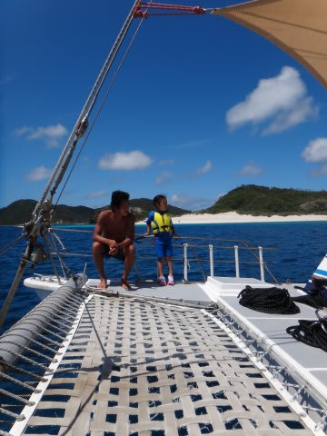

# 2013年7月　子連れ座間味ダイビング旅行記その10…2日目午前のダイビング

📅 投稿日時: 2013-08-05 03:08:39

昨日は，ちょいと毛色が違う記事でしたが．

とりあえず，今日もダイビング日記続きます．

-----

えー．

っつーことで．

1本目のダイビングスタートですが．

1本目は，

「儀名」

ってポイントです．

エントリー直後…

なんだか，珊瑚がやられてますね(涙)．

聞いたところによると，去年の台風でかなりやられたとのこと…

ただ，台風でやられたのは，白化やオニヒトデと違い，

すぐ復活するらしいんですが．

でも．

慶良間はやっぱり珊瑚が元気でいてほしいなぁ…

あとは，それほど見るところもなく…

最後はカクレクマノミを見ながら…

エグジット．

…

うーむ．

ちょいとイマイチ，盛り上がりに欠けるダイビングだったかも…

船に戻ると…

娘は雄大さんと一緒に船の周りを泳いでいた様子．

われわれと一緒に，船に上がってきました．

…娘のために，両親のダイビング中にアシスタントの人が一人

付きっ切りで面倒を見てくれるなんて．

ありがたや…

なんだか，ずいぶん楽しんでたようです．

ってことで．

船は，2本目のポイントへ移動開始！

天気がよく．

景色もよく．

こんな船を，家族で貸切にできるなんて．

ああ．幸せ…

