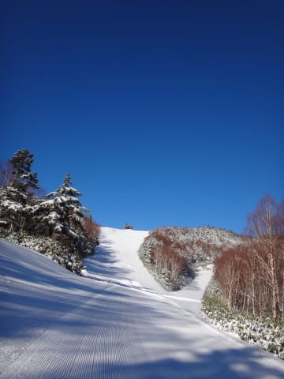

# 12月12日，土曜の志賀高原は…なんと！終日快晴っ！！

📅 投稿日時: 2015-12-12 22:33:31

🏷️ カテゴリ: [2016スキー滑走日記](c70c67ed5248e9432b899dcd5747048bb.md)

ということで．

今日も志賀高原に来ているわけですが．

…なんと．

なんとっ！！

今日は，朝から終日快晴でしたっ！！

当初の土砂降りの予想⇒曇り時々晴れ間の予想⇒実態は晴れと変化し．

それも朝イチは，やわらかい新雪が10cmほど乗った，

最高のコンディションでしたっ！！

ふははははは．

そう．これは，

やはり，私の日頃の行いが…（ドスっ）←読者からの怒りの鉄槌が落ちた音

ということで．

曇り空，ぽつぽつ雨ぽいのが落ちてくる高速道路を

走り，志賀高原に上るわけですが…

本日朝．志賀高原は10㎝程度の積雪があったようで，

上り路は積雪路になってます．

そして．

ちょうどゲレンデに着くころには…

え？なに？快晴？？

そして…

あれ？

結構な新雪！？

そして…

ええ！！？？

なに？？

なんだー！

なに，なんなんだ．この最高のコンディションはっ！！！！！！

やわらかい新雪にきれいに圧雪がかかり，今シーズン

一番の最高やわらか圧雪バーン！！

うはーーーー！

今シーズン初めて，こんなにやわらかい圧雪を滑ったよ！

もう，最高．

この週末，最低の週末を覚悟したのに…

まさか，こんな最高のコンディションが待っているとは…っ！！！

ここしばらく，人工雪の硬い斜面ばかり滑っていたので…

いやーーーー．

雪って，こんなに柔らかかったんだっ！

感動～っ！

と，最高のバーンを2時間ほど楽しむと…

あら？

ちょっと日差しが強くて，気温が春スキー並みになってきたんですが…

そして，コース上も，指導員研修会が入って，ちょっと

混んできたのですが…（涙）

そして．

気温が上がったので，雪はちょっとしっとりと固まった感じに…

そこに，結構な人数が滑るので．

午後2時頃には，ゲレンデは…

ああ．

凸凹ですね…

今シーズン初のこぶ斜面かも？？

ただ，人は多かったとはいえ．

第2高速リフトの待ち時間は最大このくらい，1-2分待ちだったので，

全然許す．

…しかし．

夕方に向かい．

気温が高く，ゆきがざぶざぶになって来たというのもあり，

ゲレンデの荒れはさらに加速し…

あら．

あらら…（涙）

ちょっとブッシュさんもお出ましになって来たし，

さらにコブコブがすごいことに…

とりあえず．

こんな中．

焼額のリフトストップの16時まで，

荒れた斜面に飛ばされながらも楽しみました…

…

…が．

が．

これで終わらない．

16時30分までやっている一の瀬に移動して，ラストスパート！

夕暮れの中，一の瀬を滑りますが…

うーむ．

人工雪で，ちょっと固めかな？

でも．

昨日の夜の段階まで，人工雪のない部分，完全に土が出ちゃってた

らしいけど．

今朝の雪で，ここまで回復．

まだ，端っこはうっすら茶色いけど…

いやー．

今朝の雪，わずか10cmとはいえ．

かなり恵みの雪だったんだな…

ってことで．

今日もたっぷり，夕日が沈むまで楽しみましたっ！！

…で．

現在．

志賀高原は，人工降雪機が動いてません（涙）

気温が高くて，降雪機が動かせないのか…

明日に向かっての積雪＆人工降雪増はなさそうですね（涙）

それどころか．

明日は．

下手をすると，ぽつぽつと雨が降る可能性も…

今のところ，基本は昨日と同じく，気温は高め，曇り…って感じの

予想ですが．

ううーーーーむ．

雨が降らないことを祈るばかり…

## 💬 コメント一覧

### 💬 コメント by (komu)
**タイトル**: イイなぁ
**投稿日**: 2015-12-12 23:09:36

今日も仕事。明日も仕事…

なのでイエテイオールナイターきてます。

今夜は暖かいので滑らない雪なのですよ

### 💬 コメント by (はなげ親分)
**タイトル**: 最高でした！
**投稿日**: 2015-12-13 06:57:57

いや～、終日よい天気でしたね。

私は

第４ロマンスメインで滑っていました。

S様のいうように柔らかい雪で、スキーってこうじゃなきぁって思いました。空に向かって、神(S…?)様にお礼を…しました。

昼過ぎに、一の瀬に戻りリフトストップ迄滑り、綺麗な日没に年甲斐もなくジーンとしちぁったりして……

### 💬 コメント by (Tomoko.Y)
**タイトル**: かぐらもよかったです(*^^*)
**投稿日**: 2015-12-13 10:54:37

前にSkier_Sさまにお聞きした奥志賀ランチは、グランフェニックスのイタリアンレストランと順調にお話しできて、素敵なランチを楽しめそうです。ありがとうございます。

12日は志賀高原を満喫されたようで良かったですね！

私は初滑りでかぐらに行きました。金曜のライブカメラでは、メインゲレンデの2/3に土が出ていて、土曜は本当に営業できるのだろうかと不安になりましたが、行ってみたら状態のよい雪がしっかりとついており、お天気も最高でよい初滑りになりました～(*^^*)

### 💬 コメント by (Skier_S)
**タイトル**: 今日は雨だったよ…（涙）
**投稿日**: 2015-12-13 23:24:48

＞komuさま

休日出勤，ご愁傷様です…

私のご無体職場よりひどいですね（＾＾；

でも，土日仕事で，夜にオールナイトって…

いつ寝てるんですか！？？

無理しないようにしてください～．

ちなみに，この時期のYetiは混んでるんですか?

＞はなげ親分さま

昨日は4ロマ滑ってらしたんですね…

2高メインの私と合わなかったわけです．

今日はレストランでお会いできましたが，

あの後は一の瀬に移動されたんですか？

午後はかなり残念なコンディションでしたね…

また来週（再来週？）もお会いしましょう！

＞Tomokoさま

グランフェニックス，BBQランチですか？

志賀高原エリアでは，お高いけどおいしい

レストランですので，良いランチが楽しめると

良いですね～！

土曜はかぐらも楽しめたのですね．

かなり混んだのではないでしょうか…？？

また，志賀高原にもやってきてくださいね～！

