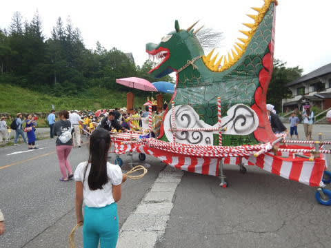

# 夏の志賀高原に行ってみた4…日曜の朝は，大蛇祭のおねり行列から

📅 投稿日時: 2017-09-04 01:05:44

ということで．

志賀高原の丸池の目の前の宿で泊まったこの日．

朝，目の前の丸池スキー場を見てみると…

すっきり晴れではないけど，雨は降らなさそう

かな～．

で．

宿は素泊まりなので，朝ごはんは

持ち込みだったのですが．

昨日立ち寄ったスーパーで，朝ごはん用に

思わず買ってしまったこいつ．

普通のヤマザキパン製品だけど…

…これ，少なくともK奈川県では

見たことないですが…？

長野ではメジャーなのかしらん？？？

で．

9:20から，丸池観光ホテル前で

お練り行列のスタートなので．

朝食後は，丸池観光ホテル前へ！

すでに，行列の参加者がスタンバイしています…

そして，出発時間になると．

行列が出発する前の神事として，

「しめ切り」が行われます．

行列の前に張られた注連縄を，

猿田彦が…

手にした日本刀で…

一刀両断！

注連縄が，切り落とされて，

おねり行列，スタートです！

が．

その時．

さきほどの「しめ切り」で切られた注連縄．

たまたま横で見ていた娘に，「どうぞ」と言って渡されました…

あら．

なんだか，縁起物をもらえるとは．

ちょっと幸先良いかも…

おねり行列は，現役ミス志賀高原＆次期候補者が

通ったあと…

おこみんの応援で子供たちが引っ張っていく…

大蛇の山車が大トリでついて行きます．

そして，行列は丸池から蓮池までを

練り歩いていきますが…

行列の周りを，時折大蛇が駆け抜けます…

その間，道路は片側一方通行．

…ご迷惑をおかけします…

そうそう．

おねり行列に，おこみんがついてきてますが…

この着ぐるみで，長距離を歩くのはつらいのでは！？？

でも．

娘はおこみんとお近づきになれて嬉しいようです…

で．

おねり行列の途中では，お神酒の振る舞いがあり…

そして，子供向けには．

豪快にばらまかれる，お菓子の振る舞い！

そんなことをやっていると．

出発してから1時間ほどで．

蓮池の98会館前，大蛇祭のメイン会場に，

行列がやってきました…

## 💬 コメント一覧

### 💬 コメント by (Goku)
**タイトル**: 信州限定？？？
**投稿日**: 2017-09-04 20:31:25

お～まさにコレは『牛乳パン』

信州ではどこのパン屋さんやスーパーに売っているものですが、これって全国区ではないんですか？？？

各パン屋さんが色々工夫を凝らして名物にしているところもある位メジャーなパンなのですが・・・

### 💬 コメント by (しんちゃん)
**タイトル**: ご当地パン？？
**投稿日**: 2017-09-04 22:45:25

静岡西部でも、ましてや関西では見たことないパンです。

### 💬 コメント by (Skier_S)
**タイトル**: 私も長野県以外で見たことないです…
**投稿日**: 2017-09-05 00:22:12

＞Gokuさま

「牛乳パン」ってのが一般名詞なんですね…

ヤマザキだけじゃなく，いろんなパン屋さんで

おんなじようなのを作ってるんですか！！

…私も，首都圏1都3県をはじめ，いろんなところで

暮らしてますが．

他で見たことないので，信州限定かと…

＞しんちゃんさま

ですよね？

やっぱり，他で見たことないですよね…

長野ではメジャーだったんですね…

