# 2019/2/11(月），3連休最終日の志賀高原スキー場，速報モード…午前中は混んだけど，午後はガラガラ！昼間は日も射して，結構楽しめた一日だったよ！

📅 投稿日時: 2019-02-12 01:58:40

🏷️ カテゴリ: [2019スキー滑走日記](c3e4496fc0fb7f9c17ff21214a35b1ace.md)

今日も～♪

家に帰ると～

日付が変わってる～♪（涙）

あまりにも眠くて，冒頭が謎文章に

なってしまっていますが．

今日もいつも通り，帰宅は深夜0時を

回ってしまい．

…帰宅後の片づけやら何やらを

していたら，もうこんな時間…（泣）．

ってなことで．

帰宅日恒例の，速報モード．

行ってみよう！

えー．

昨晩からの積雪0cmでスタートした本日でしたが．

昨晩からの積雪はなくとも，

昨日積もった軽い雪がきれいに

圧雪されて…

あさイチは，最高シマシマっ！！

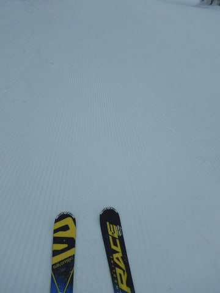

ごくわずかコロコロが出ている

所もあったものの，

冷え冷え雪がしっかり圧雪された，

ガッツリエッジが食い込むハイスピード

バーン！！

…だったんだけど．

ゴンドラ3本も滑ると…

なんだ，これは（涙）

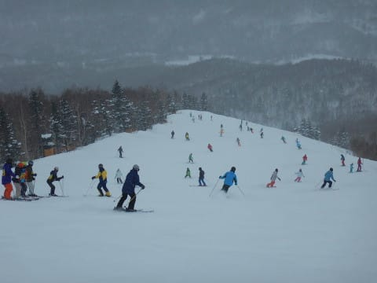

さすが3連休．

最終日とはいえ，午前中はちと

混雑しました…

でも，ゴンドラ待ちは最高で

このくらいで．

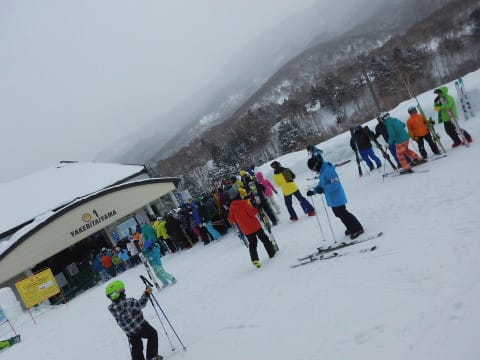

混んだのは午前11時過ぎくらいまで．

それ以降は，ゴンドラはほぼ飛び乗り

だし．

昼からは，コースもがら空き！

…あれだけいた人が，蒸発したかの

ようにいなくなっちゃったんですが…

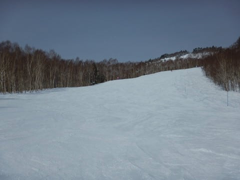

そして．

昼には太陽が顔を出すという

素晴らしいコンディションに！

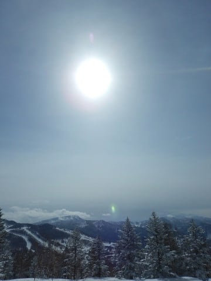

日が射しているのに．

気温は冷え冷えなので．

雪も緩まず．

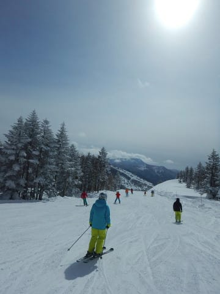

…そして，3連休中日の昨日と

比べると，人も少ないので．

コースも昨日ほど荒れず．

夕方まで比較的フラットなバーンで．

十分大回り可能！

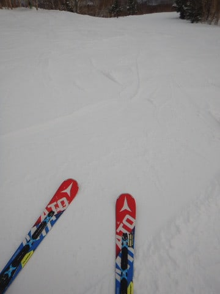

天気は，昼前後は晴れたものの．

午後2時前から，また曇り空に

なってきて．

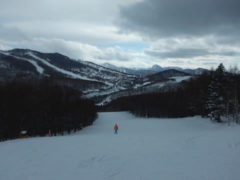

時折雪がぱらついたりもしたけれど．

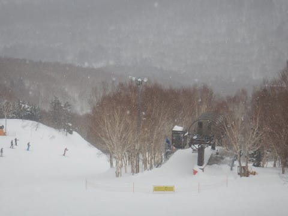

午後3時を過ぎると．

完全にゴーストタウンと化した，

無人のゲレンデを．

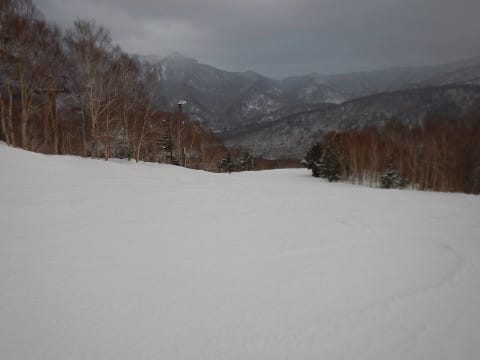

好き勝手に大回りし放題で，

楽しみまくってきたのでした…

で．

いつもなら16:20に終わってしまう

焼額．

なぜか本日．

第4ロマンスが17:15まで営業する

ということになり．

喜びのあまり，帰宅のことを考えず，

ナイター照明が点灯する17時過ぎまで，

ついつい滑ってしまったので…

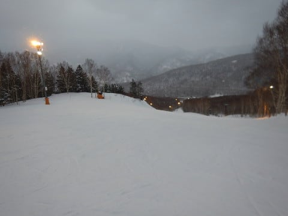

…帰宅が，深夜になってしまったの

でした…

ってなわけで．

速報モードでも十分詳細だった気がするのですが．

また明日，濃密な（？）詳細レポートやります～！

では，おやすみなさい…

## 💬 コメント一覧

### 💬 コメント by (ほっぽ)
**タイトル**: 昨日はお世話になりました
**投稿日**: 2019-02-12 07:20:09

Ｓさん

昨日は半日お邪魔して皆さんと一緒に滑らせてもらいました。

とても楽しかったです。滑りも、ゴンドラ内での会話も。

そして、やはり４ロマ最終まで滑ったのですね。(^^;

私はリフト乗車ポイントが２００を超えたので

ラスゴン１本手前で終了しました。

今週末はお休みしますが、２／２３（土）は志賀にいますので、

またお会いできたらよろしくお願いします。

### 💬 コメント by (musi)
**タイトル**: Unknown
**投稿日**: 2019-02-12 10:46:44

昨日は、佐久平PAから渋滞してましたね。

我が家は八方尾根に浮気してたのですが、初日の午後からゴンドラが止まった影響か、2日目は、朝からなかなかの混雑と宿のオーナーさんから教えてもらったので、47に行きました。リフト待ちはまあまあでしたが、

昼メシ食べるのも一仕事な混雑でした。（あっsさんは食べないか）

どちらも急斜面は、下のカチカチが顔を出して、上には連休中の積雪があり、私のレベルでは難しい斜面もありました。久しぶりに2泊出来てスキーでお腹一杯になった筈が、またすぐ徒然をチェックして、志賀の降雪を祈り、猫魔の早売りリフト券いつ使うか悩み、月末の野沢のコンディションを憂う週始めです。

### 💬 コメント by (tomorrow)
**タイトル**: Unknown
**投稿日**: 2019-02-12 11:39:39

こんにちは。

いつも楽しく拝見しています。

私も３連休、志賀高原で楽しみました。

土曜、カリカリバーン（ダイヤモンドでは泣かされました）

日曜、パフパフバーン（奥志賀でリフト始動とともに、リフト下で楽しみました）

月曜、快適バーン（焼額を堪能しました）

日曜日に奥志賀高原のゴンドラ方面におりてしまい、長蛇の列に唖然。

バスの時間を速攻チェック。十数年ぶりにシャトルバスのお世話になりました。

焼額第1ゴンドラ降り場で「第1ゴンドラの…、１０㎝…」という言葉を耳にして「？？？」と思っておりましたら、オリンピックコースを颯爽と駆け抜ける一団が。

もしやあれがS様だったのでしょうか？

今週末も志賀高原に、来週末は野沢温泉にと冬を楽しんできます。

長文失礼しました。

### 💬 コメント by (ゴン太(gonta))
**タイトル**: Unknown
**投稿日**: 2019-02-12 13:31:01

日体大御一行400名、月曜から南館貸切だそうです。4ロマ延長は、その恩恵でしょうか。本日のサウスコースはNITTAIDAIのビブスがウジャウジャです。因みに金曜日まで滞在とのこと。当方休暇とほぼ被りです。

### 💬 コメント by (Seeker.NT)
**タイトル**: レジャースキーヤーと霊山
**投稿日**: 2019-02-12 13:56:09

日曜日はエキスパで久しぶりにご一緒させて頂きありがとうございました。レジャースキーヤーのお話はSさんの何か超えてはいけない線引きを感じました。

ただ、私の知っているレジャースキーヤーの皆さんは、ちゃんと時間をかけてお昼ご飯を食します。。。(笑)

ちなみに、皆様のコメントを拝見していつも思うのですが、志賀高原は霊山なんですね。SさんのBlogに引き寄せられてたくさんの方々が集い、それぞれに千日回峰行を・・・。おぉ、なんか高野山みたいですね。

### 💬 コメント by (若杉勲71)
**タイトル**: Unknown
**投稿日**: 2019-02-12 19:59:26

皆様お仕事お疲れ様です。私も志賀で一仕事してきました。イチゴンスタートの本多ご夫妻がオリンピック一番二番。二ゴンスタートの私が四番手。その後に白樺に行ったのに、なんとまださら場。よその子の面倒をみる善行を神は見捨てなかった。今日はスキー場ストップまで(２時まで）ずーーーと最高の雪質でした。明日も新雪なので、皆様の代わりにしっかりいただいておきます。心置きなくお仕事にご専念ください。（私って、嫌われそう）

### 💬 コメント by (ホンダ)
**タイトル**: Unknown
**投稿日**: 2019-02-12 20:12:36

今日のヤケビはパフパフで最高のスタートでした。天気もハズレ以外と良かったですが、準レインボークラブの私は少々お疲れでしたので早めにあがりました。昨日は最後の最後滑っていたS様に手をふろうとお待ちしていましたが、なかなか現れず？と思っていましたが17過ぎまで滑っていらしたとはビックリでした。板に何かぶらさがってましたよー。

### 💬 コメント by (Goku)
**タイトル**: Unknown
**投稿日**: 2019-02-12 21:27:29

３連休お疲れさまでした～♪

初日はオリンピック集団爆走、昨日は白樺集団爆走と、とっても楽しかったですね(^^)v

しかし、まさかの残業に驚きを隠せません。

一番近い私が一番早く上がっているというのに１７時過ぎまで滑るとは。

やはり、それくらい精進しないと『神』にはなれないのですね。

### 💬 コメント by (なるなる)
**タイトル**: Unknown
**投稿日**: 2019-02-13 00:12:49

3連休は多少混んでいたものの呪が解けたのでしょうか?

何かを期待している自分がいます。ごめんなさい…w

今週末は板を拝みに行きたいです。

### 💬 コメント by (Skier_S)
**タイトル**: 時間が無いので短め回答で…
**投稿日**: 2019-02-13 07:26:52

＞ほっぽさま

3連休最終日もお世話になりました～！

完全集団爆走メンバーの一員と化してましたね(笑)．

また次も，一緒に爆走しましょう！

＞musiさま

帰宅時間が遅かったので，佐久の渋滞はおわってましたが…

上里で渋滞してました（涙）

白馬方面も混んだようですね．

やっぱり志賀が雪もいいので．

また志賀に来てください～！

＞tomorrowさま

コメントありがとうございます～！

…もしかしたら，ゴンドラの速度を0.1m精度で

当てていた話題でしょうか…

だとすると，それは私です(笑)．

爆走集団が一緒だったと思いますが，

もし次に見かけたら声をかけてみてください…

怪しい銀のお札をお渡しします(笑)．

＞ゴン太さま

日体大貸し切りなので，延長営業って言ってました．

有り難く17時過ぎまでサウスコース滑ってました…

毎年，この時期恒例ですよね…

しかし，せっかくの平日滞在期間に被っちゃいましたか．

今週は14日まで雪降りなので，ゲレンデコンディションは

かなり回復すると思いますよ～！

＞Seeker.NTさま

日曜は一緒に滑っていただきありがとうございました…

しかし，志賀高原はホントに濃い人が集まります．

なんだか怪しい人が集う宗教団体みたいになってきてるかも…

みんな怪しいお札を板に貼ってますし(笑)．

もう，志賀は霊峰と化してるかもしれません…

さながら，私が教祖でしょうか（爆）

＞若杉さま

毎日休まずお仕事お疲れ様です．

私は火曜から4日間休みです…(笑)．

火曜は最高のコンディションだったんですね…

うらやましいです…

14日までドサドサ積もらないまでも，

雪降りが続きそうなので，いいコンディションで

滑れると思いますよ～！

＞ホンダさま

月曜は日が暮れるまで滑ってましたから(笑)．

もう，リフトが動いていると帰れない体なので…

火曜もパフパフでよかったんですか…

うらやましい…（涙）

板にぶら下がってたのは，ホンダからのお土産だと

勝手に解釈していたのですが…

違ったのでしょうか…？？

＞Gokuさま

3連休お疲れ様でした～．

リフトが動いていると帰れない私は，しっかり

日が暮れるまで滑ってました(笑)．

