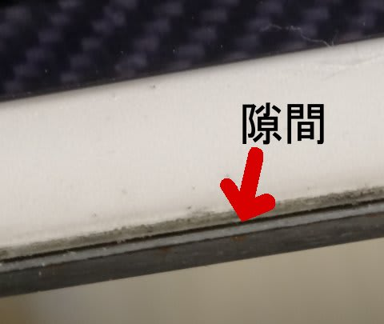
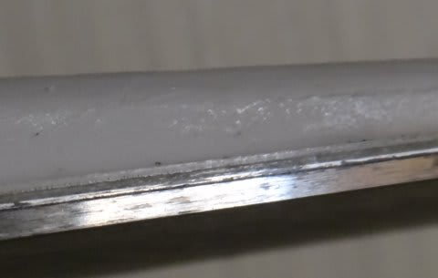

# うぎゃーっ！我が愛機，SALOMON　24hours LMがっ！

📅 投稿日時: 2012-10-24 00:58:30

🏷️ カテゴリ: [スキー雑談](c1f9d2cb7478308da16419928ea3945e9.md)

イエティでの今シーズンの初すべりを終えて．

「硫安で，エッジが錆び錆びになったでござるよ…(涙）」

と．

悲しみのまなざしで，我が愛機，SALOMON 24hours LMのエッジを眺めていたとき．

「…な，なんじゃこりゃぁ！」

エッジの錆びなんかドーでもよくなってしまうほどの．

その，衝撃の事実に気づいたのであった．

「え，え，エッジが…

　　剥離してる～」

ビンディングのトゥピースの下あたり．

長さ15cmほどに渡り．

写真の矢印の部分のように，板とエッジの間にわずかに隙間があいてます…

正常な部分はこんな感じで．

隙間などありません…

がががががーーーーん．

私がもっとも信頼している．

今シーズンもメインマシンとして活躍してもらおうと思っていた，LMも．

わずか2シーズンで寿命か～っ！！！！！

3シーズン，もたなかったか～！

まぁ．

こんな経験

[1](http://blog.goo.ne.jp/skier_nobu/e/5d407a91dffe64358270e3b66b4a3c94)

[2](http://blog.goo.ne.jp/skier_nobu/e/253007d8539a22f726f9c2170c8f6db3)

[3](http://blog.goo.ne.jp/skier_nobu/e/3aca6b5cd4f756845a1bc6af038d7444)

[4](http://blog.goo.ne.jp/skier_nobu/e/739c99f122390b651443d3488470166e)

をしているくらいで．

私が履いた板がまるまる2シーズンもっただけでも奇跡なんですけど．

今，シーズン中は4セットの板を使いまわしているので，3セットしか使ってなかった

当時に比べて板の消耗は遅いはず…と思っていたのに．

それでも2シーズンが精一杯だったか…(涙）．

ああ．

小回り用板，買わなきゃ…

お財布が…

＃まだ生き残っている3セットでシーズンを過ごす，という発想はまったく出てこないSkier_Sだった
