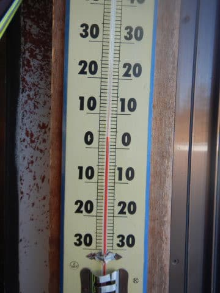
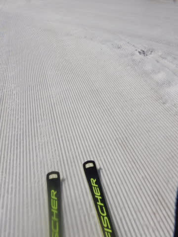
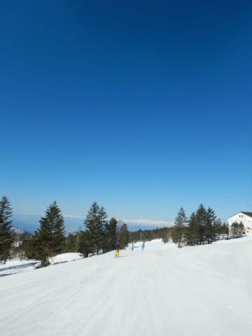
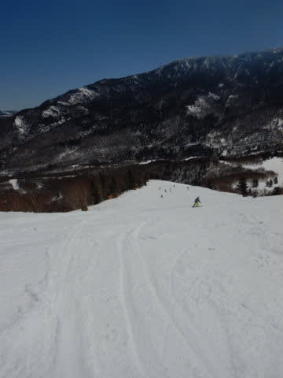
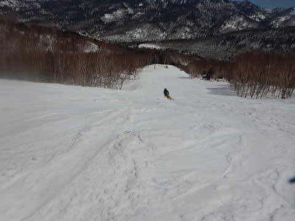
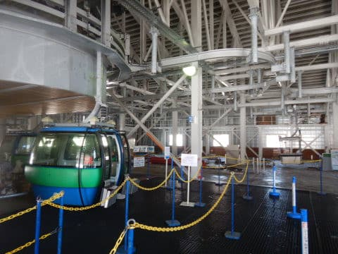
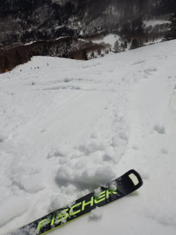
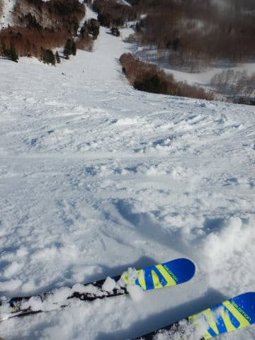
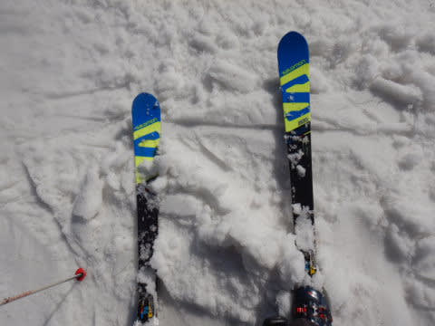
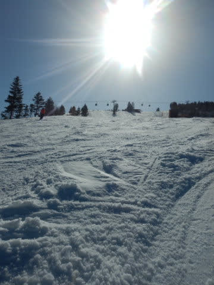

# 2022/4/9(土)の志賀高原スキー場レポート…朝はちょと冷えたけど，昼間は高温ザブザブ(涙）

📅 投稿日時: 2022-04-10 06:24:43

うぎゃーーーー！！

昨日の夜飲んでたら，そのままBlog 更新せず

寝ちゃったよ～！！

そして，今日は早朝から滑りに行かなくてはならないので．

超クイックレポートで更新！！

昨日土曜は朝から終日晴天で．

雪が結構緩んだ一日でした…（涙)

朝7時過ぎの段階で，すでに気温は

+3℃(涙)

一応，朝はちょっと硬めのシマシマでしたが…

朝から天気は晴天で，

バーンは朝からゆるゆる(涙)

早朝はゲートの外まで並ぶほど混んだけど，

昼前にはバーンも荒れ始めたので…

11時過ぎにはゴンドラもがらがら！

ただ，午後にはバーンも結構荒れてきて…

ラストのころには凸凹になったところも

あったものの．

人が少なかったからか，気温がプラス10℃と

暑いくらいに気温があがったわりには

そこまでひどく荒れませんでした～！！

ってなことで，この日もラストまで滑って

しまったわけですが…

今日も早朝から滑りに行きます～！！

行ってきます！
