# 2022/1/22(日)の志賀高原，詳細レポート！…そして天気図を見ると，週末の27日もパウダーの予感

📅 投稿日時: 2023-01-24 02:16:49

🏷️ カテゴリ: [2023スキー滑走日記](cd943df30cfcc3d0896469e2ff98720cd.md)

えー．

本日も，志賀高原はコンディションが

良かったみたいですね～！

特派員情報によれば．

あさイチは曇り空でスタートしたみたいですが…

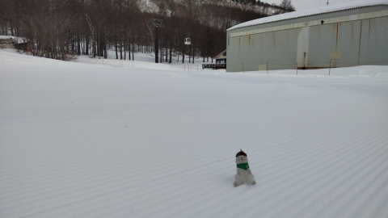

あさイチの気温は-10℃近くまで

下がったようで，今日も冷え冷え！

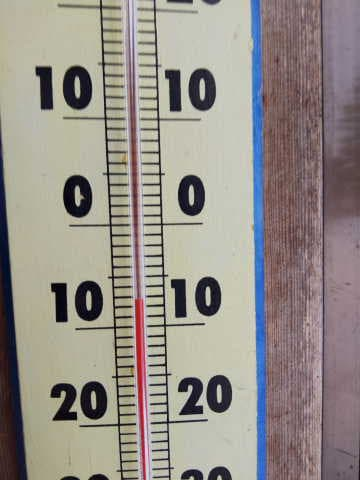

ただ，積雪は無かったから，ちょっと

ずつバーンは硬めになってきている

みたいだけど．

それでも冷え冷えのGoodな雪質で，

あさイチは最高だったみたいです！

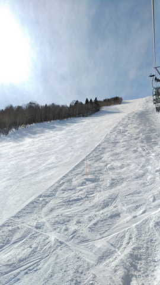

朝のうちは曇りだったけど，10時

ごろから晴れていい天気になったようで…

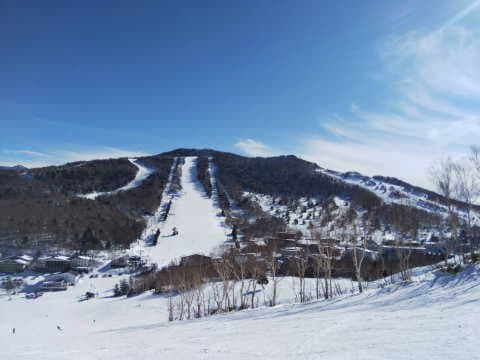

平日なので，当然ゴンドラやリフトも

混まず．

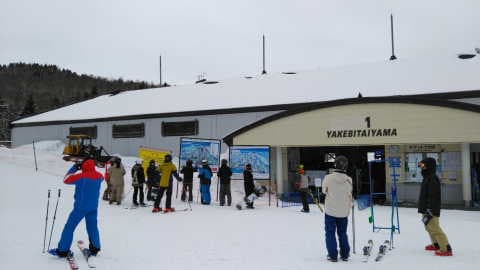

ゲレンデもガラガラで，楽しめたようです～！

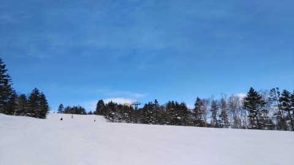

で．

昨日，これからの天気を予想しましたが．

予告通り，降りますよ～！

火曜の午後から，どさどさ降ります！！

水曜の朝までには結構積もります！

水曜の25日もそこそこの勢いで

積もるかな…

で．27から28日にも激冷えで積もり

そうな予想になってきました…！！

これは，28日土曜の朝もパウダーの予感…！

28日は根性の無いスキーヤーふるい落とし

機能がフル発動しそうな感じも

ありますが…

うむ．

とりあえず，今週末も期待できそう！！

…ってなことで，本題へ．

日曜の志賀高原，詳細レポートです！

まず．

昨日からの積雪は無かったですが，

金曜からの積雪で本格積雪路となっている

志賀高原の道路を登っていき…

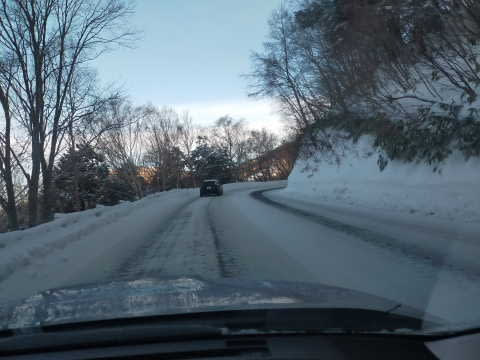

いつも通り，朝8:30の営業開始前に

焼額の第1ゴンドラ前に並ぶわけですが…

今日はそんなに列が長くないので，

そんなに混まなさそうな予感…

そして，天気は見事に晴れてます！！

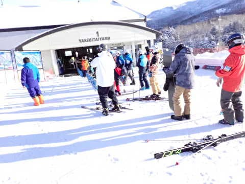

ってなことで．

営業開始と同時に山頂へ上がると…

あさイチの気温は-11℃と冷えてます！

-10℃の予想から1℃ずれで，ほぼ正解！

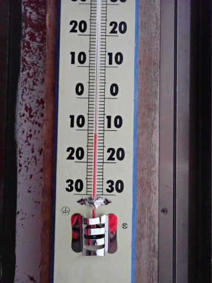

あさイチのゲレンデは，うっすら雲が

かかっているものの，ゲレンデには日が射して．

そして，バーンは最高のシマシマ！！

ぐおおお～！！

シマシマっ！！！！

金曜から土曜にかけて降った冷え冷え

雪が見事に圧雪された，柔らかすぎず

硬すぎず．

快楽の限り気持ちよく滑れる

最高悶絶級シマシマバーン！！！

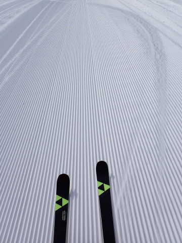

うほーーー！！！

これは…

これは間違いなく今シーズン最高！！

叫び声が出るほどの快楽バーン！！

これはいい…っ！！！

人生これ以上の快楽があるか？？？

という快楽バーン！！！

晴れてて雪がよくて，そして人がいない

という，3拍子揃ったコンディション！！

シアワセ…

シアワセすぎる…！！

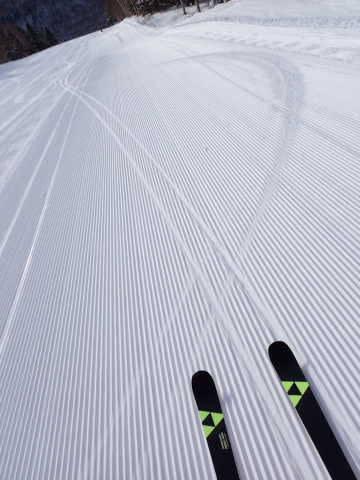

今日は人も少ないし，バーンも荒れないし…

もう，シマシマが無くなってきても，あさイチの

最高コンディションがそのまま続いてる

感じで．

もう，毎日がこんなだったらいいのに…

というシアワセなコンディション！！

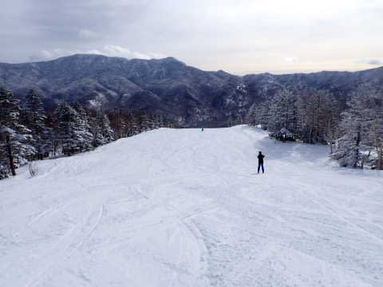

ただ，第1ゴンドラは10:30頃に一瞬ゲートの

外に並ぶほど人が増えたけど…

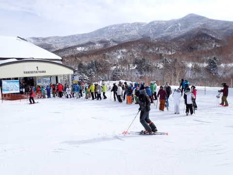

ゲートの外にまで人が並んだのは1回だけ．

それ以外はゲートの中に納まる待ち時間

だったし…

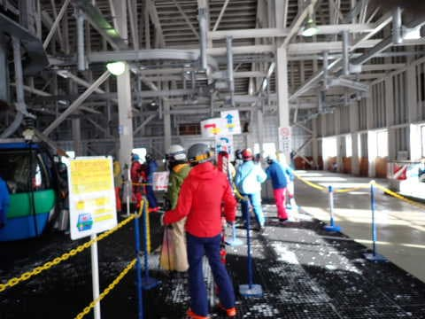

リフトは終日ガラガラ！！

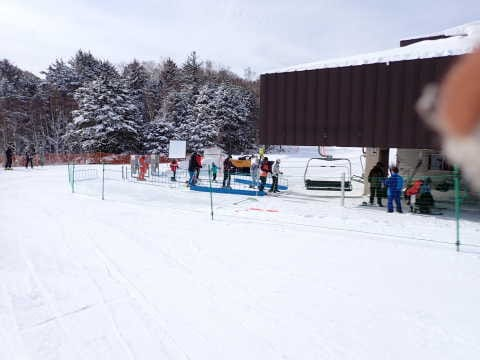

あ，ただ，第2ゴンドラだけは

午前中10時から11時前くらいまで，

ちょっと待ち時間があったみたいです…

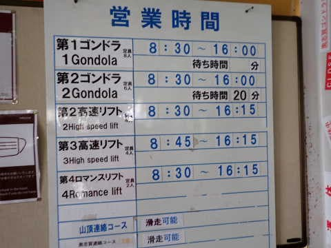

でも．

ゲレンデは人がいなくてガラガラだし．

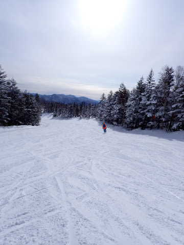

天気も，時折曇り空になったものの，

基本的に晴れの一日で．

それなのに最高気温も-5℃までしか

上がらず，一日冷え冷えをキープしてくれて．

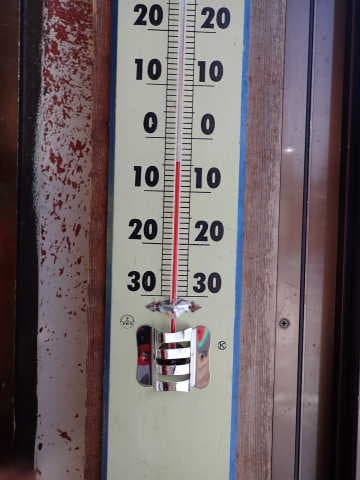

そのおかげで，一日中雪質は最高のまま！！！

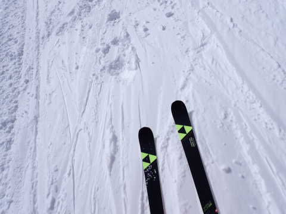

最高の雪質で，最高の天気で…

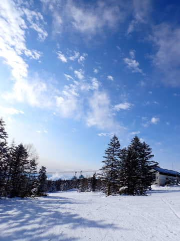

そして，ガラガラで大回りし放題の

バーン状況と来れば…

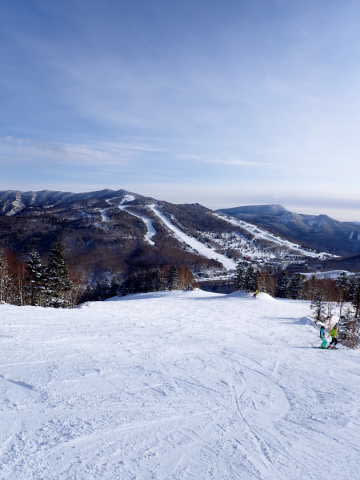

もう，これ以上何を望むものがある

だろうか…

という，恵まれた最高のスキー日和！！

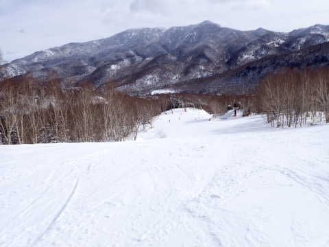

いや…

毎日がこんな状況だったらいいのに…

ゴールデンウィークまで，ずっと

こんなだったらいいのに…←さすがGWまでは無理でしょ

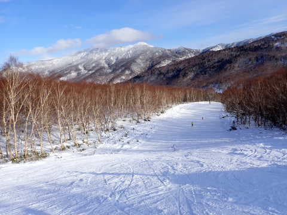

そして．

今日がいつまでも終わらないでいて

くれればいいのに…

という願いもむなしく，だんだん日が

傾いてきますが．

ホントに人がいなさ過ぎて，心配になる

くらい…

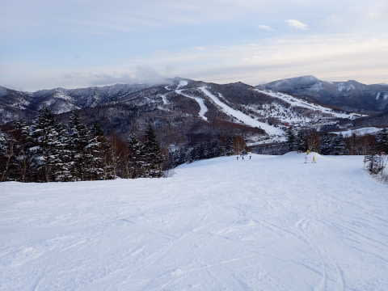

夕方ラストの1本でも，雪は全く

荒れなかったし．

（GSコースとオリンピックコースは

　ちょっと荒れてたけど…）

いや．

ホントに，こんな日がずっと続いて

欲しい…

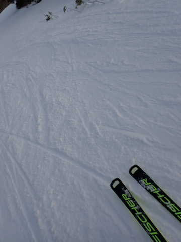

ってな感じで．

日が暮れるラストリフトまで．

一日中最高雪質のバーンを，

好き放題大回りしまくっていたのでした…

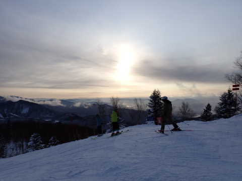

いやーーー．

良かった．

この週末は良かった…

今週末も，またこんないいコンディションだと

いいなぁ…

ってか．

今週はパウダーで，また違ったシアワセが

楽しめるのかも！？？

今シーズンはまだ本格パウダーに当たって

ないので，それも楽しみ…

## 💬 コメント一覧

### 💬 コメント by (レインボー75)
**タイトル**: Unknown
**投稿日**: 2023-01-24 19:29:56

火曜日の志賀高原情報

今日は焼額から出ませんでした。午前はどこもかしこもパーフェクト。槇原寛己です。

ゲレンデはがら空き。イチゴンが朝一故障で、ニゴン派にはラッキー。

昼は西館でステーキ。こんな幸せを満喫できる余生が待ってるなんて。

そうこうするうちに雪が。これがみるまに！

午後はカービングしても走らない。新雪滑りならなんとか。なんか楽しくない。

転倒から５日での復帰の隊員のことも考えて、レインボー(２時まで)の一時間前に終了。

夜になって湯田中は冷えて吹雪。明日は風速17mの予報。気温も-18℃。休場を決めて今夜は深酒です。今夜の手巻き寿司が評判よくて、これからはみんなにふるまいたいなと。

明日は上へ登るだけで大変かと。皆さま、たぶんやめた方がいいかと思いますよ(現時点て)

### 💬 コメント by (Skier_S)
**タイトル**: ＞レインボー75さま
**投稿日**: 2023-01-25 02:59:12

明日はすごい積もると思うので，雪搔き大変だと思います…

吹雪きそうだし，お休みにして正解かも．

手巻き寿司いいですね～！！ぜひごちそうになりたい…（じゅるる）

