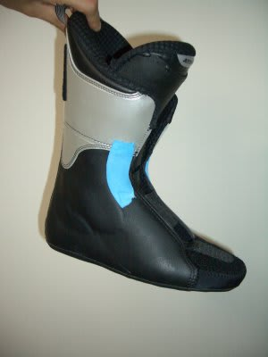
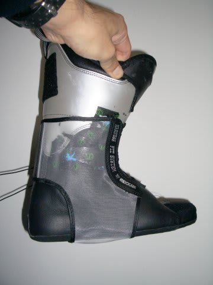
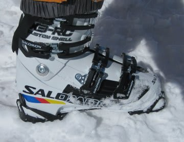

# SALOMON　X3-RC

📅 投稿日時: 2011-04-15 03:40:35

🏷️ カテゴリ: [スキー雑談](c1f9d2cb7478308da16419928ea3945e9.md)

というわけで．

なぜ，SALOMON X3-RCにしたか．

私の足は…

幅が広いんです．

最大，103mm程度．

レーシングラストとかの，幅95mm以下のブーツなんて

もってのほか．そこそこ幅広の98mmでもアウト．

中級者，初心者向けの快適100mmラストでも，広げないと

ダメです．痛くなります．

どんなブーツであろうと必ず，幅を広げなくてはならないんです…（涙）

そのくせ，足首が細いので，サイズが大きいブーツを選ぶと

がばがばで板をコントロールできません．

前のATOMICも，幅を広げるため，「これ以上削ると

穴があきますよ…」と店の人に言われてしまうほど

思いっきり削ったし，

さらに足首がゆるかったので，

こんな感じで足首をタイトにする目的で，インナーブーツに

青いパッドを張った上に…

こんな感じでレグザムのハーネスシステムで締め上げて，

足首のホールド感を出していたんですが．

やっぱり，インナーがヘタると足首がちょっとゆるく

感じられます．

また，シェル自体の足首ホールドが甘いので，

コブとかでクイックな動きを出しにくいときがありました．

…フラット滑ってるとあんまり気にならないレベル

だったんですけどね．

んで．

買い換えるに当たって．

大体，フレックスインデックス130前後の，各社の

ブーツを履き比べたとき．

足首が細く，一番しっくり来るのは，SALOMONでした．

さらに．

SALOMONブーツ，

この，足の小指が当たる黒い部分と，

反対側の親指が当たる黒い部分．

このシェルの黒い素材，加熱すると変形する材質でして．

温めてからブーツを履くと，あーら不思議，

足形に合わせて幅が広げられるという…

この部分，最初から変形させることを前提としているので，

ここを変形させてもバランスが崩れることはありません．

普通のブーツを熱で出す加工をすると，全体がゆがんで

ヒンジの位置とかが狂ったり，ソールがゆがんだりする

こともありますが．

このブーツは，そんな心配がなく，幅を広げられるという．

という感じで．

この部分の熱加工をしてもらったら，ほかの部分を

削ったり出したりする必要がなく，足首のホールドも

ピッタり．

…これまで，Nordica2足，Lange2足，SALOMON，ATOMICと

履いてきましたが…

初めて，削りや出しの加工をせず，市販そのままの

状態で履くことができたブーツとなりました．

足首のホールドがしっかりしているのに，幅はぴったり．

これまで追い求めていた，夢のブーツが今ここにに！

感動です．

…というわけで，このブーツで滑ってみたインプレッションは

また続きます…
