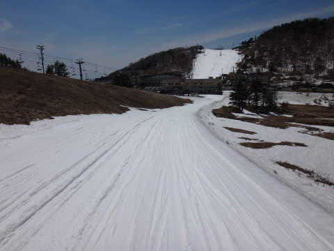

# GW4連休最終日，5月6日の志賀高原の詳細レポート…今シーズンもありがとうっ！

📅 投稿日時: 2014-05-08 01:35:23

ってことで．

昨日速報した，GW4連休最終日の志賀高原レポートをば…

えー．

焼額のゴンドラがぶっ壊れて動かないこの日．

早朝スキーは，ゴンドラ＆高速リフトが2本動いている，

奥志賀高原へ行くことに…

朝の山頂は，なんとマイナス気温！

日も射さない曇り空だったので，

さーぶいよ！

木々も白く霧氷がついてます…

ゲレンデは，前日の雨でぬれた雪が，

この低温で凍った，がちがちアイスバーンで．

こ…これは．

かなり，硬い．

本格的に，硬い．

早朝営業が終わる8時まで，全面氷のまま，

まったく緩まなかったですね…

でも．8時ごろに雲が切れだし…

をを！

9時ごろには，予想通り晴れ間がっ！！

10時ごろにはすっきりと晴れ上がってきましたよっ！

んでも，朝ガチガチに凍ってたので，10時近くまで

ゲレンデは比較的しっかりした硬さが残る，滑りやすい

状態をキープ！

だのに．

ゲレンデは，連休最終日だからか．

午前中から人が少なくて，がらがらなんですが…

寺子屋に上がると…

をを！

人が少なくて，ほとんどゲレンデが荒れてないっ！

ところどころ土が出ているものの…

けれども．

この時期というのに．

昼近くまで，そこそこ滑るフラットなコンディション！

5月の晴天の中，こんなにいいコンディションでいいのかしらん？

でも，今年は雪が多いな～．

タンネの森も，まだ全面雪に覆われてるし．

いつもはGW終盤には切れちゃう，

タンネ→高天ヶ原の連絡路も全然問題なし．

高天ヶ原も，メインバーン上部は土が出てきたとはいえ…

なんと．

モーグルバーンがまだ全面OKですよ！

さらに，焼額の第2高速沿い，唐松コースも

コース幅いっぱい，全面OKだし．

唐松コース下，プリンスホテル西館前でこんなに雪があるなんて！

…しかし．

どーでもいいですが．

どの写真も写ってる人が少ないことから分かるように．

この日は寂しいくらい人が少なかったなぁ…

さすがに午後になると．

人が少ないとはいえ，雪が荒れてきましたが．

んでも，粘つく雪にならず，結構滑る雪で．

焼額山スキー場の，今シーズンの営業終了の

なごりを惜しんで．

営業が終了し，シーズン終了の片づけが始まる

一番最後まで，滑っていたのでした…

（今シーズン最後の客として，後ろに誰もいない

唐松コースを滑る）

ありがとう～！

焼額！

今シーズンもお世話になりました～！

…

…で，終わらない．

まだ，終わらないのだ．

そう．

焼額は4時に終わるが．

一の瀬は，4時20分まで営業しているのだっ！

急いで車で一の瀬へ移動し…

そして，一の瀬のラスト1本を滑るっ！

いやー．

営業最終日まで，こんなに全面雪があるとは…

って感じで．

なんだか．

まだまだいっぱい雪があるので．

…来週から，焼額も一の瀬も滑れない，ということが

自分の中で納得できないまま．

営業最終日が，終わってしまったのでした…

…もったいないお化けを大量動員して

スキー場を襲ってでも，来週まで営業を

続けてもらいたいところではある．

## 💬 コメント一覧

### 💬 コメント by (Goku)
**タイトル**: Unknown
**投稿日**: 2014-05-08 19:29:23

今シーズンも焼額山を滑り倒しましたね。

それにしてもＳさんと入れ替えでＫ県に行っている間に、まさか２ゴンが故障で動かなくなっているとは・・・

２年前にもメンテと称してシーズン中に止めたことがあったのでナンカ怪しいですね～２ゴン・・・

まさか老朽化なんてもっともらしい理由で廃止なんてことにならなければいいんですが。

Ｓさんはこの後はかぐらとかでしょうか？

私は横手辺りに行くかも？ですが

行ったとしてもＢＢＱ目当てだったりです。

また来シーズン焼額山でお会いしましょう。

### 💬 コメント by (Sora)
**タイトル**: ありがとうございました
**投稿日**: 2014-05-08 22:54:54

Skierさん、お疲れさまでした。そしてレポートありがとう

ございました。

結局、私はGWに志賀高原へ行かずにシーズン終えてし

まいました。少し心残りです。

来季は、初めからレポ参考にさせていただきます。それま

でお元気で。（日々の行いは・・もう、好きなようにやってく

ださい・笑）

### 💬 コメント by (Skier_S)
**タイトル**: お疲れ様でした…
**投稿日**: 2014-05-09 02:59:24

＞Gokuさま

いやー．

今シーズンも滑りましたよ～．焼額．

でも．焼額のゴンドラ．

2ゴンも1ゴンも，最近故障で止まることが

多いですね…．

2ゴンはできてから20年以上，

1ゴンも12年たちますから，そろそろ

いろいろガタが出てくるころで…

私はこのあと，5月いっぱいはかぐら通いです！

＞Soraさま

今シーズン終了，お疲れ様でした．

来シーズンは最初からよろしくです～．

…でも，このBlog．

夏の間もやってますので，引き続き

ご愛読のほどを…（笑）．

