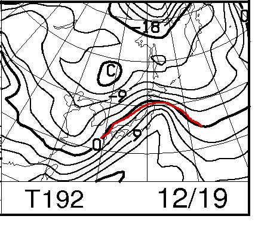

# 今週末の志賀高原の天気は…降りますね～．そして焼額第2ゴンドラ運行予定！

📅 投稿日時: 2013-12-13 02:14:00

いやー．

昨日，12日は．

予想通り，日本海側はもうドッサドッサ積もる，

かなりの大雪だったようですが．

残念ながら，志賀はやはり西風の影響で，それほど

どっさりとは積もらなかったようで…

でも，どっさりとは言わないまでも．

昨日の夜からそこそこ雪が降ってくれたおかげで．

[焼額のHP](http://www.princehotels.co.jp/ski/shiga/)には，12月14日(土)から，第2ゴンドラ運転予定の文字が！

やったー！！！

そして，[志賀高原リゾートのページ](http://www.shigakogen.co.jp/news/829.php)には．

　12/11現在、今週末の14日（土）から高天ヶ原クワッドリフト、

　一の瀬ダイヤモンドクワッドリフト、山の神第2ペアリフト、

　丸池第1トリプル、法坂第1クワッドリフト、発哺クワッドが

　追加で営業予定です。

　一の瀬クワッド（ファミリースキー場）は現在、微妙な状況です。

って書かれてて．

この週末，志賀はかなり滑れるエリアが広がりそうですね～！（喜）

ではでは．

この週末の詳細な天気をば，占ってみましょうか…

えー．

これは…

なんだか…

…この週末まで，降り続けますね．

ひたすら．

これが金曜夜9時の850hpa予想図ですが…

うむ．0度線は日本のはるか南．

志賀高原はマイナス9度線がかかっているので…

標高1500mの志賀高原の一番下の近辺でもマイナス10度近く，

山頂付近ではマイナス10度を大きく下回る気温になり．

むちゃくちゃ冷えてます．

そして，金曜夜9時の地上天気図は…

日本海付近，縦じまの天気図になっているので．

ばっさばっさというほどではないですが，

金曜は朝9時ごろから，志賀もそこそこ降ってくれそうです．

＃白馬，新潟エリアはばさばさ降りそう…

で．

土曜の夜9時の地上天気図を見てみると…

ここでも日本上空は縦じまの等圧線．

等圧線がこの角度だと，志賀高原は北西の風．

まぁまぁ降ってくれそうな感じ．

そして，850hpaの0度線は相変わらず南に下がり，志賀高原は

-6度線．

しっかり冷えます．

そして，日曜も，夜9時の天気図を見ると…

うむ．

これは見事な縦じま．

さらにこの日の500hpa図を見ると…

…これは，志賀でもかなりドサドサ降りそうな予感っ！！！

細かく解説するのもあれなので，簡単に説明すると…

青い色をつけた網掛け部分が，暖かい上昇気流があるところ．

夏ならこの部分で雨になるところ．

しかし．

冬の日本海側は，網掛けのない，乾いた冷えた空気が日本海に

流れ込むと雪雲を発生させます．

図中の赤い矢印で示したように，冷えた空気の道が，青い領域に

はさまれるように日本に向かって伸びています．

このパターンの場合は，大雪になるんですね～

これは．

日曜，すごいよ．

日曜は終日，ドサドサ降りますよ．

…でも．風も強そうなので．

吹雪っぽいなぁ…

ゴンドラが運休にならないことを祈るばかり．

ってことで．

志賀高原の天気，まとめると．

・土曜朝は，金曜夜からの雪が20cm程度積もってるかな～？

　土曜は終日，時々やむこともあるが，シンシンと雪が降り続ける．

　気温はマイナス7-8度くらい．寒いよ！

・日曜は，おそらく終日ドサドサと降る．パウダー天国になりそうだけど…

　下手すると吹雪く．マイナス10度近い激冷え．

って感じでしょうか．

…うむ．

この週末は期待大だなっ！！

…しかし．

うむ？？

うむむむむ？？？

…来週水曜～木曜あたり，雨になるかも…(涙)
