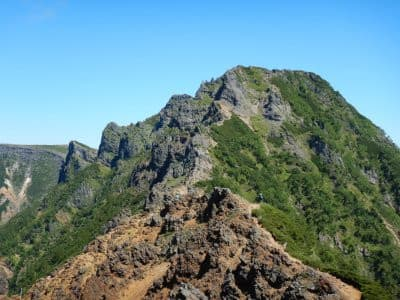
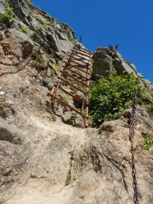

# このままでは運動不足で死んでしまう…ちょっと運動してこないと！

📅 投稿日時: 2021-08-31 03:28:45

在宅勤務が続き，スマートウォッチの

歩数計によると，一日100歩程度しか

歩いていない日が続き．

先週も，月曜から土曜までの

6日間の総計で1200歩ほどしか

歩いていないという衝撃の

事実が示されている今日この頃，

皆様いかがお過ごしでしょうか．

いや．

一日80歩とか．

トイレと仕事机の片道10歩を

数回歩いただけってことですね(涙）

私の職場の周りでも．

運動不足で糖尿を悪化させたとか

いう人もぼちぼち出始めてきたので，

健康には気を付けないと！！

ってなことで．

昨日の日曜，

このままでは健康が維持できないという

危機感を感じたので．

仕事が終わっていないにもかかわらず．

土曜の深夜まで仕事したあと，

1時間ほど仮眠を取っただけで，

ちょっと運動しに行ってき

ました～←睡眠不足の方がよっぽど健康に悪いのでは！？？（至極当然なツッコミ）

現地では買い物や食事に寄らず．

登山口も人があまり来なさそうな

マイナーな登山口を選び．

家の外では他人にも合わず，会話せず…

という感じでしたが．

とりあえず，久しぶりに1日200歩以上

歩きました！

…しかし．

目の前にこんなところが現れた時．

これ，どうやって登るんだろう？

…と思ったけど．

はしごやら…

鎖やらが，必要な場所には

しっかり設置されていて．

なかなかな急登は多かったものの

(矢印の先に人が…)

結果的には，こんな感じのルートで

登っていきました

いや．

いつも思うけど．

登山道って，すごい…

いや．

もっとすごいと思ったのは．

山のてっぺんから下を見下ろしたとき．

すごい絶壁感にちょっとビビっていると…

そのちょっと横を見た，

あの矢印の先のところ．

拡大すると…

あんなところに人がいるん

ですけど…っ！！！

すごい…

凄すぎる…！！

どうやら，アルパインクライミングの

名所らしく．

結構その筋の方には有名な絶壁

みたいです…

あんな絶壁を登る人がいるとは！！

…私には絶対できない…

ってなことで．

平日は一度も玄関から外に出ない日が

数週間続いてますが．

なんとかスキーができる健康状態を

維持できるよう，頑張ってます～！←だからほぼ徹夜で登山に行くどこが健康維持なんだ？

## 💬 コメント一覧

### 💬 コメント by (ikkun)
**タイトル**: Unknown
**投稿日**: 2021-09-01 09:08:16

ヤバい(・・;)死にます( *´艸｀)  ゴンドラ駐車場で☕タイム？に以前同じschoolの指導員様 走っておりましたなあ😅何かしないとヤバいけど……普通の登山じゃないですよね(笑)

### 💬 コメント by (Skier_S)
**タイトル**: ＞ikkunさま
**投稿日**: 2021-09-02 02:14:25

オフトレやらないと，冬のシーズンまでに体力一気に無くなりますよね．

それだけじゃなく，病気になったりしたらヤバいですから．

自転車がトレーニングによさそうなんですけどね～．

