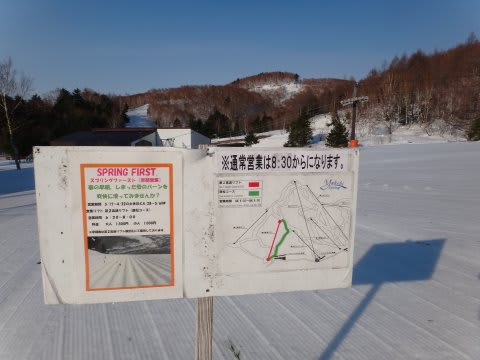
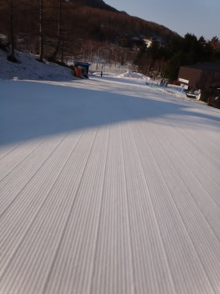

# なんと！春の焼額早朝営業は，第2ゴンドラが動くらしい…

📅 投稿日時: 2013-03-07 02:59:16

🏷️ カテゴリ: [スキー雑談](c1f9d2cb7478308da16419928ea3945e9.md)

『冬来たりなば，春遠からじ』

意味：楽しい時間はすぐに終わり，やがてつらい時期がやってくる

…昨日と同じようなネタで書き出してみました．

Skier_Sです．

とりあえず．

春が近づいてるわけですが．

春といえば恒例の，焼額第2高速リフトでの早朝営業．

はじめのうちはGWだけだったのが，4月中旬スタート，

4月上旬スタート…と，だんだん前倒しになり．

ついに去年から，3月下旬にスタートするようになったという，この早朝営業ですけど．

今年も，3月23日からスタートするようです．

んで．

雪質が悪くなる春は，朝の締まったいい雪を滑りたい！

と，4月になると結構おせわになる焼額早朝営業．

なんと．

今年から．

第2高速リフトではなく．

[第2ゴンドラで早朝営業](http://blog.princehotels.co.jp/yakebi/2013/03/post_1059.html)をやるようですっ！

ををを！

焼額，英断！すばらしいっ！

早朝からゴンドラが滑れるとはっ！

…って思ったけど．

ひとつ，残念なことが…

営業開始が，これまでの6:30から7:00に，30分遅くなってるんですね～．

去年まで：第2高速リフト　6:30～8:00（30分休憩あり）8:30から通常営業　＠1500円

今年：第2ゴンドラ　7:00～8:30　8:30から通常営業　＠1500円

終了時間も30分遅くなったので，時間が1時間半ってのは変わらないんですけど．

ですけど．

これまでは．

6時半から8時までの1時間半滑って，8時から8時半の休憩時間に宿で朝食…

って技が使えたのに．

今年から，いつ朝ごはんを食べればいいんだろう…？

宿の朝ごはん＠8時までに間に合うように帰ってこようと思うと，

1500円払っても1時間以下しか滑れないなぁ…

うーーむ．

早朝から第2ゴンドラが動くのは嬉しいんだけど．

開始時間が遅くなっちゃったのは，ちと悩ましい…．

PS.

でも，[この](http://blog.princehotels.co.jp/yakebi/2013/03/post_1059.html)案内．

「2.5mのロングラン滑走が可能になり、」って…

…長くない，長くない．ぜーんぜんロングランじゃない．

私のVolkl Platinum CDより，0.7mほど長いだけだし（笑）．

## 💬 コメント一覧

### 💬 コメント by (ひろりん)
**タイトル**: Unknown
**投稿日**: 2013-03-07 14:48:07

ぶはｗｗｗ

たぶん、マイル表記なんだと（違）

私は2.5km以前に7時開始とかが鬼畜過ぎてムリです（汗）

### 💬 コメント by (Skier_S)
**タイトル**: ひろりんさま
**投稿日**: 2013-03-07 23:55:35

ぶはっ！

気づかなかったっ！

マイル表記だったんですね…（笑）．

一の瀬の早朝は6時からですよ～．

2回ほど，朝6時からナイターストップの9時まで

滑ったことがありますが…

人間として何かを捨てているような気がしたので，

最近はやってません（笑）．

