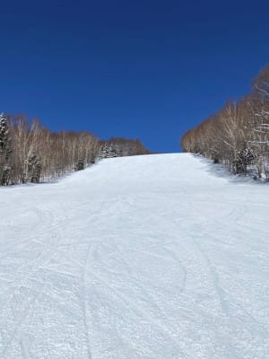

# 2021/2/25(木)の志賀高原スキー場，特派員レポート！…晴天最高だったらしい…そして，これからの1か月予想を見てみたが(涙）

📅 投稿日時: 2021-02-26 00:06:35

ということで．

本日も筆頭特派員であるレインボーさんは

志賀高原へ行っていないという，残念な

状況ですが．

今日も志賀高原には他の有能な特派員が

送りこまれているので．

今日も志賀高原の特派員レポートです！

えー．

まず．

今朝も朝はちょっと雲が多めだったものの，

日が射す天気でスタートしたようで…

あさイチの気温は-12℃と，

結構な冷え冷え！

そして…

ゲレンデは，最高のトップシーズン

冷え冷え雪のシマシマ！！！

ぐはぁ…！！

何とおいしそうなシマシマバーン！！

そして，すぐに空はすっきり晴れ

渡ったようで…

この空の青さを見よ！！

奥志賀エキスパートコースも，

見事にいい感じに締まった，

悶絶モノのフラットバーンだし…

この晴天のもと，こんなバーンを

滑れるなんて，うらやましすぎる…！！

今日は一日，自分が上手くなったと

強烈に錯覚できる，絶賛勘違いバーン

だったようで．

ピカピカ晴天なのに，昼間の気温も

-3℃程度しか上がらず…

雪質は終日，自分が上手くなったと

思い込める，勘違い度MAXの

最高バーンだったようです！

こんな晴天のもと，最高雪質の

こんなガラガラバーンを滑れるとは！！

うらやましすぎる…

一の瀬も，誰も滑ってませんね…

寺子屋からも，北アルプスがきれいに

見えたようですし．

ぐはーー！

こんな天気で，こんなバーンを

滑りたい！！

いや．

今日の特派員からは，

「帰りたくない」

というメッセージが飛んできましたが…

そうでしょうね．

私もこんなだったら帰るどころか，

ずっとゲレンデに住み着いて

しまいそうです…

今日は，ゴンドラ待ちもそんなに

無かったようなので．

こんな日に，志賀に行けた特派員の

某氏がうらやましすぎる！

とりあえず，

　朝の気温は-10℃くらい．昼間も

　-5℃程度と結構冷え冷え．

　あさイチは前日の雪が圧雪された，

　最高のシマシマバーン．

　昼間も雪は緩まず，冷えてるのに

　晴れている，かなりいい感じの

　一日になりそう

という予想が，見事に当たった感じの

一日だったようです…

あぁ…こんな日に滑りたかった…

ってなことで．

昨日の予想通り．

明日26日（金）も曇り空ながら冷え冷えの

一日で，

明後日27日（土）は朝は曇りそうだけど，

この日も一日冷え冷えで午後は晴れる

いいスキー日和！

28日（日）は…昼間は0℃を上回りそうだけど．

終日晴れそうなので．

今回の冷え冷え雪は，この週末までは

もってくれて，いい週末になりそう…！！

…

…なのだが．

今週末は良さそうなのだが…

毎週木曜発表の一か月予想図，

FCVX14を見てみると…

なぬ！？？

…これからこの週末までの期間である

2月26日あたりに，水色矢印で示す

平年程度に冷える冷え込みがあった後は．

平年比+4℃~3℃程度高い期間が3月

いっぱい続きそうな予想なんですが！？？

なんということか…っ！！！！

緊急事態宣言解除の3月以降に

期待している人にとって．

これはあまりにもひどい仕打ち

ではなかろうか…（涙）

2月は平年よりちょっと高くても，

元が冷えてるからそれほどひどい

状況にはならないけど．

3月が平年より3℃から4℃高いっ

てのは…

かなり致命的（泣）．

あぁ…

この3月．

冷え冷えパウダーは期待薄の気配です（激涙）

今シーズンは，もう冷え冷えパウダーは

滑れないのか…

あぁ．

今シーズンも，まともに太板を履いたのは

1回だけで終わりそうな予感…

とりあえず．

3月以降に期待をかける私としては．

この予想が外れるよう，

全力で祈り，踊り，歌い続けます…←久しぶりに聞いたフレーズだな

## 💬 コメント一覧

### 💬 コメント by (新米パパ)
**タイトル**: Unknown
**投稿日**: 2021-02-26 10:25:15

お疲れ様です。

ニセコ情報、感謝感謝です。

ニセコは良いぞー！言う人は意外と東京在住で志賀高原行った事ない人ばかりだったんで。

3月の大寒波襲来を祈り倒します！

あと、志賀高原グルメ特集もいつかお願いします。

と、言いつつ、1秒でも長く滑りたいんで、魚肉ソーセージで昼飯は済ませてしまいがち。笑

### 💬 コメント by (Skier_S)
**タイトル**: ＞新米パパさま
**投稿日**: 2021-02-26 22:44:08

志賀高原グルメ特集ですか…

確かに，私の記事候補には上がっているのですが，

ヤケビで私と滑っている人は良く知っている，

私がレストランでお昼ご飯を食べるのは，シーズン数回しかない

というレアなイベントなので．

そんなにたくさん志賀高原のレストランを知っているわけじゃないんですよね…

