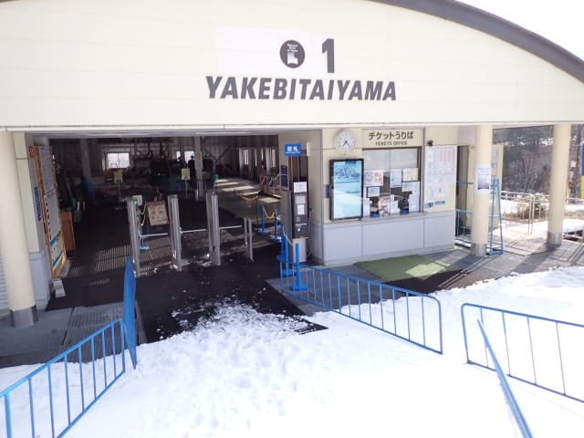
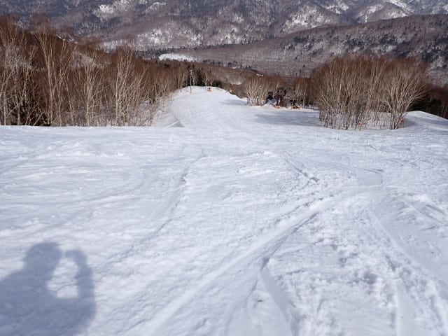
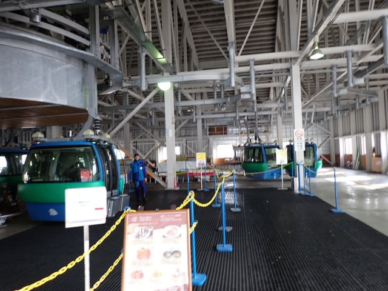
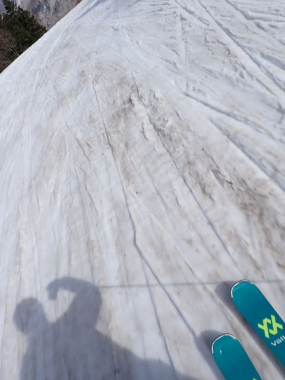

# 2025/4/19(土)の志賀高原焼額山スキー場は…終日晴天，そしてガラガラ！でも最高気温15℃で夏スキーか？という陽気

📅 投稿日時: 2025-04-19 21:53:17

🏷️ カテゴリ: [2025スキー滑走日記](cacd3fbf84d4a679ee61a5894c3f95e14.md)

ということで．

今日も志賀高原で滑ってきました～！！

…しかし．

今日は暑かった…

関東もかなり高温になったようですが，

志賀高原も夏でした（泣）

でも，雪はまだまだたっぷりあるし，

板は比較的滑ってくれたので，晴天の中

夏スキー(？)を楽しんできましたよ～！

まず．

今日は早朝の営業開始に間に合うように家を出たら，

睡眠時間2時間を切ってしまい死んじゃうので，

朝7時ごろ到着を狙って志賀高原へ登りますが…

気温も蓮池で9℃近く，日差しもあるので

路面に積雪はないし，トンネル内の凍結もなく，

楽勝でスキー場まで登ってこれました…！

そして，早朝営業開始後1時間ほどたった，

7時過ぎごろに焼額第1ゴンドラに乗車しますが．

早朝のゴンドラはガラガラですね…

山頂へやってくると…

気温はすでに+7℃！！

なんじゃこりゃーーー！！

まだ早朝営業の時間帯なのに，

これは気温が高すぎる…（泣）

で，今日は予想通りすっきり晴天．

…この時期は晴天高温だと雪が緩むので，

薄曇りくらいのほうがいいんだけどな…

そしてこれも予想通り，昨晩に雨が降ったので，

雪は朝から緩めです…（泣）

朝7時だと，さすがに板がザブザブ潜っていく

ほどではないものの，早朝からしっとり柔らかで，

クリーミーな雪ですね…（涙）

営業開始から1時間たってるけど，人が少ないので，

まだところどころシマシマが残ってましたが…

でも，ユルユルの雪なので，シマシマでも

多少踏まれた雪でもあんまり変わりがない…（泣）

せめて早朝はもう少し雪が締まっててくれると

うれしいな…

まぁ，とはいえ．

今日は天気も良く，そしてGW直前の週

ということで，お出かけする人が少なめ

なのか，ゲレンデの人も少なくて…

雪は緩いながらも，朝9時前までは

かなりフラットなバーンを楽しめましたよ！！

しかし．

気温も高く，日差しが強かった本日．

午前9時には早くも雪はザブザブになってしまい…

そのため，午前中…それもまだ早い時間と

いうのにバーンは徐々に荒れ始め，

緩斜面では板の滑りが悪くなってきました…

でも，今日は終日，急斜面では板が走ったし．

緩斜面でも急激なブレーキがかかるという

ほどではなく，ちょっと滑りが悪いなぁ…

という程度で．

妖怪板掴みというより，その幼体の

幼体板ちゅかみ

が出現した程度だったので，まだマシ

だったかな…

まぁでも，いつもなら上の写真の右側の傾斜

部分は，かなりの土が出ているころなのに…

まだ全然土が出てくる気配はないですね！

今年は雪が多く，GW最後まで問題なく

滑れそう！

そして，この下の写真のパノラマコース．

左端にコブラインが掘られていますが…

コブ溝にもまだ全く土が出てないです！

この時期，ヘタするとコブを掘ってなくても

コース真ん中に穴が開き始めて，

雪をどこかから持ってきて穴を埋めてる

ことも多いのに，

今シーズンはしっかり人工雪を打っている

こともあるけど，やはり雪が多い！

ちなみに，オリンピックコースにも

こんな感じでコース左右にコブが

作られていて…

さすがに1か所だけ，コブ溝に土が出てる

ところがあったけど．

でも，この1か所以外は土も出ておらず，

コースの上から下までずっとコブが

できてました～！

…でも．

コースいっぱいに雪があるように見える

オリンピックコースですが…

1か所，岩が出ているところがあります…！

斜面変化を越えたあたり，雪の中に

埋もれて1か所石が出てるのでご注意を…！

で．

雪はたっぷりあり，板の滑りも悪くなく，

緩斜面で幼体板ちゅかみが出る程度で済み，

晴天＆高温の日としては恵まれている

ものの．

この日の最高気温は，山頂で15℃を越えて

しまい…標高2000mの15℃っていうと，

夏に近い気温なんですが（泣）

そのせいで，昼前には雪は4月下旬らしい

ザブザブ雪になり．

バーンはかなり荒れ気味になってきて

しまいましたが…

それでも，今日は朝から第1ゴンドラも

ガラガラだし．

第2ゴンドラも終日ほぼ待ちなしだった

ので．

ザブザブ雪だったわりには，ひどい凸凹には

ならなかったけど…

でも，やっぱり午後になるとそこそこの

荒れた斜面になってきて．

そのせいで，さらに人が減っていきました…

そして，人が減っていき，滑る人がいなく

なると…

雪の表面に汚れが浮いてくるように…（泣）

まぁ，強烈なストップ雪にはならなかったけど．

…春ですねぇ…（ちょいと残念）

ってなことで．

この4月の時期は，午後2時に第2ゴンドラが

営業終了となり，第1ゴンドラ側へ誘導が

始まります…

そこから午後3時半の第1ゴンドラ営業

終了時間まで，ほぼ人がいなくなった

ゲレンデを滑り倒し…

今日も朝7時から午後3時半まで，

ひたすら休まず滑り続けたのでした…

とりあえず．

天気が良く，ストップ雪にはならなかったので，

夏スキーと思えば楽しめた一日でした～！！

明日の日曜は，気温は今日とそんなに

変わらないけど…

今日と違って夜中に雨も降らないし，

朝は晴れるので放射冷却で冷えて

朝イチのバーンは締まったバーンに

なりそうだし．

早朝は晴れてても，午前中から

雲が増えて，日差しが弱まるので

雪が今日ほどは緩まなさそうだし．

雨も昼過ぎまで降らずにいてくれて，

降っても午後にぽつぽつ程度降るか

どうか…

ってな感じだし．

明日の日曜も，思ったよりいい感じに

なるんじゃないかな…

とりあえず，明日も志賀高原で滑ってます～！！

## 💬 コメント一覧

### 💬 コメント by (大阪のK)
**タイトル**: Unknown
**投稿日**: 2025-04-19 23:56:30

今日は昼前に奥志賀にえっちら漕いで行きましてエキスパートを回していましたが、焼額山より雪質が良く滑りやすかったですよ🎵

呪いが解けたら行ってみてください🙇

### 💬 コメント by (musi)
**タイトル**: Unknown
**投稿日**: 2025-04-20 08:35:59

昨日初めてSさんとご挨拶出来たmusiです。焼額山に行く度にDEACONを見ても、ご本人を特定出来ないので、実在の人物なのか？なんて思いだしてたので、準備中で申し訳ないなと、思いながらも我慢出来ず声掛けさせてもらいました。挨拶できて、ウキウキしながらコブ練習してたら、とんでもない転け方して、人生初パトロールの世話になり、初めて骨を折り、トロトロ運転して

### 💬 コメント by (musi)
**タイトル**: Unknown
**投稿日**: 2025-04-20 08:40:03

今朝方漸く帰京しました。変なオチがついて、今シーズンが強制終了となりなした。何処か良い病院ないですかね。ＣＴの画像では素人目にも骨折とわかる骨折でした。

皆様も春雪お気をつけて。

### 💬 コメント by (Skier_S)
**タイトル**: 今日は気温が高かった…
**投稿日**: 2025-04-21 01:59:05

＞大阪のKさま

今日は午前中，久しぶりにかなりの時間一緒に滑りましたね…

でも，今日も結局ラストまで一日焼額を滑り続けてました．

奥志賀，上からしか行けなくなって移動がめんどくさいので…（笑）

＞musiさま

土曜は無事お会いできて，実在の存在というのが証明できたかと思ったら…

えええ？？？骨折ですか？？？

そして，骨折してそのまま運転して帰宅ですか！！

…ご愁傷さまです…

コブ斜面で転倒して骨折っていうと，腓骨骨折のパターンですが，

入院せずに自力で移動できるというと別の場所でしょうか．

とりあえず，シーズン強制終了というのは残念ですが，治療に専念して早期回復を

図ってください…

お大事に…

### 💬 コメント by (Skier_S)
**タイトル**: Unknown
**投稿日**: 2025-04-21 14:17:42

＞ Skier_S さんへ

＞ 今日は気温が高かった…... への返信

上腕近位端骨折でした。足取られて、逆エッジみたいに肩から叩きつけられてしまいました。北信総合病院まで、救急車呼びますか？とパトロールの方に言われたのですが、ブーツ脱がして頂けたので、自力で向かい、自宅へもゆっくり独りで帰りました。ほんと、天国から地獄の土曜日でした。

でも、パトロールの皆さん、コブで倒れてる私に声掛けて頂いた方達、の優しさ。沁みました。私も世の中へ還元出来る様、徳を積みたいと思います。

### 💬 コメント by (Skier_S)
**タイトル**: ＞musiさま
**投稿日**: 2025-04-23 01:33:56

あら…腕の骨折でしたか…

それも上腕近位端って，またごついところが折れましたね…

利き手の方じゃなければ，少しは救いになりそうですが…

ぜひ徳を積んでください．

徳を積んだ分，早く治るかもしれません…

お大事に…

