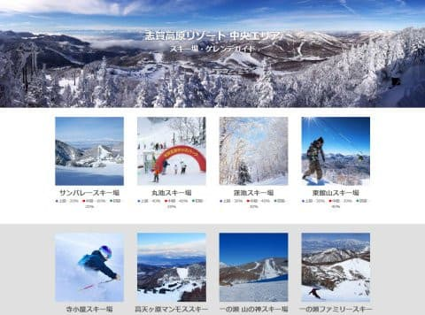
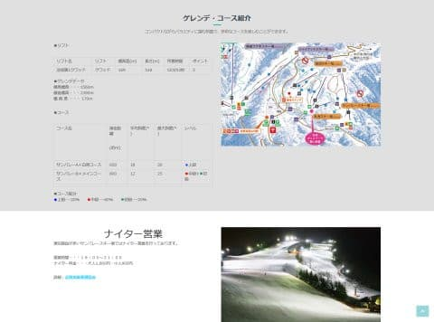
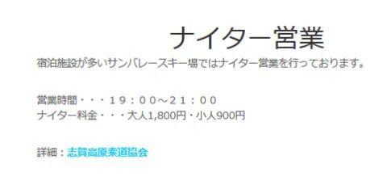
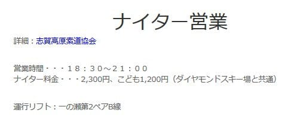
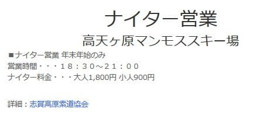
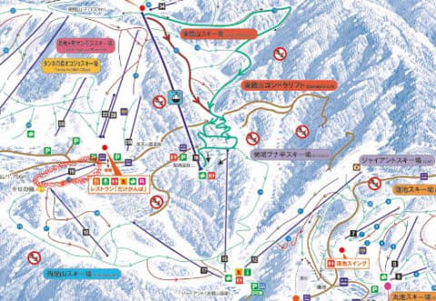
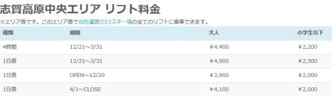
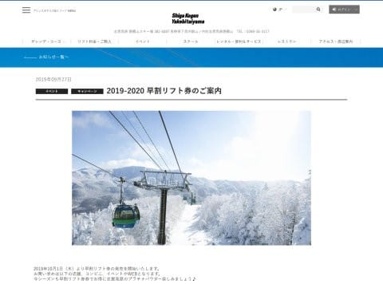
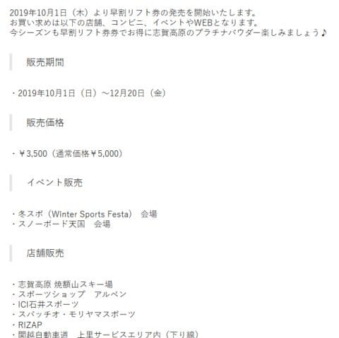
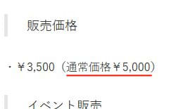

# 志賀高原の2020シーズン情報も，そろそろ出始めてきたよ…中央エリア，リフト券一気に値上げ（涙）

📅 投稿日時: 2019-09-29 02:02:24

…そろそろ10月に入るので．

わがホームゲレンデの志賀高原も，

いくつか来シーズンの情報が

出てきてますね…

まず．

志賀高原中央エリアのウェブページを見ると．

このページからたどれる各スキー場の

ゲレンデ情報が，さりげなく2020シーズンの

内容に入れ替わってました…！

（[志賀高原中央エリアホームページ](http://shigakogen.co.jp/highlight/snow-slope)より）

いや．

この，各スキー場のページ．

どこにも2020シーズンの内容と書いてないし．

「まだ2019シーズンの内容だよね…」

と，何気なくスルーしていたら．

（[志賀高原中央エリアホームページ，サンバレースキー場](https://blog.goo.ne.jp/admin/newentry/)より引用）

うむ？

このナイター情報に，

なぜか違和感が…？？

って，ええええ？？？

たしか…

たしか，2019シーズンは1600円だった

はずっ！！

もう，2020シーズン情報になってるってこと？

そして，2020シーズンは200円値上げ

するってこと！？？？

…と，気になって．

他のスキー場も見てみると．

ファミリースキー場のナイターも，

2100円が2300円になってます…（涙）

ここも200円値上げか…

でも，ダイヤモンドと共通って

書いてあるから．

2020シーズンもダイヤモンドナイター

やってくれるのか…と一安心．

そして．

高天ヶ原も200円値上げしてますが．

2020シーズンも，正月のみナイター

やるようです…

で．

各スキー場のマップを見てみましたが．

2020シーズンは，志賀高原中央エリアでは，

リフトの増減は全くなさそうですね…

[落雷で燃えてしまい](http://shigakogen-ginrei.com/blog-entry-1722.html)，シーズンラストの

営業ができなかった西館第2トリプル

リフトも，無事営業するようです…

…で．

ナイター料金は値上がりするようですが．

中央エリア，昼間の料金も上がってます…

（[志賀高原中央エリアホームページ，リフト料金](http://shigakogen.co.jp/highlight/896-2)より）

昨シーズンは4時間券が4000円，

1日券が4500円だったのに，

それぞれ4400円，4900円と，

400円アップしてます…

ナイター券，昼間券ともに，

大体1割値上がりですね（泣）．

で．

まだ全山共通券のお値段は

更新されておらず．

2020シーズンの全山券のお値段は

不明です…

が．

焼額のホームページを見ると，

志賀高原共通早割券の案内が

始まっており．

（[焼額山ホームページ，早割リフト券のご案内](https://www.princehotels.co.jp/ski/shiga/informations/earlyliftticket/)より引用）

12月20日まで，早割一日券が3500円で

買えるようですが…

これを詳しく見ると．

「通常価格5000円」

と書かれてますね…！

…これは．

来シーズンも共通一日券は5000円の

ままなのか？？

あるいは，まだ2020シーズンの価格が

分からないから2019シーズンの価格の

ままにしているのか？？？

…もし，共通一日券が5000円なら．

中央エリア一日券の4900円は高すぎて，

買う人はいなさそうなので．

おそらく，共通券も400～500円値上がり

するのかも…

と思ってるのですが．

（9/29追記：志賀全山共通一日券5500円，

　2日券10500円，3日券15500円のようです）

一日券5500円だったら，八方や五竜の

一日券と横並びなので，このあたりに

値上げしてきそうな感じ…

うーむ．

5000円を超えると，心理的

バリアーが高くなるので．

高い海外リフト券に慣れている，

インバウンドのゲストが多い

八方とかならまだしも．

国内客がメインの志賀高原．

さらにお客さんが減るんじゃ

ないかな～（心配）．

…そして．

シーズン券は一体いくらになるんだろう？？

1割アップだとすると，79000円！？？

8万円近くになっちゃう（涙）←それでも20000mクラブな方は，リフト1回数10円レベルだけど

うーーん．

いろいろ，痛い…

## 💬 コメント一覧

### 💬 コメント by (ふく)
**タイトル**: Unknown
**投稿日**: 2019-09-29 08:42:38

おはようございます

冬は志賀高原情報いつも参考にさせていただいています

タイムスカードの提携割引では志賀高原前日山リフト券5500円になってました

https://www.timesclub.jp/benefit/shop/sports/detail.jsp?shop=S000001455&search=key%3D%25E5%25BF%2597%25E8%25B3%2580%25E9%25AB%2598%25E5%258E%259F

### 💬 コメント by (musi)
**タイトル**: Unknown
**投稿日**: 2019-09-29 11:18:47

だんだんスキー関係のネタで、ザワザワし始めて来ましたね、志賀高原全山共通一日券は、早割のサイトでも、5500円から、500円引きと書いてあります。

海ネタの娘さんの旅先での仲良しさんとの別れのクダリ良いですね〜、私も小学生のころ伊豆の宿の前で女の子と暗くなるまで、ザリガニ釣って盛り上がった事思い出しました。最後の方はザリガニなんてどうでも良くて喋り続ける口実だったな〜。今シーズンも良いスキーと出会いに恵まれます様に。そろそろ踊ります。ヒエヒエを。

### 💬 コメント by (まうちゅう)
**タイトル**: Unknown
**投稿日**: 2019-09-29 17:33:44

みなさんあまり見ないであろう熊の湯のHPには

数週間前から早々にシーズン券以外の情報がupされています。

熊の湯限定シーズン券も始めるようです。

http://www.kumanoyu.co.jp/lift/#ticket

共通シーズン券の情報は現時点ではまだないです。

### 💬 コメント by (Goku)
**タイトル**: Unknown
**投稿日**: 2019-09-29 21:51:02

野沢が5,200円で67,500円

八方が5,500円で71,000円

志賀が5,500円で？？？？？

どうか、75,000円以内であって欲しいです。

### 💬 コメント by (Skier_S)
**タイトル**: 今年の志賀高原シーズン券は一体いくらなのか…
**投稿日**: 2019-09-29 22:14:05

＞ふくさま

コメントありがとうございます～！

いろんな情報を集めると，やっぱり志賀高原1日券は5500円のようですね…

高い…（涙）

これからシーズンイン．

またいろいろ情報あれば，コメントお願いします～！

＞musiさま

そろそろスキーシーズンが近づいてきましたよ～！

…そしてザリガニ釣りの話，いいですね．

旅先ではいろんな出会いがあり，別れもありますよね．

娘もそれが分かる年になってきたようです．

今シーズンも冷え冷え踊り，よろしくお願いします～！

＞まうちゅうさま

ををを！！

本当だ！

熊の湯のページに，全山共通リフト券価格出てますね…

気づきませんでした．

でも，熊の湯限定シーズン券6万円はちょいと高いかな…

焼額限定券がすごく安く感じますね(笑)．

＞Gokuさま

志賀は昨シーズンですでに72000円ですから…

リフト券が軒並み1割アップと考えると，

75000円以下の可能性は低そうですが…

しかし，八方みたいにシーズン券専用ラウンジとか，

焼額シーズン券のようにドリンククーポンやいろんな割引券サービスとか，

なにか特典があればまだいいのですが，

志賀高原全山シーズン券は何も特典が無いので

すごい割高に感じますよね（涙）

