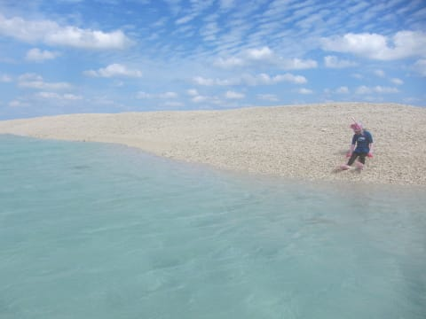

# 2015年10月　子連れで西表へダイビング旅行その14…バラス島でのんびりと

📅 投稿日時: 2016-09-09 03:02:52

🏷️ カテゴリ: [ダイビング日記](ce3a7a8d424d112fce83ee85c81a0e344.md)

ということで．

バラス島にて，お弁当タイムなわけですが．

お昼ご飯を食べ終わったら，島に上陸してみま

しょうかね～．

この島．

せいぜいこんな感じの，ホントにちっちゃい島で．

島全体が，こーゆーサンゴのがれきが

積み重なってできてます．

海の流れの関係上，ここにがれきが溜まるらしいん

ですけど…

うーむ．

なんとも不思議な感じの島ですね…

で．

海が荒れてて，今回は全く泳げなかった娘．

この島の周りは，海が穏やかだったので．

ようやっと泳げるので．

大喜びで海へ…

まさに．

水を得た魚ならず，

水を得た娘！

しばらく，楽しそうに泳いでましたが…

島の周りはちょいと浅く．

あまり魚もいなかったので．

泳ぎは早々に切り上げて，

海辺でのんびりタイムを満喫していました…

しかし，だなぁ．

こんな島を一人貸し切りで楽しんで．

娘～，

おまえ，これがどれだけゼイタクなことか．

分かってるのかな…？？

ってことで．

お昼ご飯を含めて，約1時間の休憩タイムを

満喫した後．

ちょっと名残惜しいけど．

バラス島を後にし．

ボートは3本目のポイントに向かって，

進んでいったのでした…
