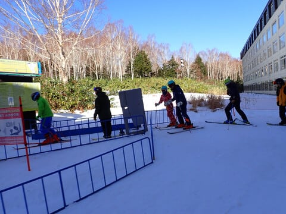

# 2023/12/10(日)の志賀高原焼額山スキー場，速報レポート！…終日晴天，最高気温+7℃で雪は4月の春スキー並み．サウスコースはよかったけど唐松は明日からクローズ

📅 投稿日時: 2023-12-11 02:15:20

🏷️ カテゴリ: [2024スキー滑走日記](c453f687e8a0f05679e95831d0a02cd0c.md)

ってなことで．

今日も志賀高原で滑ってきて，深夜に

帰宅したわけですが…

帰宅後，天気図を見るとかなり衝撃的な

予想になっていて，かなりのショックを

受けている，Skier_Sです(涙)

[この日の記事](e3c2920e54ce14f7139c7a51db77b57f9.md)で，17日から冷えそう…

と書きましたが．

その冷え冷えになる直前．

15，16日の金，土の850hPa気温図を見ると…

な，なんじゃこりゃーーーっ！！！

15日は志賀高原に+9℃線がかかるってるし，

16日も+6℃線がかかってるレベルだから…

これ，12月の気温じゃない（泣）

降れば絶対雨．

そして，15，16日の地上天気図は…

…

…

…

（即死）

ダメだ…

次の週末前の金曜と土曜．

見事に志賀高原でも雨にやられそう（泣）

これから1週間の気温を見ると，

火曜12日も高温で雨になりそうだし．

13,14日はわずかに冷えて，13日は

雪も降りそうだけど…

それもまた，15，16日に超高温の

雨で融けちゃうし．

平年比+12℃って，どういうこと！？？？

…これ，来週末も，ゴンドラが動かない

どころか，第2高速リフトもヤバいかも？？

いや．

今日の高温で雪が融けてしまって，

焼額山スキー場の第2高速リフト，

明日11日から一旦運転見合わせ

になっちゃったんですが…（泣）

（[焼額山スキー場ホームページ](https://www.princehotels.co.jp/ski/shiga/winter/)より）

うーん．

火，金，土と雨だと，次の週末に

ゴンドラが動かないどころか，

第2高速リフトも運転再開できない

かも…？？

だめだ．

ここしばらく暖かすぎる…

そして．

17日から冷えるのが，2日ほど遅すぎる

感じ（泣）

せめて週末の前日，15日の金曜から冷えて

くれれば，週末はマシな状況になりそう

なんだけど…

ヘタすると次の週末は，12月第1週より

コンディション悪いかも（泣）

…ってな残念なニュースの後は，今日の

焼額山スキー場，速報モードにて！

えー．

今日もあさイチからすっきり晴天で

スタートしたわけですが．

うん．

朝の第4ロマンス側，サウスコースは

シマシマだし，雪も冷えてていい感じ！！

…だけど．

気温がぐんぐん上がって，日差しも

強かった今日．

第2高速リフト側の唐松コースは，

雪が4月の雪みたいにドロドロに融けて

行き…

そこかしこにブッシュやら石ころが

出てきてました（涙）

雪がかなり薄そうなので，残念ながら

明日から第2高速が営業見合わせって

のは納得…

ただ，第4ロマンスリフトのサウスコースは

雪は緩んだものの，雪の厚みはたっぷり

あるし，コース幅いっぱい安心して

滑れます！

まぁ，午後はちょいと荒れ気味には

なりましたが，そんなにひどい凸凹には

ならずに済みました…

リフトは，第4ロマンスリフトは午前中に

一瞬2-3分待ちになったものの．

それ以外は数人待ってるかどうかという

程度だし．

第2高速は飛び乗りで，ガラガラでした…

営業終了間際にちょっと雲が出てきましたが．

基本的に終日晴れで，4月かと思うほど暑い

一日で，雪質もあいまって春スキーを

思わせる，のんびりした感じの一日でした…

ってなことで．

天気が良く，気温も高く春スキーみたいな

雪だったこの土日ではあったけど．

まぁ，第2高速も動いたし．

雨も降らなかったから楽しめました！！

…次の週末が怖い…

また明日，詳細レポートやります～！！
