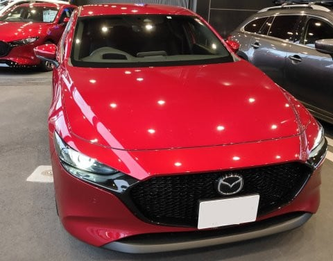
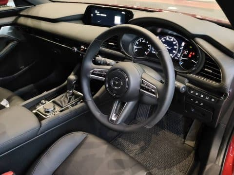

# MAZDA 3 Skyactiv-Xエンジン車に乗ってみた

📅 投稿日時: 2020-08-21 00:59:37

🏷️ カテゴリ: [車試乗](c07dec5709d34bd74e1f6cb9c8291061b.md)

えー．

どうやら．

書きかけのこの原稿を，また間違えて

今日の朝から昼過ぎまで晒してしまっていた

ようなんですが…

…誰も見ていない．

書きかけの原稿なんて，誰も見て

いないはずだ…！

ということで．

まるで知らなかったふりをして投稿！

ってなことで．

スキーシーズンも終わり．

自宅待機もある程度緩和されてきた

今日この頃．

…とはいえ，県境を超えた遠くへのお出かけは

控えておきますか…

ということで．

選んだお出かけ先は，自宅近所のマツダ

ディーラーさん．

かつて，ノーマルガソリンとディーゼル車には

乗ってきたものの，その時はSKYACTIV-Xエンジンは

まだ出ておらず，試乗できなかったので…

当初スケジュールよりリリースが遅れた

SKYACTIV-Xエンジン車，やっと乗ることが

出来ました～！

そもそもSKYACTIV-Xエンジンとは…

普通のガソリンエンジンと違い．

ディーゼルと同じ，高圧縮での混合気自着火を

積極的に利用したエンジンで，

そのメリットは…

・圧縮比（図示膨張比）が高くできて燃費がいい

・リーン燃焼ができるので，スロットルロスが少なく燃費がよい

・リーン燃焼ができるので，燃焼温度も下げられる

　　⇒比熱比向上による燃費改善

　　⇒冷却損失削減による燃費改善

・部分負荷時の絞り弁絞り量が少ないので，

　アクセルレスポンスがいい

などと主張していますが．

このあたり，また論文をいろいろ読み込んだので

また別途報告するとして．

とりあえず乗ってみた感想をば…

まず，乗ったグレードはX L-Package．

シートも本革で，BOSEサウンドオプションが

付いていました…

内装の質感，グレード感は高いよ！！

いや，これは素晴らしい…

と思ったら．

「本体価格338万，ナビ＆BOSEサウンドオプション

付けると350万円です」

…ちょいと高いですね…

「4WD希望ですか！？？

　だとすると…オプションなしで360万円です」

…なるほど…

SKYACTIV-Xエンジンを選ぶと，

LEVORG2.0と同じ価格帯か…

一番安いグレードは340万ちょっとであるけど．

これは自動追随オートクルーズがついてなくて．

自動追随オートクルーズがある最低グレードの

4WD車でも355万円．

LEVORG2.0のV-SPORTより10万高いのか…っ！

ってな感じで，SKYACTIV-Xエンジンを選ぶと，

かなりお値段が高い車になっちゃうけど．

この内装なら，その車格に見合った品質感．

とりあえず，エンジンを始動すると…

をを！！

エンジン音はすごい静か！！

HPCCIは高圧縮で，どう考えてもディーゼル的な

高周波音がするはずだけど．

HPCCI燃焼を安定させるための熱カプセルで

エンジンが覆われているので．

副次的効果としてすごい静かになっているようで．

高級車並みのアイドリングのサイレントさ！

ってなことで．

非常に期待して，車を動かしますが…

ふむ．

足回りは比較的締まった感じ．

…ってか．

締まってるというより．

ちょっとフロントが跳ね気味？

ダンピングの収束がよくないんです

けど…？？

…たぶん．

このディーラーさん．

タイヤの空気圧，メーカー指定より高く入れてるよ．

間違いない…（涙）

惜しい．

惜しい．

Mazda3，前回はすごく感動した足回りで．

久しぶりにそれを感じようと思ったけど．

空気圧にセンシティブらしいMazda3のサス．

空気圧が高めだと，突き上げの角はとれてはいる

ものの，ドン！という感じの揺さぶりが

わずかに入り，そのあとのタイヤの収まりの

時定数もわずかに長い感じ…

惜しい…

タイヤの空気圧が高めなので，縦バネの

硬さ感に比べ，横G方向の剛性が心持ち低めに

感じる…

いや，Mazda3，もっといい車のはず…

惜しい．

Mazda3に乗っている方，この車の真の性能を

味わうために，タイヤの空気圧に注意しましょう…

まぁ，

それでも，ボディ剛性はがっしりしていそうで，

足回りの素性の良さは感じられます．

とりあえず．

肝心なのはエンジン．

…まぁ，SKYACTIV-XエンジンのHPCCIって，

決して排気量当たりの出力・トルクが高まる

仕掛けでなく．熱効率を高める仕掛け

なんだけど…

Mazda3のSKYACTIV-Xは機械式スーパー

チャージャーの過給付きエンジンで，

カタログ数値は

　2L NAエンジン：156ps/20.3kg-m

　1.8L ディーゼル：116ps/27.5kg-m

　2L SKYACTIV-X：180ps/22.8kg-m

と，出力・トルクとも2Lの通常エンジンより

1割ほど高い値になってます．

かつマイルドハイブリッドによる

モーターのサポートもあるので，

2Lより軽快かな…

と思ったけど．

「ドライバーが意図しただけトルクが出る」

という調整になっているアクセルペダル．

1.8Lだろうが2.0L NAだろうがSKYACTIV-X

だろうが，同じだけ踏めば同じだけ

加速されるよう調整されているようで．

アクセルを踏んだ瞬間のピックアップの

良さは感じますが，

アクセルペダルの非線形性も低いのか，

踏んだ以上に加速するようなオーバー

シュート演出もされていないので，

トルクの厚さは感じにくいです…

アクセルを踏んだ瞬間，わずかなアクセル開度の

ピックアップはいいのですが，

これはエンジンのピックアップなのか，

マイルドハイブリッドのピックアップなのか…

ぐっと踏み込んでみた時のトルク感は…

うむ．

びっくりするほどのトルク感は無いですね．

あたりまえですが，Mazda6やCX-8の

2.2Lディーゼルや2.5Lガソリンターボみたいな

爆発力は無いです…

というか．

1割トルクが高いはずなのに．

フル加速感で2LのNAとそんなに変わらない

気がするなぁ…

と，カタログをじっくり見てみると．

2L NA車の車両重量1360kg＠2WD車に対し，

SKYACTIV-X車の車両重量1440kg＠2WDと，

80kgも重いのね…

この重量差が，エンジントルク差ほどの

加速感の差が感じられない理由かな…

ちなみに，4WDだと1510kgと，

車両重量1.5tを超えてきます…

インプレッサ4WDより100kg以上重いのか…

そして，

2L NAガソリンが15.2km/L (4WD/WTLCモード)

SKYACTIV-Xが16.2km/L(4WD/WTLCモード）

と，燃費は1km/Lいいみたいだけど…

大変残念なことに，NAはレギュラー，

SKYACTIV-Xはハイオク指定なので．

燃費はいいものの，ガソリン代は

ほぼ同じか，SKYACTIV-Xの方が

高くつきますね…（涙）

ということで．

結構期待したSKYACTIV-X車でしたが．

…論文とかを読んでいると，技術的には

すごいチャレンジングで，これを市販まで

持っていたたのはすごいとしか

言いようがない技術なのですが．

「これ，買いますか？」

と言われると．

「Mazda3買うなら，2.0NAにします…」

と答えてしまうなぁ…

と思った，Skier_Sだったのでした…

## 💬 コメント一覧

### 💬 コメント by (Northfox)
**タイトル**: 夢でもみたかな？
**投稿日**: 2020-08-21 07:39:44

何故でしょう、読んでいてデジャブ感を感じました。（笑）

SKYACTIV-Xは4月に試乗してまして、私も感想はS様と同じです。

ディーラーの店長さんによると全然売れていないと泣いていました。そもそも試乗したいという客がいないそうで、ようやく私で二人目なんだとか。

試乗から戻ってきて店長に“率直な感想はどうです？”と聞かれましたが“良く出来ているけど．．．”としか言えなかったです。

突出して感じるものが無いので、過不足ない良いエンジンとしか言いようがなくて。

マニアではないエンジンの仕組みに興味のない人に売るのは大変でしょうね。

店長は“価格が高すぎるんですよね”と嘆いていました。。。

### 💬 コメント by (ほっぽ)
**タイトル**: Unknown
**投稿日**: 2020-08-21 08:45:49

Sさん

まるで業界の人のような詳しいインプレッションですね❗😊

感覚派の私にはここまで理詰めのインプレッションはとても出来ません。

ところで新型レヴォーグ情報が解禁になりました。

低迷していたように見えるスバル開発陣渾身の作品のようで、

四半世紀スバルオーナーだった私も是非実物を見て試乗してみたいと思いました。

1800ターボで3L NAと同等のパフォーマンスとか。

そして、もしもSさんか新型レヴォーグを新車購入されたら

一番に５年後のオーナーに立候補しようかと思ってます😅

### 💬 コメント by (Skier_S)
**タイトル**: それは夢です…
**投稿日**: 2020-08-22 01:28:52

＞Northfoxさま

え？デジャブ？

気のせいですよ，きっと…

で，Skyactiv-X試乗されたんですね．

いや，エンジニア観点で見るとすごいエンジンなんですけどね．

直噴，リーンバーン，過給とかの技術と並ぶレベルの

レシプロガソリンエンジンの革命だと思います…

ただ．

それが商品価値につながらないところが，技術者としては悲しいところ…

＞ほっぽさま

プラグを使わない自着火のHCCI技術は「こんなもん商用にできるか！」

と思っていたところ．

プラグ点火での燃焼膨張での未燃ガス圧縮を使うという逆転の発想で

HCCI制御をやってしまえ！

というのはすごいアイディアだし，それをあらゆる運転領域で使われる

乗用車のエンジンとして動くように作ったてのは，

すさまじいと思います．

これをやっちゃったMazdaはすごい．

ホントにすごい．

そこには敬意を表したいです…

で，LEVORGですが．

アイサイトEXが欲しくなりますが，この35万円プラスが高い…

すごいんですが，1.8Lのエンジンパフォーマンスが分からないと

２L からの乗り換えはためらいますね…

なんてったって，STI Sports EXはオプションつけると乗り出し500万近いらしいので…

