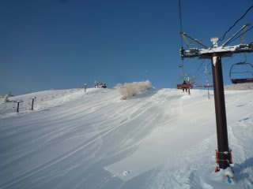
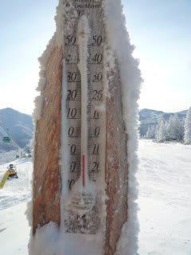
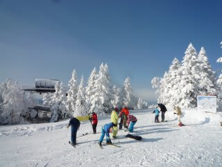
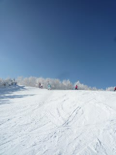
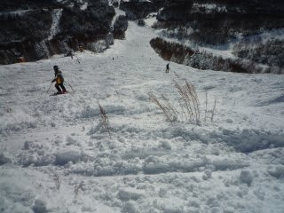
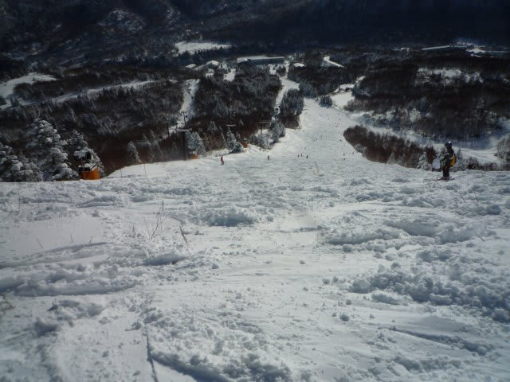
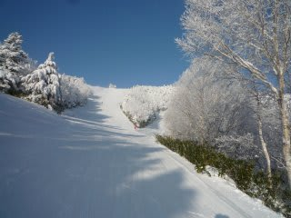
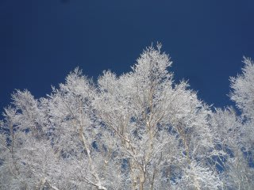

# 26日…日曜の志賀は晴天！

📅 投稿日時: 2010-12-26 23:49:28

🏷️ カテゴリ: [2011スキー滑走日記](ca488c98cfb9169941c3e73770dcefb56.md)

この飛び石4連休．

ずーーーっと激しい雪が降り続けたので．

最終日も雪が降り続けるのかな～，と思っていたところ．

最終日は見事な晴天！

朝イチのゲレンデは，粉雪がきれいに圧雪された

程よく締まった最高バーン！！

朝イチの山頂の気温はマイナス11度．

しっかり冷えてます．

昨日から動き出した焼額第一ゴンドラ沿いのコースは

しっかりと締まっていて，気持ちよいハイスピードバーンに

なってます．

午前10時ごろ，オリンピックコースがオープン．

非圧雪のまま開放されたので，喜んで飛び込むと…

…

…

何じゃこりゃ．

うーーーん．

ちゃんと除草しないとダメだよ…

って感じの，草ぼうぼうバーン．

うーーん．

今年の焼額．

オリンピックコースは除草されてないし．

4ロマより上，第2ゴンドラの人工降雪は打ってないし，

第1ゴンドラと第2高速は速度を落として運転してるし．

経費削減してるのかなぁ…

でも，ゴンドラ待ちもほとんどなく，コースは快適．

昼からは一の瀬ファミリーの正面バーンで

滑りましたが，景色もよく，滑りよいですね～．

ところどころ，人工降雪のちょっと固めの雪が顔を出してますが，

コブにもならず大回りOK.

かなり楽しめました．

昼ごろはぽかぽか陽気で，背負われていた娘も昼寝して

しまうほどでしたが…

気温自体は最高でも-4度と，それほど上がらず雪質は

終日良いままでした．

…というわけで．

中3日あけて．

また30日から志賀高原へ舞い戻ります…

