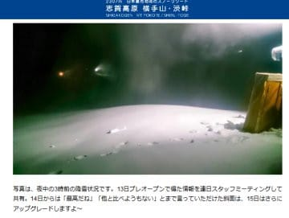

# 2020/11/15(日)のイエティ速報＆ゲレンデ状況動画…コース幅はちょっと広がったかな？雪の厚みも十分

📅 投稿日時: 2020-11-16 00:51:43

🏷️ カテゴリ: [2021スキー滑走日記](c2b0fc073d6357d3b786f6ca655147f7d.md)

えー．

意外なことに．

土曜の夜から日曜朝にかけ，

熊の湯は人工雪が打てなかったのに．

横手山は人工雪を打ち続けられた

ようですね…！

（[横手山ホームページ](https://yokoteyama2307.com/news/11123/)より）

横手だけが人工雪を打てたのは，

横手のほうが標高が高いのが効いているのか，

あるいは横手の最新降雪機(SUFAG製)が，

高温性能に優れるのか…

で．

今日も横手に行っていたらしい某氏のレポートを見ると．

[今日の横手山，朝はすごく良かったよう
ですね](https://red.ap.teacup.com/gokurakuskier/1263.html)…

ところどころ雪は茶色くなっていたものの，

リフト待ちもそれほどひどくなく，

午後はガラガラだったようで…

私の方は，果たして横手まで行こうか

どうしようかちょっと悩みましたが．

今週は無難にイエティにしておきました…

ということで．

今日もナイターまでちょっと滑って帰宅が遅いので．

いつもの速報モードにて…

最後に定番のコース状況動画も載せておきます…

えー．

今日の朝イチはいい感じの晴れで，

かなり暖かく感じるくらい．

朝イチのコースはアイスクラッシュの

雪がモサモサ積もった感じでしたが，

雪の厚みは十分．

コース幅も，先週よりは広がったかな！

…コース上の人口密度はいつも通り

高めでしたが（涙）

午前中は日差しで雪がの表面が緩み気味で，

板の滑りが悪い感じでしたが…

昼ごろから雲が時々出てきて

曇りはじめ…

午後はうっすらガスが出るタイミングも

あったりして，風もあったので

ウェアのジャケットをしっかり着こまないと

寒く感じるほどでしたね～．

今日はクワッドだけじゃなく，並行してかかる

ペアリフトも運転していたので，

クワッドのリフト待ちは終日こんな感じで，

最大5分程度の待ち時間でした．

ペアリフトは飛び乗りだったので．

リフト待ちが短かったのは良かったかな．

で．

いつも通りナイターにも繰り出しましたが…

ナイターの方が待ち時間が長いかも…？

という感じで，5分を超えるリフト待ちに

なってしまったので退散したのでした…

とりあえず．

今日はコースの雪の厚みも十分で，

土が出てきたり穴が開いたりはなく．

コース幅も広がったのが，

下の動画を見ても分かってもらえるかと…

とはいえ．

コース上の人口密度も高いし．

斜度もゆるいので…

そろそろYeti以外で滑りたく

なってきた今日この頃．

うーん．

でも．

この週末の3連休．

アサマ2000や熊の湯，オープンは

厳しいだろうなぁ…（涙）

また明日，詳細レポートやります～！

## 💬 コメント一覧

### 💬 コメント by (かず)
**タイトル**: Unknown
**投稿日**: 2020-11-16 14:32:51

完全に折れです  転倒頻度が違うので 笑  この後のオチは現地で話しまーす！

### 💬 コメント by (アリス)
**タイトル**: 動画ありがとうございます
**投稿日**: 2020-11-16 14:37:26

Skier_S様

動画拝見させていただきました。

前回よりはコース幅が広がって滑りやすかったみたいですね。

3連休はもっと広いゲレンデを滑走できることを祈っております。

Gokuさんの横手山滑走動画拝見させていただき、志賀高原もいよいよウィンターシーズン始まりの実感がしてきました。

中央部でお会いした折は、挨拶とスマートウォッチの取り扱い指導のお礼を言わせていただきます。

### 💬 コメント by (Skier_S)
**タイトル**: コメント遅れました
**投稿日**: 2020-11-18 01:37:32

＞かずさま

折れですか…

また詳細現地で教えてください！

＞アリスさま

コース幅は結構広がった感じがあります…

横手山はこの3連休微妙な感じになってきましたね(涙)

志賀高原でお会いできるのを楽しみにしています．

