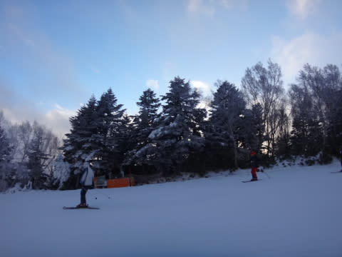

# 12月27日，日曜日の志賀高原・焼額山は…すごい混雑＆雪も積もらず（泣）

📅 投稿日時: 2015-12-27 23:08:21

えー．

もう，あれです．

今日は．

ダメダメな一日でした（滝のように流れ出る涙）

雪が…

雪が足りないよ～っ！！！！（心の奥深くからの叫び）

今日も，焼額は第1ゴンドラ，第3高速ともに動かず．

一の瀬ファミリーも、正面バーン上部は

まだ開いてません(涙)。

寺子屋も，タンネも，西舘も東館も蓮池も動いてません…

奥志賀ゴンドラもまだ滑れません…（涙）

ただ，今日から，山の神（雪薄いけど…）と，

ジャイアント，丸池，そして奥志賀第2高速が動き出したようです．

…しかし．

この，山の神が動いて，一の瀬と焼額がつながったからか．

焼額．

史上最高に混みました（泣）．

まず．

朝イチ，志賀高原に上ってくる道が…

上林のチェーンチェックまで，全く雪が積もって

ないってのが，すでに何か，ダメダメ感を醸し出しています…

さすがに，志賀高原に入ってくると，雪になってきて。

「これは，いけるか？」

と，ゲレンデに飛び出すものの…

え？

あれれ？？

なな，なんだ，これは？？

積雪，わずかに10cm弱…

コース上は全く新雪パフパフ感はなく．

なんだか，昨日からの積雪の積み増しが，

全くないように見えるのですが…っ！！！

な，なんてこった！！！

どうしたこった！！！

今日は，パウダーデーではなかったのか！！？？（止まらない涙）←天気予想を外した涙ではなく，純粋に雪不足を嘆く涙

ニュースでやっている大雪って，どこの世界の

話ですか～っ！！

そして．

雪不足で焼額第1ゴンドラが動いておらず，

第2ゴンドラに人が集中するために…

コース上は人が増えていき…

…

なんだ，これはっ！？？

朝9時半で，ゴンドラ待ち時間，10分を超えてるんですが！？？

そして，ゲレンデはさらにすごい人口密度に

なってきてるんですが！？？

…たしか，20年以上前は，ゲレンデが

こんな混雑した時代もあった気もするが…（回顧モード）

で．10時過ぎには．

……

…

…（言葉がない状態）

これは…

おそらく，焼額第2ゴンドラでの，

私のこれまでの最高待ち時間記録．

30分待ちです…（止まらない涙）

10時から11時過ぎまで，20分待ち程度が続き．

昼休みを過ぎて午後になっても，10分以上の

待ち時間…

当然，隣の第4ロマンスもすごい待ちです．

第2高速も，午前中は5分以上の待ち．

第2高速側のコースも，すごいことになってます（耐えられない涙）

…ただ．

これでも，一の瀬よりましだったようで．

一の瀬は，ファミリーもダイヤも，ありえないほどの

待ち時間で．

「ヤケビの待ち時間のほうがよっぽどまし」

ってことらしいので…

一の瀬，一体どんなだったんだ？？

まぁ，せめてもの救いは．

午後までゴンドラは10分待ちだったけど．

午後は，第2高速のほうはそれほど待たずに済んだことかな～．

でも．

今日は一日中，すごい混雑が続き．

終日雪がちらついたものの，積もるほどではなく．

ゴンドラ山頂付近のブッシュは全く隠れてくれず…

リフトに沿いのコースは人工雪がつけてあるからいいけど，

焼額でゴンドラに乗ろうと思ったら，新しい板は

やめたほうがいいです…

というか，新しい板で焼額ゴンドラに乗るのは

やめましょう…（心からのアドバイス）

でも，

人工雪がつけてある，リフト沿いのコースは…

ブッシュはないものの，午後には硬い人工雪の

下地が出てきちゃって，ちと滑りにくい感じ…

ああ．

ダメだ．

今日もダメな一日だった…

と，嘆きつつも．

リフトが止まる16時半まで滑ってたのでした．←お約束ですから

で．

そうです．

このようなダメダメな一日で終わらせてしまわないために．

当然．

ナイター

に繰り出すわけです．

焼額第4ロマンスのナイターは…

うひょうっ！！！

圧雪かけたてのシマシマっ！！

そして，誰もいないガラガラっ！

昼間と違って，圧雪かけたて最高の，

人のいない斜面を，好きなラインで

かっ飛ばせるよ！！

ああ…

ナイターがあってよかった…

と．

昼間の残念さを，ナイターで紛らわせたSkier_Sだったのでした．

…

んで．

明日ですが．

焼額第1ゴンドラ，営業しますっ！！

それも，ジャイアントスラロームコースが

ちゃんとオープンするようです！

＃雪が足りなければ，第2ゴンドラ側（パノラマコース）を

＃滑る連絡ゴンドラとして営業予定だったらしいけど…

＃今日午後の情報では，GSコースオープンとのこと

…でも，雪，薄いだろうなぁ

明日も，小雪が舞う一日になりそうだけど…

今日と同じで，全く積もらないパターンなんだよなぁ…

ああ…

今晩，どっさり積もってくれないかなぁ．

せめて，2mくらい…←ないから．それ，無理だから

## 💬 コメント一覧

### 💬 コメント by (いか)
**タイトル**: Unknown
**投稿日**: 2015-12-28 06:23:30

2ゴン30分待ちですか…

こちら八方隊はパノラマ20分以上待ちです…

今日は少し減りそうなので期待です！

### 💬 コメント by (べべ)
**タイトル**: Unknown
**投稿日**: 2015-12-28 06:30:19

今も降ってませんね…

こんなヤケビ見たこと無いです( ; ゜Д゜)

週末もあまり降らないのではっていう悪い予想が当たってしまいました…

今夜に期待ですね。

### 💬 コメント by (Skier_S)
**タイトル**: 今日も降らなかった…（涙）
**投稿日**: 2015-12-29 02:59:01

＞いかさま

八方のゴンドラは，日曜は1時間待ちだったとか…

昨日はどこも混んだみたいですね．

しかし，月曜はゴンドラが強風で

運転しなかったという噂を聞きましたが…？？

＞べべさま

ダメです…

雪が，雪が少ない…

一体いつ積もるのか…

私も，こんなひどいヤケビは初めてです（泣）．

