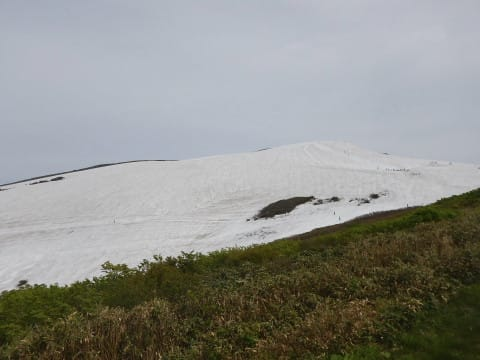
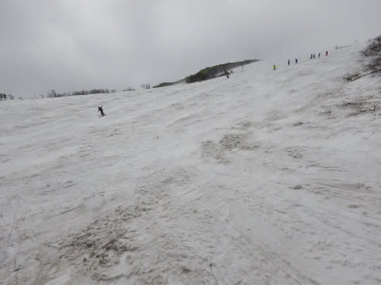
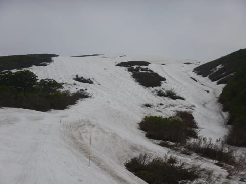
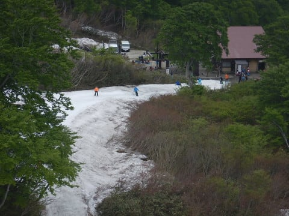
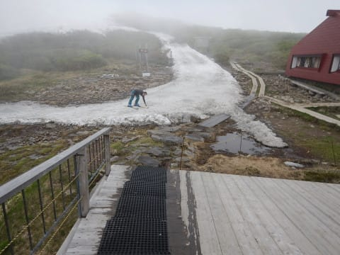
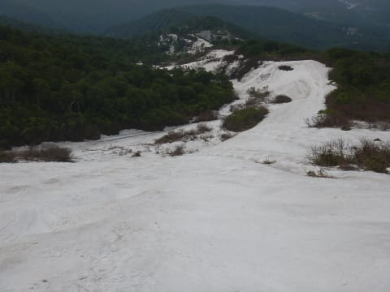

# 6月18日（日）速報…無謀！月山日帰り！時々ガスが出たものの，それほど混まず，楽しめたよ～

📅 投稿日時: 2017-06-19 02:10:47

🏷️ カテゴリ: [2017スキー滑走日記](c7d777cecfc91bdf0fa464ad62c6d49ab.md)

えー．

昨日，土曜日ですね．

以前から書いていたように，

娘の授業参観日だったわけですが．

授業参観日って，午前中で終わるんだったっけか…

だったら，午後は娘と公園で遊んでやるか…

…と．

授業参観が終わったあと．

車で30分ほどの大きな公園で一緒に遊んで．

…たっぷり，娘と一緒に過ごしたわけで．

うむ．

土曜は参観日で一日つぶれると思っていたけど，

午後のうちに，日曜の分もたっぷり娘と遊んだ気が…

…と，思ったタイミングで

娘「明日は友達と遊ぶ約束したんだ～」

…え？

…ってことは．

明日は私はフリーってことか？？

…フリーってことか？？

私「あのー．だとすると．私は明日スキー行っていいでしょうか……？」

娘「いいよ」

ということで．

白い粉の禁断症状が出始めていた私は．

娘の許可も出たことだし．

白い粉を求め，

無謀！一人で月山日帰り

を実行することにしたのだった…

で．

普通の人はやらないだろう，ご無体プランで

出かけた，本日の月山．

天気はうす曇り，時々ガス…

という感じで．

ちょっと肌寒さを感じるくらいのコンディション．

カンカン照りより，このくらいがいいな！

大斜面もこんな感じで…

雪はまだたっぷりありますよ～！

コースは沢コースもまだ問題なく滑れますし，

大斜面もラインが数本あって，

まだ結構な幅で滑れます！

リフトは，板を脱いでの乗車になったけど．

乗り場にもまだ滑りこめるし…

リフト降り場からも，すぐ板を履いてゲレンデに

出れるようになってます！

いやーーー．

6月下旬でこれって…

恵まれてますね～！！！

リフト待ちは，9時半ごろから列が伸び始め，

10時半過ぎに最大8分ほどまで延びたものの，

昼ごろに2分待ち程度，

午後はほぼ待ち0になり．

ゲレンデも，思ったより人は少なかったですよ～．

ってことで．

本日．

朝イチに間に合うように，午前2時に出発して．

帰宅したら午前1時過ぎ…（涙）．

活動時間，24時間突破．

とりあえず．

K奈川県から一人で運転して日帰りで月山に行き．

朝8時から営業終了まで滑って帰ってくると

死ぬ

ということが

今回の経験から分かりました…←いや，普通，経験しなくても分かるから

ってことで．

死ぬほど眠いので．

詳細レポートはまた明日～！

## 💬 コメント一覧

### 💬 コメント by (まいる)
**タイトル**: 日帰りお疲れさまでした
**投稿日**: 2017-06-19 07:14:25

月山日帰り、ビックリです！

Sさん、大丈夫ですか？

会社で生きてますかぁ

月山の登山を考えていますが、私も日帰りできるということですかね・・

### 💬 コメント by (Skier_S)
**タイトル**: まいるさま
**投稿日**: 2017-06-20 02:44:01

いや…

意外と，スキーに行って疲れた翌日の方が．

夜ぐっすり深く寝れるので，

なんだか，だらだらと長く寝た休日のあとより

すっきりしている気がします…

月山日帰り，行けますけど…

ぜひ，月山日帰りやってください，

とはおススメしません（笑）

