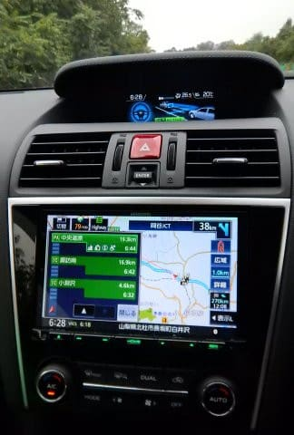
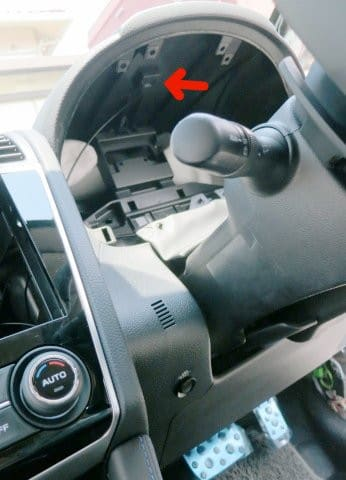
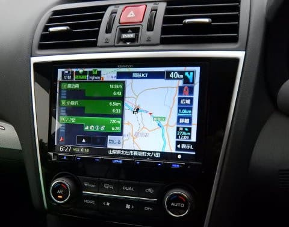
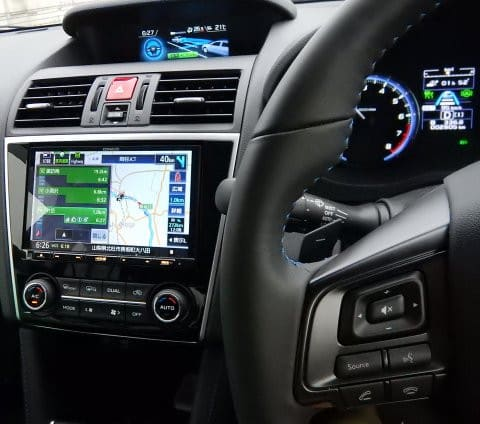
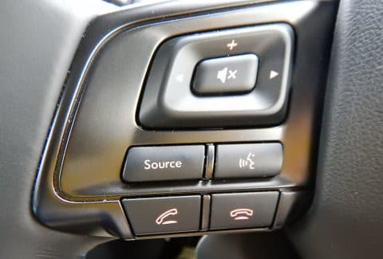

# プロジェクトX2第2章…LEVORGに載せたKENWOODナビ，MDV-M805を使ってみて

📅 投稿日時: 2018-10-12 00:21:47

🏷️ カテゴリ: [車](cba0e8330b3f2ded7c1addfacc75d4547.md)

ってなわけで．

本日は，久々のレヴォーグの話題をいってみましょう！

…[前回](e5fbd680ccacf3ff30993d27d66a2e05a.md)はLEVORGの便利機能について書きましたが．

今回は，ナビの話題です…

で．

[かなりの苦労と取り付けた](edd57949b5ae86a0a208960256cb06e91.md)KENWOODのナビ，MDV-M805ですが．

無事，動いてます…

しかし．

自分でナビ＆ETCを付けた人には分かると

思いますが．

自分が取り付けたETCで初めて高速に乗って．

ETCゲートを通過するときは．

「ゲート開かなくてレーンふさいじゃったらどうしよう…」

と．結構ドキドキもんですよね…

今回，メーターナセル内側にアンテナを取り付けましたが．

（取り付け時の写真…ここにアンテナ付けました）

一発で無事ETCゲート通過できて．

「ををを～！良かった～！」

と，一安心．

ってなことで．

LEVORG乗りのみなさん．

ETCアンテナは，メーターナセル内側で

問題なく使えてますよ～！

そして．

ナビの使い勝手は，KENWOODの特徴である

スマホライクなスクロール＆拡大・縮小操作が

サクサク動きます．

先日，[代車で乗ったWRX S4](e73a891fe8e9b77985f42fe6a849e125f.md)の純正パナナビを使って．

指でドラッグした際のスクロールがカクカクとしか

動かず．

2本指での拡大・縮小操作も，KENWOODナビのように

滑らかに無段階の拡大・縮小ができず．

カクカクとステップ状に拡大・縮小される，

不自然な動きで．

うーむ．

スマホみたいに滑らかにスクロールや

拡大・縮小ができるKENWOODナビの操作性は，

かなりいい方だったんだな…と再認識．

で．

今回．

画面も8インチに大きくなって，

前のナビより見やすくなりましたね～．

ただ，以前使っていたMDV-Z700から，

結構操作性やメニュー構成がかなり変わったので．

同じKENWOODを使い続けているというのに．

「案内中止はどこのメニューから呼び出すんだっけ？」

とか，操作に戸惑うことになってるのが，

ちと残念…

そうそう，

あと，音質は前のナビより良くなった気がします…

けど．

ナビが良くなったのか，LEVORGのスピーカーが

良いのかは良く分かりません（笑）．

そして．

今回．

LEVORG D型以降で標準装備になった，

ステアリングリモコン．

前回のBRレガシィ君では，ステアリング

リモコンがオプションだったので．

結構いい値段がするステアリングリモコンは

着けませんでしたが．

今回のD型以降のLEVORGから，

ナビ非装着車でも，なぜか標準で

ステアリングリモコンが着いてくるように

なりましたね～．

ステアリングリモコン非対応ナビを着ける人や，

ナビそのものを着けない人には，何の意味も

ない余計な装備のような気もするのですが（笑）．

とりあえず，幸いにも私が取り付けたKENWOODナビは，

ステアリングリモコンに対応しており，

この，LEVORGのD,E型の9キーステアリングリモコンで

操作できるのは，デフォルトでは

　・上下ボタン…音量

　・左右ボタン…チャネル切り替えorスキップ

　・真ん中ボタン…ミュート

　・オーディオソース切りかえ

　・音声認識

　・電話発信・切断

という感じで，オーディオのみの操作系のみです．

ナビの操作ボタンはありません…

でも，KENWOODのナビは，ユーザー設定で

ステアリングリモコンの好きなキーに

好きな機能を割り当てられるので．

私はかなりいろいろキーを変更して

使ってます．

利用頻度の高い，ナビ系の

　・地図を現在地へ戻す

　・地図の拡大・縮小

等を，ほとんど使わない電話発信・切断ボタンなどに

割り振ってます…

そして．

ナビのルート探索能力については．

まぁ，自分が使う分には特に不満は無いかな．

ただ．

高速の入り口・出口IC指定と

中継点指定の，

両方同時に使えないという，

過去のナビではなかった謎の制限が

加わってしまい，不便になりました…（涙）

中継点＆ゴールを設定して，検索されたルートが

自分の思った高速IC利用でなかった場合．

入口ICを指定すると，なぜか中継地点が

解除されてしまい．

中継地点を指定すると，入口ICの指定が

解除されてしまいます…

なんでこんな謎仕様になっちゃったんだろう…（残念）．

とりあえず．

こんな感じの，ちょっとした不満はありますが．

自分でとりつけたナビは，愛着も湧きますし．

自分で着けたので，サイドブレーキを引かなくても

ビデオ視聴やらあらゆる操作ができるようになってますし．

（長距離移動中，助手席の娘にDVDを見せるためですよ．

　運転手が見ちゃダメですよ！…と言っておく）

KENWOODナビ．

結構満足しています…

## 💬 コメント一覧

### 💬 コメント by (もりや)
**タイトル**: Unknown
**投稿日**: 2018-10-12 04:57:47

私の軽自動車とフォレスター両方Panasonicナビですが、ガクガクスクロールで使いにくいです(泣)スイスイとスクロールが動けばいいですねー。DVDこれは必需品です。

### 💬 コメント by (ほっぽ)
**タイトル**: 茶水
**投稿日**: 2018-10-12 09:08:27

全然話題が変わりますが、昨日出張帰りに茶水に寄りました。

石井にSXとSL PROがまだありました。

金具付きでしたがそこそこお安くなったいました。

2シーズン前のモデルなので安くなるのは当然かもしれませんが。

金具だけ売ってしまえば板はかなり安くなりそうです。

### 💬 コメント by (なるなる)
**タイトル**: Unknown
**投稿日**: 2018-10-12 11:09:50

私も昔、自分でETC付けて埋め込みましたが、初めて料金所通るときは緊張しました。

現車のナビ&ETCの取り付けは、スバルディーラにお願いしましたが(Sさんみたいに、

新車をバラす勇気は無かったw)、サイドブレーキ信号のゴニョゴニョはやってくれました。

何か一筆書かされましたが…

冷かし半分で、プロジェクトXやってますが、予想外に下取り価格が良かったので、

Sさんと同じ、LEVORG 2リッター逝っちゃうかもしれません…

### 💬 コメント by (Skier_S)
**タイトル**: そろそろスタッドレス買わないと…
**投稿日**: 2018-10-13 02:31:10

＞もりやさま

私も代車のナビ使うまで，最近のナビはどれもスマホみたいに

スムースにスクロールするものだと思い込んでました…

ガクガクスクロールはちょっと使いにくいですよね…

＞ほっぽさま

17SX，まだ意外と残ってますよね…

でも，ビンディング付きだとまだ税込み7万超えてませんか？

去年，ビンディング込み47000円＋10％商品券で買ってしまったら，

7万円が異常に高く感じます（笑）

＞なるなるさま

そうですよね～

自分で取りつけたETC，一番最初にゲート通るときは

ドキドキですよね…

で．

そちらもプロジェクトX実行中ですか！！

ぜひ，LEVORG 2L行ってやってください．

他の車に乗れなくなってきます…

### 💬 コメント by (ほっぽ)
**タイトル**: 17SX
**投稿日**: 2018-10-13 12:36:40

Sさん

17SXですが、金具付きで6万円切ってました。

金具をオークションなどで売れば、

5万円切るのでは？と思います。

SL PROも似たような価格だったと思います。

そろそろ物欲選手権開幕ですかね？

### 💬 コメント by (Skier_S)
**タイトル**: ほっぽさま
**投稿日**: 2018-10-14 06:18:16

6万円を切ってますか…！

うーん．

でも，まだ使ってないSXが2台あるので，

もう1台増やして5台目のSXを買うっていうのは，

それはちょっとヤバいかもしれません(笑)

