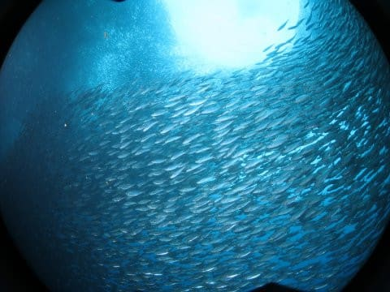

# 2019年8月，4度目のモアルボアル・小6の娘Cカード取得1周年！その28…ビーチエントリーでのイワシ＆アジの群れ攻略も満足！

📅 投稿日時: 2020-09-12 02:58:52

🏷️ カテゴリ: [ダイビング日記](ce3a7a8d424d112fce83ee85c81a0e344.md)

[昨日の記事](ef4b4cdec6157b3462acc922877f3e899.md)，

過去14年間分のGWの志賀高原の写真を並べる

という力作で．

焼額山マニアッククイズの記事より

手間がかかった，

かなりの時間をかけて書いた記事

だったんですが…

…焼額マニアッククイズよりももっと

マニアックすぎたからか．

意外と盛り上がらなかったな…（涙）

でも，昔の写真を見返すと気付くことが

いっぱいあって．

例えば，ここ数年は一の瀬ファミリーの

正面バーン上部がGW後半に滑れなくなる年が

よくあるけど．

昔はそんなことはほとんどなかった…

ということに改めて気づいたり．

いろいろ昔の写真を見返してみると，

結構面白いですね～．

ってなことで．

今日はダイビング旅行記に戻ります！

ーーーーー

ってな感じで．

ビーチエントリーの1本目，

ハウスリーフでのイワシの群れ攻略が

続いてますが…

また，アジの群れが下から湧き上がる

ように，イワシの群れに近づいていきます…

ん？

群れがぶつかる…！！

と，思ったら．

アジの群れはばらけていき…

目の前を，川のように流れていきます！

ほぼ群れの中につっこんでるよ！！

すごい大群…

そして，追い越されたかと思うと…

また，戻っていったりして…

しばらく，アジの群れとランデブー

出来ました(笑)．

と，思うと．

現れたのは…

これは，コガネアジかな？？

コガネアジが，イワシの群れに

アタック！

(下の方にコガネアジが数匹)

コガネアジに追われると，イワシが

瞬間にドドドっ！と激しく動いて，

これは…迫力！！

ってなことで．

モアルボアルに来てから初のビーチエントリー

でしたが．

いつも通りのイワシ＆アジの群れと

戯れられて．

うむ．

初めは，今日は潜れないんじゃないかと

びっくりしたけど．

潜れてよかった…

そして．

エントリー直前の浅瀬では，

またアオウミガメがいたり…

途中すれ違ったダイバーのタンクに，

コバンザメがついてたりと．

不思議なものを見ながらのExit

だったのでした…
