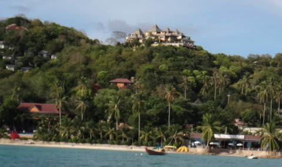

# 2013年9月　子連れタイ・タオ島ダイビング旅行記　その6…タオのFirst Night

📅 投稿日時: 2013-10-09 01:48:17

ってことで．

ホテルに着いたわけですが．

今回泊まったのは，Ko Tao Resortっつーホテルのビーチゾーン．

…ビーチゾーンより高級なパラダイスゾーンってのもあるらしいけど．

パラダイスゾーンは高台でビーチから遠いし．

(リゾート全景．山頂のお城みたいなのがパラダイスゾーン，海沿いがビーチゾーン)

ダイビングメインの我々は，ダイビングショップや桟橋がある

ビーチゾーンが便利なので．

今回はこちらを選択．

お部屋のグレードはいくつかあるけど，今回は

中間グレードのスーペリアルーム．

海岸近くの，長屋みたいな作りの建物．

…あー．

部屋からは残念ながら，海は見えないんですね～．

向かいの部屋が見えます(笑）．

…広さはまーまー．

冷蔵庫もテレビもエアコンもありますし，

電気ポットと無料コーヒーもありました．

…でも，バスタブは無いんですよね～．

シャワールームは，ちょっと安っぽい感じ…

アメニティはシャンプーと石鹸のみ．

とはいえ．

これで一部屋一泊1600バーツ．

一人1600バーツじゃないですよ！一部屋で1600バーツ．

家族で泊まって，これで一泊約4800円っ！！

…なんてお財布にやさしいリゾートなのかしらん…(感動)．

で．

今朝国際線でタイに到着して，夕方にやっとホテルに入ったばかりと言うのに．

到着した娘は，早速

「プール，プールっ！」

…おまえ，どんだけプール好きなの？？？

ってことで．

5時過ぎ到着だったので，それほど長くは泳げなかったけど．

日没までプールで遊んで．

その後は，ホテルのレストランで夕食．

こんな感じでビーチが見えるレストランで，

タイ料理をいただきますが．

タイ料理，んまいっ！

このスイカジュースが，半分凍ったフローズンな感じで

おいしかった…

…でも．

ビール飲んでたらふく食事して．

全部で700バーツ．2000円ほど．

タイの物価から言えば高いほうだけど．

なんて庶民のお財布に優しいリゾートなんでしょう…

＃[タヒチ](ed1a0981df33d8e447e4cb50a3f342544.md)とは対極にあるなぁ…

ってことで．

夕食を食べたら．

長距離移動で疲れているので，熟睡…

いやー．

今日は移動だけでへとへとの，長い一日だったなぁ…．
