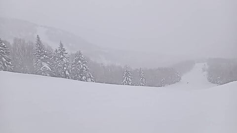

# 年末年始，正月休みの12/28~1/3の志賀高原スキー場の天気は…大体曇り~雪降りが続き，30日だけちょっと気温が上がるかな．2日は晴れるかも？

📅 投稿日時: 2024-12-28 04:33:13

🏷️ カテゴリ: [スキー天気予想](c6554f5c3c106093b511a8daae23757e8.md)

ということで．

年末休みの1日前の本日も，

仕事をさぼった早めに休みをとった皆さんが

志賀高原で滑っていたようで，また写真が

いろいろ送られてきましたが…

…私も早く休んで志賀に滑りに行きたいのに，

今日も夜までお仕事(涙)

そして明日もいろいろやっつけなくては

ならない仕事があるので，土曜28日も志賀に

行けず…（泣）

あぁ…早く滑りに行きたい…っ！！

とりあえず．

特派員写真を見ると…

朝の気温は-9℃だったようで，

ふはははは！

私の水曜の予想がぴったりだったみたい

ですね…！！

そして，朝イチの積雪は20-25cm．

予想の10-20cmよりはちょいと多めに

積もったようですが，まぁ大外しは

してないかな…

圧雪コースも，圧雪上の10cm程度の軽い

雪が積もっていたようです…！！

天気は雪~曇りの一日だったらしく．

昼間もちょっとだけ積もったようですが…

とりあえず圧雪コースも新設バフバフだった

この日．

当然のごとく，昼過ぎにはコースが荒れ

始めたようですが…

土日に比べれば人が少ないので，

そこまでひどく荒れなかったのかな．

ただ，第2高速はゲート付近まで人が

待つことがあったりして，さすが年末休みの

前日，普通の平日よりは人が多かったよう

ですね…

とりあえず，いい感じで雪が降り

続けているおかげで，明日からは志賀高原も

予定の全リフトが動き出し，

コースもごく一部のコースを除き，

全面オープンになります…！

ってなことで．

気になるのは，この年末年始のスキー場の天気．

水曜深夜は28，29日のみ予想しましたが，

今回は12月28日から1月3日までの予想を

してみましょう…！！

…ただ．

7日間すべての天気図を貼り付けて詳しく

解説しても，1億7000万人のこのBlog読者の

うちの1億6999万9999人は天気図の

細かい解説は読まずに飛ばして，

まとめだけ読むと思うので…

まとめ部分だけ書きます．

…天気図の解説を楽しみにしている人

なんていう奇特な方，いませんよね…

ということで．

いきなり予想結果から行くと．

28日(土)：風が西に回ったので

　水曜予想より積雪は減りそうで…

　前日からの積雪は10cm程度，

　圧雪コースも数㎝の積雪．

　終日雪降りの一日で，昼間も

　10cmくらい積もるか？

　朝は-10℃程度，昼は-5℃程度．

　この日も一日降り続け，

　昼間も気温が上がらず，

　コースはボコボコになっていき，

　根性の無いスキーヤーふるい落とし

　デーになるか…

29日(日)：朝までの積雪は5cmくらいか？

　曇り午後は雪が降る．

　朝の気温は-9℃くらい，

　昼間もそんなに気温が上がらず

　-5℃程度．

　朝イチは柔らかめトップシーズン

　シマシマバーン．

　運が良ければ朝は西風で晴れるかも！

　朝のうちは冷えたトップシーズン

　雪でよさそうだけど，人も増えて

　雪も柔らかいので，午後は急斜面は

　凸凹になっていく

30日(月)：朝までの積雪はほとんどなし．

　うっすら数cm．

　朝の気温は-7℃くらい．

　朝イチはこの日も最高シマシマ！！

　天気は雲が多めながらも晴れていい

　感じ！時々曇り．

　昼間の気温は-2℃くらいまで上がる．

　南風で気温が上がり，暖かさも

　感じるような一日．

　夕方は曇っていくかも…

31日(火)：たぶん朝の積雪は無し．

　朝の気温は-6℃くらいかな…

　志賀にしては気温が高め．

　朝イチは締まり気味のいい

　感じのシマシマ！！

　朝は曇り空だけど，昼頃に

　雪が降り始め，一時強く降る．

　午後はだんだん冷えていき，

　雪が強まっていく．

　夜はかなりの雪になる

1日(水)：一日雪降り．

　詳細天気図が無いので，朝の

　気温は正確にわからないけど，

　そこまで激冷えにならず朝は

　-7℃くらいかな？

　朝までの積雪は20cmくらい？

　もしかしたら30cmくらい積もるかも．

　詳細天気図が無いのでよく

　わからないけど，おそらく夕方まで

　雪が降り，夕方ごろに止む．

　運が良ければ昼頃には止む．

　昼間もコースに雪が積もり，

　新雪が積もるので，夕方のコースは

　モサモサ凸凹になる．

2日(木)：朝までの積雪はほぼ無し．

　天気は晴れ→曇り．

　晴れているのに結構冷えて，

　朝イチは柔らかトップシーズン雪の

　最高圧雪のシマシマバーンを楽しめる，

　ねらい目の一日．

　ただ，運が悪ければ昼頃から雪になる．

　運が良ければ夕方まで雪が降らず，

　リフト営業終了後から雪になる．

　雪が柔らかめなので，午後は凸凹に

　なりそう…

3日(金)：まだ天気図の変動要素が

　大きいので，この日の予想は変わる

　可能性もあるけど…

　今のところそこそこ新雪が積もりそう．

　朝から雪．前日からの積雪はまだ

　読めないけど，前日の夜からずっと

　雪が降り続け，この日の昼間も

　降り続けそうなので…

　終日パウダーデーになる可能性も！

　ただ，気温も冷えそうなので…

　根性の無いスキーヤーふるい落とし

　デーになりそうとも言える．

…ってな感じでしょうか．

ただ，まだ詳細天気図が出ていない

1月1日以降の予想は，変わる可能性が

高いと思っていてください…！

今のところ，ディープパウダーの日は

なさそうですけれども，そこそこ雪が

降り続ける正月休みになりそうですよ～！！

## 💬 コメント一覧

### 💬 コメント by (けんけん)
**タイトル**: Unknown
**投稿日**: 2024-12-28 05:56:26

ヤケビバレーも開くみたいです。

12月にパウダーコースが開くってなかなか雪多いですよ！

### 💬 コメント by (地元民)
**タイトル**: Unknown
**投稿日**: 2024-12-28 10:51:30

天気図の解説が楽しみなんですが・・・

### 💬 コメント by (地元民)
**タイトル**: Unknown
**投稿日**: 2024-12-28 11:02:49

長野地方気象台の「大雪に関する情報」や「大雪警報、大雪注意報」より、中野市内に関しては当たるので、こっちを天気予報として利用してます。

中野市内、微妙なの・・・。飯山地域と長野地域の境目だから。ここの西風情報や、南岸低気圧の降水が、雨になるか雪になるかの情報。めちゃくちゃ役立ってます。　

天気図解説に期待してる人、ちゃんといましたよ〜。

### 💬 コメント by (アツシ)
**タイトル**: Unknown
**投稿日**: 2024-12-28 20:19:17

ええっと、私も天気図の解説、分からんなりにもヘエーと思って読んでますよ。たまにそこで知った用語を知ったかぶりで後輩に使わせてもらったり。例えば夏が暑かった時は「それはね、ラニーニャが発生してるのではなく正のインド洋ダイポールモード現象のせいなんだよ」といった具合です。

### 💬 コメント by (Skier_S)
**タイトル**: マニアックな解説に需要があったのか…
**投稿日**: 2024-12-28 23:21:37

＞けんけんさま

ヤケビバレー，オープンしましたね～！！

まさか12月にオープンするとは…

今のところ積雪は順調ですね！

＞地元民さま

おっと．天気図解説を楽しみにしている方，いらっしゃいましたか…

志賀の天気はは北信エリアの予想とちょっと違うので，志賀高原の

ピンポイント天気を予想するのは，経験値補正をしないといけなくて，

志賀の雪・天気を知り尽くした人じゃないと，天気図を読んだだけではわからないんですよね…

ただ，私は志賀の山の上の予想なので，中野の街中の予想は多少補正が必要かも．

特に北風が志賀にぶつかるとき，中野の街中は晴れていても山の上だけは雪が降る…

ということがよくあるので．

なのでそういう天気図の時は，「山の上は雪」とか，「標高が高いと雪」と書いてます～！

＞アツシさま

あ，ここにも天気図解説を参考にしている方がいらっしゃいましたか…

最近はJPCZもメジャーになってきたので，「北極振動」とか「インド洋ダイポールモード」とか，

「離岸距離」とか，いろいろ専門用語を駆使してみてください（笑）

