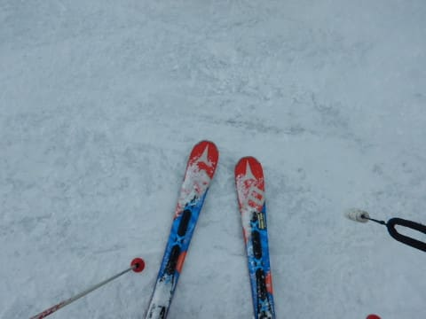

# 11月24日，飛び石の谷間の金曜のかぐらはほぼ全面可！ガラガラ！…あとは氷のコロコロさえなければ文句なしだったんだけど．

📅 投稿日時: 2017-11-24 22:08:22

ということで．

本日，かぐらへ行ってきました～！

…いや．

仕事休んでる場合じゃない気がしたのですが．

あまりにも今日の，コンディションがよさそうな

天気予想に我慢できず．

気がついたら，意識を失っている間に

休みを申請していたようです…

ってことで．

今朝，関越道を走っていると…

をを！

山がもう真っ白だよ！

そして…かぐらの登り路も積雪路だ！

今シーズン初の，雪道走行です…

この週末，かぐらに来る人は冬タイヤ必須ですので．

ご注意を…←夏タイヤで来ようっていう，人生をかけたチャレンジをする人はいないと思うけど

で．

駐車場も凍ってます．

駐車場で，すでに気温マイナスです．

山頂は寒そう…

ってことで．

まずはみつまたロープウェーに乗るわけですが．

をを！

さすが平日．

がらがらだよ！

そして，ロープウェーでみつまたゲレンデに

着くと．

うおおおおおおおお～っ！！

この時期，みつまたゲレンデまで全面真っ白とはっ！！

みつまた高速リフトまでも，Pislabを滑っていかなくて

いいどころか…

完全コースいっぱい，全面滑れますよ？？

なんと素晴らしいっ！！

…今シーズン初の天然雪だっ！

みつまたからゴンドラ乗り場へ降りていく

コースも，全面に雪はついていたけど…

でも，ここはちょっと凍っていたなぁ…

いや．

でも，ゴンドラ乗り場周辺も雪たっぷりだし…

11月でこんなに雪が積もってたこと，あったっけ？？

で．

やってきましたよ～．

ゴンドラの終点，かぐらゲレンデへ！！

いや…

もう，雪たっぷり！！

すでに，パークにジブも準備されてるし．

これって，雪不足のだった2シーズン前の，

トップシーズンより雪があるんじゃないか？？

と思ってしまうほど…

リフト乗り場も完璧に雪がついてるし．

平日ってこともあり，リフトは終日ガラガラっ！！

もう，一日中この程度の待ち（というより，待ち0ですね…）

でした．

あぁ…なんてすばらしいんでしょう！

ビバ，平日っ！！！←でも，ちょっと罪悪感もある

リフトを降りると…

当然ながら，ここも全面雪たっぷり．

ってことで．

いざ，かぐらメインバーンへ，Go！

うほーーー！

コース幅いっぱい滑れるよ！

そして，がらがら！

…

…なんだけど．

なんということか…

何かの陰謀か，朝はコース全面に，

殺人コロコロがばらまかれてます（泣）

これは．

どうやら昨日の雨で融けた雪が固まったようですね…（涙）

くうう…

昨日の雨が，残念…

残念すぎる！

せっかくのコース全面滑走可能なんだけど．

ちょっと快適度は低め…（残念）

でも．

コロコロに足を取られるけど．

時々下地が硬かったりするけど．

いいんだ！

今シーズン初の天然雪だもん！！←自分をごまかす

殺人コロコロはあるものの．

雪はたっぷりなので，

この日はパノラマコース＆ジャイアントコースが

空いてます！

すばらしい！

…けど．

パノラマコースを滑ってみたけど…

ここも殺人コロコロいっぱいだし．

さらにはちょっと小石も出てたし…

うーむ．

ここはあんまり楽しくないかな…

そして，ジャイアントコースは．

非圧雪なので，新雪が乗ってるけど…

でも．下地がかなり硬い荒れ荒れ凸凹で．

その上に殺人コロコロが大量にばらまかれて

いるという．

「これ，なんの嫌がらせ？？（涙）」

って感じの苦行コースだったので．

うーむ．ここももういいかな．

ってことで．

やっぱりメインバーンが一番よさそうだな…

で．

この日の天気は．

こんな感じで，パラパラと雪が降ったり，

止んで薄日が差したり…

ガスったり…

かと思えば，ゲレンデに日が差したり，

という，目まぐるしい天気でしたが．

午後になると，殺人コロコロも踏みつぶされたのか，

それほど気にならなくなり．

ところどころ硬い下地があるものの…

これは，かなりいいんでないかい？？

そして，リフトも飛び乗りだし．

午後は，午前よりむしろ楽しいんでないかい？？

コース横には，コブも作られてるし…

…という感じで．

殺人コロコロでやられた午前に比べれば．

午後は日も射すタイミングも多く，

結構楽しめたのでした…

いや，楽しかったよ！！

そして．

15:30に，かぐら高速が終わり．

下山するわけですが…

当然，ゴンドラコースも全面可能！

全然ブッシュの気配もないよ…

そして，みつまたコースも雪たっぷり！

これは…下山コースじゃなく，十分普通の

ゲレンデとして楽しめるレベル！

みつまたゲレンデ，雪も冷え冷えの締まった圧雪で，

コロコロもないし．気持ちよく大回りできるん

ですけど…っ！！

…楽しい．楽しいよ！！！

これは楽しい！！

…ってことで．

みつまた高速リフト終了の4時まで，

時間いっぱい滑り．

ロープウェーで下山したのでした…

いや．

今日の午前中，全面殺人コロコロバーンだったときは

どうしようかと思ったけど．

予想より雪は多かったし．

ガラガラだったし．

楽しめた一日でした～！！

明日はやっぱり混むのかなぁ…

私は明日はアサマ2000に出没します．

## 💬 コメント一覧

### 💬 コメント by (葛飾のS)
**タイトル**: アサマ2000
**投稿日**: 2017-11-24 23:03:52

アサマ2000行くのならコメントを11/23情報です。

手前の上級コースしかリフト動いてませんでした。

しかもリフト側半分です。しかもSさん級が大漁です♡僕は負けました。多分1番下手っぴでした。午前中は混んでました(リフト待ちなし)午後はガラガラでした。その日東京は雨でしたので出足悪かったんでしょうか。

### 💬 コメント by (タカ)
**タイトル**: うらやましい❗
**投稿日**: 2017-11-25 16:28:35

今年は各スキー場は快調ですね。白馬五竜47はほぼほぼ全面いけますし。47のオフピステ70cm位積もりで面つるで最高だったっぽいです。自分も来週から行きますよ～かぐらor八方尾根。リーゼンスラローム開かないかな～

### 💬 コメント by (Skier_S)
**タイトル**: 今日のアサマはちょっと混みぎみ
**投稿日**: 2017-11-25 22:54:15

＞葛飾のSさま

情報ありがとうございました～！

23日は午後ガラガラだったんですね…

25日は午後も結構人が多かったです…

でも，アサマは上手い人が多いので

いろいろ刺激になりますね（＾＾

いやー．

すごい人が多すぎる…

＞タカさま

え？47ほぼ全面いけるんですか！？？？

それはすごい…

今日八方に行った人からも，パフパフ

レポートがあって最高だったようです…

来週はちょっと気温が上がりそうなので，

雪の状態が心配ですが…

まぁ，1日以降は冷えそうなので，

何とかなるかな？？

