# 2013年7月　子連れ座間味ダイビング旅行記その19…2本目のダイビング

📅 投稿日時: 2013-08-19 00:34:50

ってことで．

娘が釣りに必死になっているうちに．

夫婦揃って，2本目のダイビングをスタートしたわけですが…

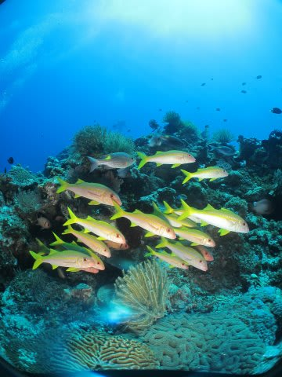

2本目のポイントは，「久場のイソバナ」という名のポイントです．

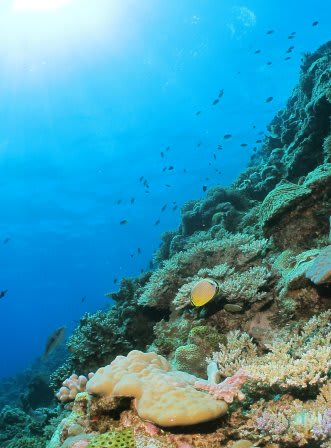

全体的に，サンゴに覆われたスロープのポイントですが．

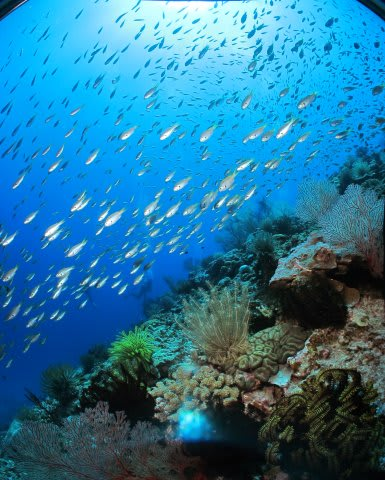

サンゴの上を漂っていくと…

ポイント名のとおり，立派なイソバナのついた根があります…

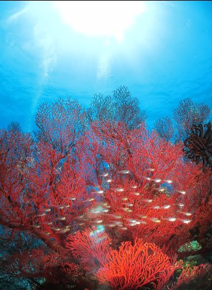

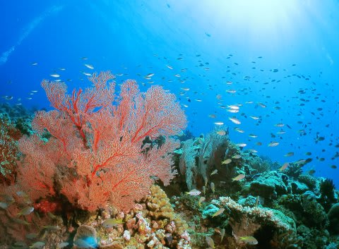

さらにいろいろサンゴの上を泳いでいくと…

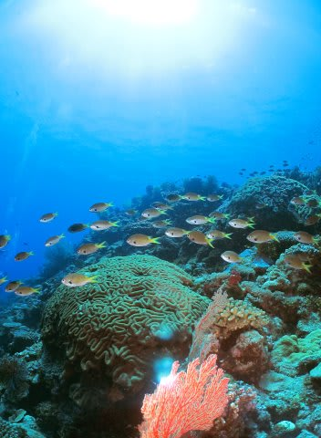

サザナミヤッコやら…

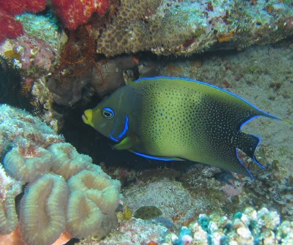

ハナビラクマノミなんかを見つつ…

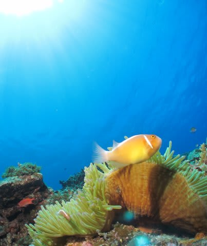

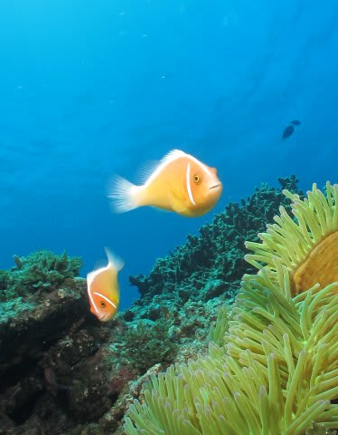

「

ひたすらサンゴの上を漂っていきます．

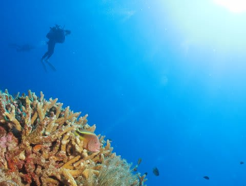

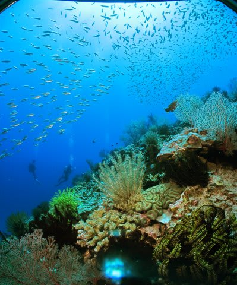

最後は魚に囲まれて…

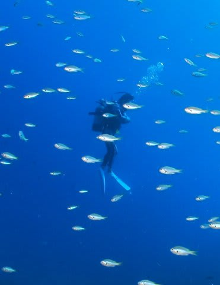

エグジット．

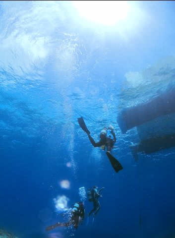

船の上では，娘がお出迎えしてくれました…

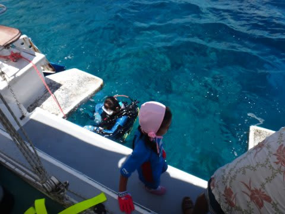
