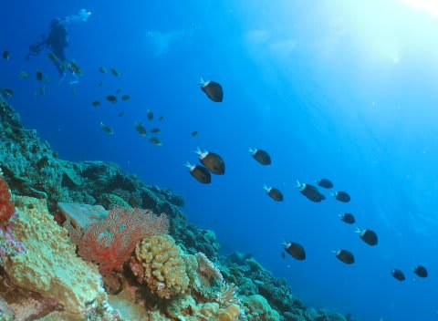

# 2013年7月　子連れ座間味ダイビング旅行記その19…2本目のダイビング

📅 投稿日時: 2013-08-19 00:34:50

ってことで．

娘が釣りに必死になっているうちに．

夫婦揃って，2本目のダイビングをスタートしたわけですが…

2本目のポイントは，「久場のイソバナ」という名のポイントです．

全体的に，サンゴに覆われたスロープのポイントですが．

サンゴの上を漂っていくと…

ポイント名のとおり，立派なイソバナのついた根があります…

さらにいろいろサンゴの上を泳いでいくと…

サザナミヤッコやら…

ハナビラクマノミなんかを見つつ…

「

ひたすらサンゴの上を漂っていきます．

最後は魚に囲まれて…

エグジット．

船の上では，娘がお出迎えしてくれました…

