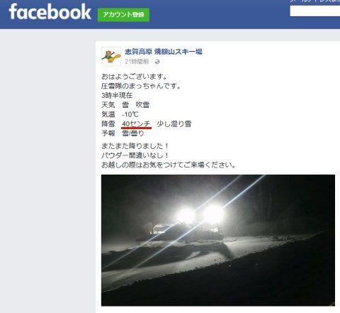
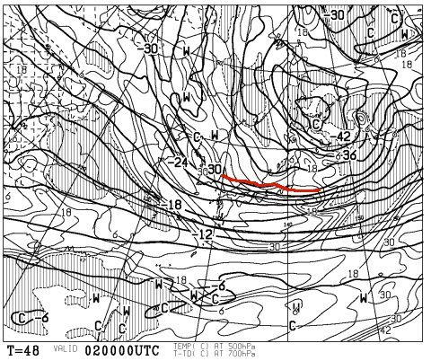
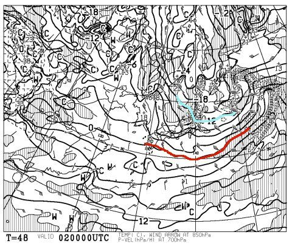
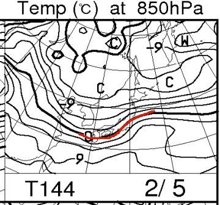
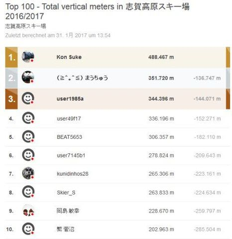
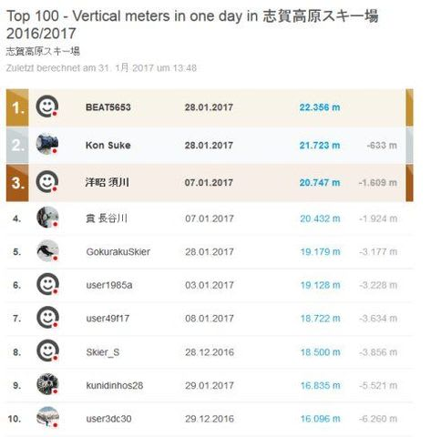
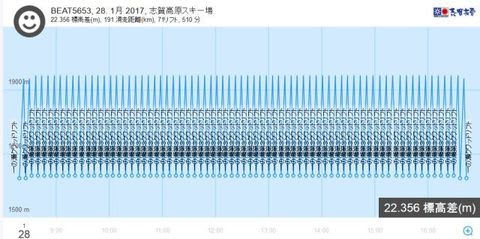
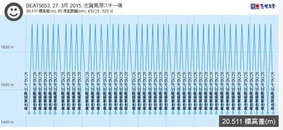

# 現在の志賀高原Skilineランキングを眺めてみる…そしてやっぱり20000mクラブな人は素晴らしいことが良く分かる（笑）

📅 投稿日時: 2017-02-01 02:54:58

🏷️ カテゴリ: [スキー雑談](c1f9d2cb7478308da16419928ea3945e9.md)

…どうやら．

本日朝は，かなり雪が積もったようですね～！

…朝は40cm以上の積雪があったようです！

（[焼額山FB](https://www.facebook.com/yakebitaiyama/posts/1208376375924373:0)より）

これで，月曜の雨のアイスバーンは隠れてくれるかな？

…さらに．

2日の木曜日．

また，降りそうですよ～！

500hpaの-30℃の寒気が下りてきてますし…

850hpa図では，水色の-12℃線が近づきつつあるので．

また，この日も-15℃クラスの冷え込みかな！？？

2日は，パフパフデーだろうなぁ…

…しかし．

5日の日曜は…

あう？？

なんだ，こりは？？？

…0℃線が志賀高原に近づきつつあるので，

ちょっと危険…

でも，まぁ．

今の天気図のままなら．

なんとか日曜は夜までは降らずにもってくれて．

降ったとしても，ぎりぎり雨にはならなさそうかな～．

とりあえず．

また明日，週末の詳細天気予想をやりますので，

しばしお待ちを！

…という前フリのあとは，本題へ．

そうなんですよ．

なんと驚くことに．

早くも1月が終わり，

志賀高原のシーズンも，もう2か月が過ぎたんですよ…

…早いッ！

早すぎるっ！！！

…ということなので．

シーズンインから2か月．

現時点でのSkilineのランキングを眺めてみましょうか…．

まず．

今シーズンの積算標高差ですが…

…

…はっきり言って．

トップ10は．

いつもの顔ぶれですね

もう，1位から8位まで．

6位の方を除くと，全員20000mクラブ会員の方が並んでます（笑）

そのうち6人がゴールド会員という．

…おかしな人たち素晴らしい人たちのリストと化してます．

そして．

1位はぶっちぎりでKon Sukeさん．

一人だけ40万m台に突入し，2位と13万m以上の差をつけるという．

他の追随を絶対に許さない，一人孤高の神の領域に突入し．

完全独走モードに入ってます…

で．

次は．

20000mクラブのゴールドステッカーとシルバーステッカーを

分けることになる，

運命の（？）一日標高差を見てみると．

…今シーズン．

すでに，20000mを達成した，おかしな人突き抜けた人が，4人もいるんですか…

3位，4位の方はお会いしたことのない方ですが…

おそらく初めての20000m突破かな？？

ゴールド会員への昇格おめでとうございます！←おめでたいのか？ホントにめでたいことなのか？…微妙な気がする…

で．5位は，このBlogに時々登場の[Gokuraku Skier](http://red.ap.teacup.com/gokurakuskier)さん．

…ヤケビグルグルのあと，私と同じ

「焼額終了後から一の瀬への瞬間移動」の技を繰り出し．

さらに，ダイヤナイターまでチャレンジするものの，

20000mに今一歩及ばずって[レポート](http://red.ap.teacup.com/gokurakuskier/641.html)がありましたが…惜しいっ！！

そして，6，7，8，9位と，私を含め，20000mクラブの

ゴールド会員がずらっと並んでますが．

今シーズンはまだ20000mを超えてませんね～

＃いや，私は超えるつもりはありませんけど（^^;）

…そして．

今シーズントップは，BEAT5653さん．

一の瀬リフト71本乗車という記録を残していますが…

…とりあえず．

この記録を見ると．

人間じゃないですね

この方．

3シーズン連続で20000m超えを達成していて．

おととしは奥志賀ゴンドラ43本乗車で達成していますが…

奥志賀と一の瀬，両方で昼間20000mを達成しているのは，

この方だけではないでしょうか？？？

…ってな感じで．

とりあえず，これを見て思うのは…

おそるべし，20000mクラブ…っ！！

20000mクラブのゴールドな方々．

なんの報酬が得られるわけでもないのに．

この，ひたすらひたすら，リフトをグルグル滑り続ける情熱は，

一体どこから湧いてくるのか…！？？←人のこと言えないだろ，というツッコミを受けそうだけど，

私はまだ昼間だけで20000m達成してませんから（汗）

それも．

リフト終了が近づいたとき．

「ペースアップすれば，あと1本リフトに乗れる！」

と，

夕方の荒れ荒れの一の瀬正面バーンを，数本連続してほぼ直滑降で滑り降りていく，

20000mクラブゴールドな某氏を見た時は．

　「…この恐ろしいバーンを直滑降…それ，た，楽しいのですかっ！？？？

　　そこまでして，1本でも多く滑るのかっ！！」

と，驚愕感動したものですが．

一体何が，彼らをここまで駆り立てるのか？

なぜ，そこまで楽しくなさそうな滑りをしてまで，

1本でも多く，滑ろうとするのか…

…という，誰もが疑問に思う問いの答えを．

先日．

Kon Sukeさんがぽつりとつぶやいてました…

「…彼らは，たぶん

　リフトに乗るのが大好きなんだよ．

　滑りを楽しみたいんじゃなく，

　リフトがどうしようもなく好きだから，

　一回でも多くリフトに乗りたくて，

　必死に滑ってるんだよ…」

…納得．

なるほど～！！そうだったのかっ！！

それなら，あの怖い斜面を直滑降してまで，

一本でも多くリフトに乗る理由も分かるっ！！！

…と，納得したものの．

これをつぶやいたKon Sukeさんも．

一般人から見れば．

「リフトに乗るのが楽しい人」に分類されているのではないか

という気がする，Skier_Sなのだった…

## 💬 コメント一覧

### 💬 コメント by (まいる)
**タイトル**: 志賀高原行きは
**投稿日**: 2017-02-01 06:53:15

お疲れさまです。

20000mクラブ、スノーボードでは無理でしょうね

志賀高原行きは、２月の最終土日です。

書き方が曖昧ですみません。

今週末は久々に滑らない週です。

### 💬 コメント by (Kon Suke)
**タイトル**: 20000達成者
**投稿日**: 2017-02-01 14:54:20

２００００メートル達成、３位と４位の方は狙ってやっていました。

タダ危ない感じも見受けられましたので、今後挑戦するときは皆さん周りをよく見て安全を第一にお願い致します。

彼らにはゴールドシールをお渡ししています。

板とヘルメットに貼っていますので、リゾート開発エリアを主に滑っているので見つけてください。

しかし、３位の須川さんは、その後ぎっくり腰になり２月末まで出陣がかなわないようです。

２００００メートル達成との因果関係はただ今のところ定かではありません

### 💬 コメント by (Goku)
**タイトル**: Unknown
**投稿日**: 2017-02-01 23:32:52

私の場合、楽しく滑るのがモットーなので、その結果として２００００ｍ行ければ良いかな～って思ってます。（ナイター含む）

あの日もあまりにもコンディションの良さにペースも上がり、休むのがもったいない！って思いながら滑っていたらあの滑走量になっていました。

でも、食事休憩も取ったし、景色を眺めにパノラマコースにも行ったので、その分でゴンドラ２回逃したのはしょうがなかったかな。

それにしても、２００００ｍゴールド会員の方たちは本当に凄いの一言です。

あのスピードは異次元です。

### 💬 コメント by (Skier_S)
**タイトル**: 今，志賀高原はかなりの雪
**投稿日**: 2017-02-02 00:44:22

＞まいるさま

あ，すいません．来月末って書いてありましたね…

無条件に，「今週末」だと思い込んでました…

また，月末に会いましょう！

＞Kon Sukeさま

3，4位の方は，ご存知の方ですか？

しかし，狙ってホントに20000m達成しちゃうとはすごいですね．

でも，もし20000m狙った後遺症でぎっくり腰だとすると…

払った犠牲は大きかったようですね（笑）

みなさん，無理しないで，安全に注意して20000m狙ってください．

ちなみに，話題は変わって．

月曜は朝まで雨だったようですが，

そのあとは緩んだ雪のままだったんでしょうか…？

あるいはアイスバーンの上に新雪が積もっていった

感じだったのでしょうか…？

＞Gokuさま

Gokuさんもかなり速いですが…（笑）

いや，でも．

惜しかったですよね…あの日．

昼休みをとってなければ…

