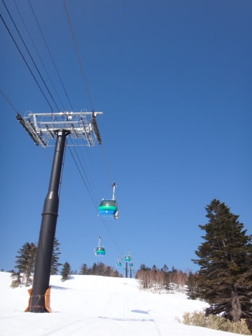

# 2月28日，日曜の志賀高原詳細レポート…終日晴天なのはいいんだけど，アイスバーンだし，もう少し雪が…

📅 投稿日時: 2016-03-01 01:46:08

🏷️ カテゴリ: [2016スキー滑走日記](c70c67ed5248e9432b899dcd5747048bb.md)

どうやら．

今晩の志賀高原，

大変素晴らしいことに．

ドサドサ雪が降っているようですね．

ええ…ドサドサと．

…明日の朝は，かなりの積雪で，

最高でしょうね…

…この雪が，週末までもてば文句はないんですが…

…が…

今日の天気図を見てみても…

うぐっ…

はうぁっ！！

昨日時点の予想とほぼ変わらず…（涙）．

…これは…ダメだ．

日曜は，雨…

いやいやいやいやいや．

…週末まで，まだ5日ある…っ！

それまでに，予想が変わってくれるよう．

祈り，歌い，踊るばかり…っ！！←もう，みんな踊り疲れてるんだけど

ってことで．

昨日速報した，日曜の志賀高原，詳細レポートをば．

…土曜の夜．

わずか，2-3cmほどとはいえ，積雪があったようで．

うっすら路面に積雪があった，朝．

天気は，すっきり晴天で始まりました～！

…いや．

何度も言うように．

今は，晴天より積雪がうれしいんですが…

朝の気温は-7度と，放射冷却もあり，そこそこの冷えで．

…んだもんで．

ふはははははははは！

朝イチは，最高シマシマっ！

今日も，結構いい感じでかっ飛ばせるシマシマ！

積雪が欲しいところだけど，

天気もすっきり晴れて，朝イチはいい感じっ！！

朝イチの晴天シマシマは，やっぱり最高！！！

…と．

1時間少々，大変シアワセな時間を過ごしていたら…

うむ．

GSコース，ちょっと人が増えてきて…

…そして．

10時ごろには．

ところどころ，固いアイスバーンさんが

「ようこそおこしやす（ハート）」

って感じで，顔を出してきます…（涙）．

うむ．

GSコースはアイスバーンさんが出始めてきたので．

ちと，オリンピックコースの様子を見に行きますか…

当然，昨日からの積雪はほとんどないので．

土曜と同じく，ブッシュを警告する看板が…（涙）．

…って，あれ？

看板，それだけじゃないぞ…

なに？これ？？

今日はオリンピックコース，圧雪できなかったの？？？

…どうやら，雪不足で，本日は圧雪が

かけられなかったようです…（泣）．

だもんで．

コースのブッシュは昨日のまま残っており…

雪もかなり固め，かつちょっと荒れたバーンで．

うーむ．

ちと楽しくない感じ…（残念）．

ということで．

第1ゴンドラで，GSコースをグルグルしますが．

トップシーズンの2月の週末ということもあり，

人は多め．

でも．

今日はゴンドラ待ちが少なく，第1ゴンドラもゲート外まで

並ぶことはほとんどなく．

まぁ，快適にゴンドラグルグルできるかな～．

でも．

やっぱり，ゲレンデの人が多いので…

大勢の人で雪が削られて…

昼間には，バーンはところどころ，かなり固い

ツルツルした感じに…（涙）．

ツルツルアイスバーンが出たのは，人工雪を打ったエリアがメインですか…

ツルツルバーン以外は，そこそこいい感じの雪なんですけどね～．

でも．

GSコースは長さ数100mに渡り，かなりの同時多発アイスバーンテロ状態でした（涙）．

で．

終日ピカピカ晴天だった，この日．

日が当たる南斜面側，

白樺，唐松，ブナコースなんかは，昼ごろにはちょっと雪が重くなり…

あれれれれ？？

ちょっと，春の雪になってきました…（涙）．

そして…

え？

（ブナコース）

ええええっ！！？

（第3高速沿い，イーストコース）

…大変残念なことに．

ブナコースやら，サウスコースなど．

南斜面には，一部土が…（激烈涙）．

雪が…雪が欲しいよっ！！

…いつもなら雪で完全に隠れるリフト下のクマザサが，

今年は全然隠れてないし…

去年はGW前半で，まだリフト下に全然クマザサが出てきてないことを考えると．

(去年，4月29日の写真）

…今年は雪が少なすぎる…（涙）．

とはいえ．

この日．気温自体は，昼間もマイナスをキープし続けたので．

真南の斜面以外は，雪が溶けることはなく．

…って，溶けないのはいいんだけど．

アイスバーンは全く緩まず，相変わらず固いまま…（泣）．

でも．

おかげで，GSコースは午後になってもそれほど凸凹になることはなく．

かなりフラットな感じで．

…多少雪が固いのさえ我慢すれば．

午後は人も少なかったし，天気は終日良かったし．

うーむ．

先週末までの悪条件に比べれば，←ここ重要

まぁ楽しめたのかな…

…と．

いつも通り，日が暮れるまで滑り続けたSkier_Sだったのでした…

…しかし．

雪が少ない．

少ないよ…

ホントに3月に雪が積もらなかったら…

GWどころか，4月まで雪がもたないかも…！？？？（かなり恐怖）

## 💬 コメント一覧

### 💬 コメント by (Goku)
**タイトル**: 志賀がサイコー！
**投稿日**: 2016-03-01 18:30:10

土曜日の八方がサイコーだった。

という情報で日曜日に行ったら、降った雪が柔らかすぎ＆冷え込みが足らず、

人生サイテーの朝イチリーゼンとなってしまいました(T_T)

日中の最高気温は１０℃近くまで上がったので、名木山や白樺は水は浮いているわで、もう悲しかったです。

前日の志賀でテンションＭＡＸだったのに、逆にテンション最低で帰って来ました。

### 💬 コメント by (Skier_S)
**タイトル**: Gokuさま
**投稿日**: 2016-03-01 23:08:48

土曜の八方，残念でしたね…

そこまでひどかったんですか…

朝はしっかり締まった圧雪で，志賀はまぁまぁでしたよ．

やっぱり，志賀でしょ！（笑）．

